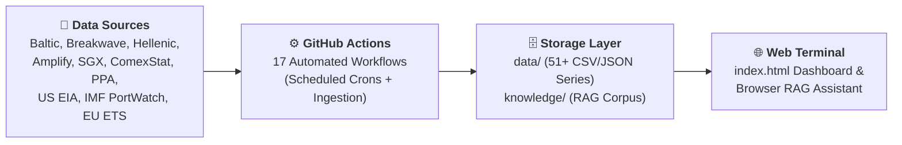
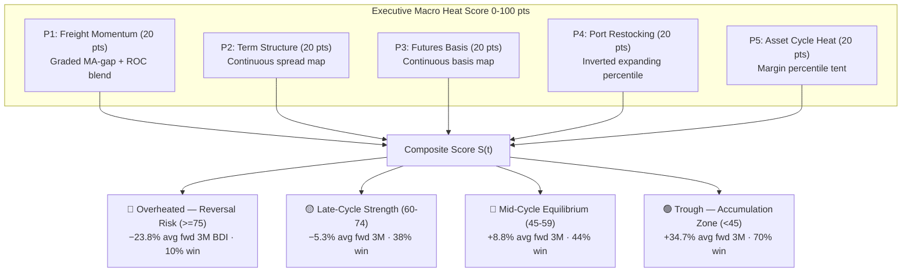
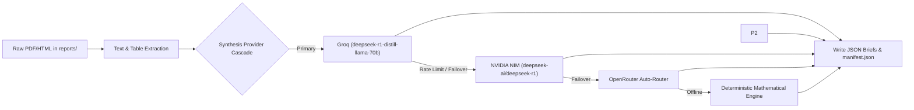
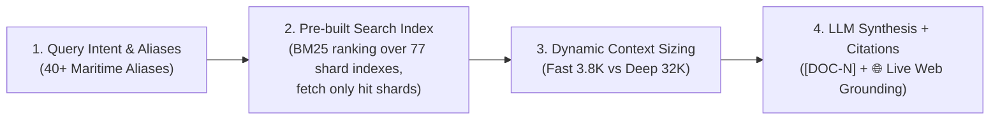

# Shipping: Zero-Infrastructure Intelligence Platform & Quantitative Terminal

[](https://yieldchaser.github.io/Shipping/)
[](file:///c:/Users/Dell/Github/Shipping/scripts)
[](file:///c:/Users/Dell/Github/Shipping/.github/workflows)
[](file:///c:/Users/Dell/Github/Shipping/knowledge)

> *"I am a Man of Fortune, and I must seek my Fortune."*  
> — **Henry Avery, 1694**

---

## 🌐 Live Web Terminal & Production Dashboard

The production analytical dashboard is served directly from this repository via GitHub Pages:  
👉 **[https://yieldchaser.github.io/Shipping/](https://yieldchaser.github.io/Shipping/)**  
*(Can also be launched locally by opening [`index.html`](file:///c:/Users/Dell/Github/Shipping/index.html) in any modern web browser).*

**No server. No build step. No database cost.** The entire platform operates as a self-sustaining quantitative shipping intelligence terminal with client-side execution, browser-native RAG AI research search, and automated multi-daily scraping pipelines.

---

## 1. System Architecture & Flow



### Supported Maritime Segments & Vessel Classes

| Segment | Vessel Class | Capacity / Spec | Key Freight Cargoes | Primary Routes / Indicators |
| :--- | :--- | :--- | :--- | :--- |
| **Dry Bulk** | **Capesize** | 180,000 DWT | Iron Ore, Coal | BCI, C5 (WAus → China), C3 (Tubarao → Qingdao) |
| **Dry Bulk** | **Panamax** | 82,000 DWT | Grain, Coal, Bauxite | BPI, P1A, P2A, P3A Atlantic/Pacific |
| **Dry Bulk** | **Supramax** | 58,000 DWT | Minor Bulks, Steel, Fertilizer | BSI, S1C, S2, S4A, S10 |
| **Dry Bulk** | **Handysize** | 38,000 DWT | Agricultural, Logs, Minor Bulks | BHSI, HS1, HS2, HS3 |
| **Crude Tankers** | **VLCC** | 270,000–300,000 DWT | Crude Oil | BDTI, TD3C (MEG → China 270kt) |
| **Crude Tankers** | **Suezmax** | 130,000–150,000 DWT | Crude Oil | BDTI, TD20 (WAF → UKC 130kt) |
| **Crude Tankers** | **Aframax** | 80,000–115,000 DWT | Crude Oil | BDTI, Regional Aframax routes |
| **Clean Tankers** | **LR2 / LR1 / MR**| 45,000–75,000 DWT | Refined Products (Naphtha, Diesel) | BCTI, TC2, TC14 |
| **Specialized** | **LNG & LPG** | 160k m³ / 84k m³ | Liquefied Gas | BLNG, BLPG Indices |
| **Container** | **Boxships** | Multi-TEU | Manufactured Goods | FBX (Freightos Baltic), NCFI (Ningbo) |
| **Freight ETFs** | **BDRY & BWET** | Freight Futures | FFA Derivatives Baskets | Solactive BDRYFF & BWETFF Indices |

---

## 2. Exhaustive Data Catalog & Time Series Inventory

This section provides a complete reference for every data file tracked within the repository. For the full tabular health inventory and update cadence schedule, see [`docs/DATASETS.md`](file:///c:/Users/Dell/Github/Shipping/docs/DATASETS.md). **External LLMs or automated parsers can use this inventory to locate datasets, verify schemas, and extend historical data.**

### 2.1 Primary Freight Spot Indices (`data/indices/`)

All files use standard CSV formatting with date headers in `DD-MM-YYYY` format.

| File Path | Target Index | Code | Start Date | Rows | Schema / Columns | Primary / Derived |
| :--- | :--- | :--- | :--- | :--- | :--- | :--- |
| [`data/indices/bdiy_historical.csv`](file:///c:/Users/Dell/Github/Shipping/data/indices/bdiy_historical.csv) | Baltic Dry Index | BDI | 04-01-1985 | ~10,492 | `Date, Index, % Change` | Primary (Validated Backfill + Scraped) |
| [`data/indices/cape_historical.csv`](file:///c:/Users/Dell/Github/Shipping/data/indices/cape_historical.csv) | Baltic Capesize Index | BCI | 06-10-2008 | ~4,312 | `Date, Index, % Change` | Primary (Scraped) |
| [`data/indices/panama_historical.csv`](file:///c:/Users/Dell/Github/Shipping/data/indices/panama_historical.csv) | Baltic Panamax Index | BPI | 06-10-2008 | ~4,312 | `Date, Index, % Change` | Primary (Scraped) |
| [`data/indices/suprama_historical.csv`](file:///c:/Users/Dell/Github/Shipping/data/indices/suprama_historical.csv) | Baltic Supramax Index | BSI | 06-10-2008 | ~4,311 | `Date, Index, % Change` | Primary (Scraped) |
| [`data/indices/handysize_historical.csv`](file:///c:/Users/Dell/Github/Shipping/data/indices/handysize_historical.csv) | Baltic Handysize Index | BHSI | 06-10-2008 | ~4,290 | `Date, Index, % Change` | Primary (Scraped) |
| [`data/indices/cleantanker_historical.csv`](file:///c:/Users/Dell/Github/Shipping/data/indices/cleantanker_historical.csv) | Baltic Clean Tanker | BCTI | 02-01-2008 | ~4,484 | `Date, Index, % Change` | Primary (Scraped) |
| [`data/indices/dirtytanker_historical.csv`](file:///c:/Users/Dell/Github/Shipping/data/indices/dirtytanker_historical.csv) | Baltic Dirty Tanker | BDTI | 05-12-2007 | ~4,499 | `Date, Index, % Change` | Primary (Scraped) |

### 2.2 Baltic Ticker API Series (`data/indices/`)

Updated via Baltic Ticker public API (`scripts/baltic_new_indices.py`) and TAC Index API.

| File Path | Index Description | Code | Start Date | Rows | Schema |
| :--- | :--- | :--- | :--- | :--- | :--- |
| `data/indices/blng_historical.csv` | Baltic LNG Freight Index | BLNG | 13-03-2026 | 104 | `Date, Index, % Change` |
| `data/indices/blpg_historical.csv` | Baltic LPG Freight Index | BLPG | 13-03-2026 | 104 | `Date, Index, % Change` |
| `data/indices/fbx_historical.csv` | Freightos Baltic Container Index | FBX | 13-03-2026 | 104 | `Date, Index, % Change` |
| [`data/indices/bai_historical.csv`](file:///c:/Users/Dell/Github/Shipping/data/indices/bai_historical.csv) | Baltic Air Freight Index | BAI | 01-01-2018 | 456 | `Date, Index, % Change` |

> [!NOTE]
> **Shallow CSVs until backfill runs land (E2E audit, no-break):** Drewry WCI **139 rows** (2024-01-04→2026-08-26 provisional, 2024+ badge in UI; Wayback 2011 pending — never synthesized), Brazil ComexStat **92 rows** (2024+ slice), EIA weekly exports **500 rows** (real 2017+ kept as-is without `EIA_API_KEY`), FAS outstanding sales **10k rows** (tail 2006 — FAS DESC 60k lands on Thu 15 UTC runs), FBX **108 rows** (Mar-2026+ slice; full 2017→present is a follow-up). How to trigger: `gh workflow run poten_drewry_weekly.yml -f backfill_2011=true`; `gh workflow run upstream_commodity_flows.yml -f comexstat_full=1` (multi-hour pacing) or `COMEXSTAT_FULL_HISTORY=1 python scripts/scrapers/fetch_comexstat_brazil.py`; `gh workflow run usda_weekly.yml` (Thu 15 UTC FAS DESC 60k). See [`docs/DATASETS.md`](file:///c:/Users/Dell/Github/Shipping/docs/DATASETS.md) for full inventory.

### 2.3 Time Charter (TC) Rates, Forward Curves & Valuations (`data/derived/`)

Calculated weekly via Fearnleys Hasura GraphQL API (`scripts/backfill_historical_data.py`), Alibra Deep Archive (2008–2026), and direct Google Sheet / OCR ingestion (`scripts/integrate_alibra_feed.py` & `scripts/process_knowledge.py`).

| File Path | Description | Start Date | Rows | Columns / Schema Overview |
| :--- | :--- | :--- | :--- | :--- |
| [`time_charter_rates.csv`](file:///c:/Users/Dell/Github/Shipping/data/derived/time_charter_rates.csv) | **Merged** Weekly TC Rates ($/day) — Fearnleys pre-2021 + Alibra Deep Archive (2008–2026) + Alibra weekly feed | 2000-01-05 | ~2,083 | `date, source` + 64 rate columns (66 cols total) spanning 4/6M, 1Y, 2Y, 3Y, 5Y across Dry Bulk (Atl/Pac), Crude, Product, and Handy Tankers. `source` = `fearnleys`, `alibra_archive`, `alibra_ocr` |
| [`tanker_forward_curves.csv`](file:///c:/Users/Dell/Github/Shipping/data/derived/tanker_forward_curves.csv) | **Tanker FFA Forward Curves** — 22-month forward term structure across 12 tanker routes | 2026-08-12 | ~22 | `snapshot_date, forward_month, contract_label, vlcc_td3c, vlcc_eco_td3c, suezmax_td20, aframax_td25, lr1_tc5, lr1_eco_tc5, mr_tc2, mr_eco_tc2, mr_tc14, mr_eco_tc14, mr_tc6, mr_triangulation` |
| [`tanker_forward_curves_history.csv`](file:///c:/Users/Dell/Github/Shipping/data/derived/tanker_forward_curves_history.csv) | **Tanker Forward History Accumulator** — persistent multi-snapshot forward curve time series | 2026-08-12 | Accumulating | `snapshot_date, forward_month, contract_label` + 12 forward TCE route columns |
| [`time_charter_rates_fearnleys.csv`](file:///c:/Users/Dell/Github/Shipping/data/derived/time_charter_rates_fearnleys.csv) | **Fearnleys-only** TC Rates — single-source reference for cross-validation | 2000-01-05 | ~1,595 | `date, capesize_1y_avg, panamax_1y_avg, supramax_1y_avg, handysize_1y_avg, vlcc_1y, suezmax_1y, aframax_1y` |
| [`intermodal_tc_rates.csv`](file:///c:/Users/Dell/Github/Shipping/data/derived/intermodal_tc_rates.csv) | **Intermodal** Weekly TC Rates ($/day) — fills MR, LR1, Handysize & 3Y period gaps | 2025-03-07 | ~43 | `date, source` + 20 rate columns (`mr_1y_tc`, `mr_3y_tc`, `lr1_1y_tc`, `lr1_3y_tc`, 3Y dry/wet period rates) |
| [`lpg_charter_rates.csv`](file:///c:/Users/Dell/Github/Shipping/data/derived/lpg_charter_rates.csv) | LPG 1Y TC Rates ($/month) from Fearnleys API | 2019-07-01 | ~359 | `date, vlgc_84k_tc, mgc_38k_tc, hdy_22k_tc` |
| [`lng_charter_rates.csv`](file:///c:/Users/Dell/Github/Shipping/data/derived/lng_charter_rates.csv) | LNG 7Y/10Y TC Rates ($/day) & Newbuilding Prices ($M) from Fearnleys API | 2017-01-05 | ~513 | `date, lngc_174k_7y_tc, lngc_174k_10y_tc, lngc_80k_nb_price, lngc_30k_nb_price, lngc_7k_nb_price` |
| [`lpg_spot_rates.csv`](file:///c:/Users/Dell/Github/Shipping/data/derived/lpg_spot_rates.csv) | LPG Spot Rates ($/day) from Fearnleys API | 2004-01-07 | ~1,152 | `date, vlgc_spot, mgc_spot` |
| [`vessel_valuations.csv`](file:///c:/Users/Dell/Github/Shipping/data/derived/vessel_valuations.csv) | S&P Secondhand 5Y/10Y Prices & Newbuilding Prices ($M) from Fearnleys | 1970-12-01 | ~20,499 | `date, category, tenor_type, vessel_class, valuation_usd_m` |
| [`scrappage_prices.csv`](file:///c:/Users/Dell/Github/Shipping/data/derived/scrappage_prices.csv) | Demolition/scrap prices by country ($/LDT) parsed via AnyDoc OCR engine | 2021-07-03 | ~377 | `date, dry_india, dry_bangla, dry_pak, dry_turkey, tanker_india, tanker_bangla, tanker_pak, container_india` |
| [`alibra_tce_matrix.json`](file:///c:/Users/Dell/Github/Shipping/data/derived/alibra_tce_matrix.json) | **Live Period TCE Rate Matrix** — weekly benchmark rates across Dry Bulk (Atl/Pac) and Tanker classes with multi-horizon momentum (`1W WoW`, `1M MoM`, `1Y YoY`), 52-week SVG trend sparklines, 10-year historical cycle percentile ranks (2016–2026), Atlantic vs Pacific basin spreads, and Eco fuel efficiency premiums | Live | 11 Classes | `report_date, dry_bulk: [size, 6M/1Y/2Y (Atl/Pac), sparkline_52w, pctile_10y, basin_spread_1y, mom_1w/1m/1y], tankers: [size, 1Y/2Y/3Y/5Y, sparkline_52w, pctile_10y, eco_premium_day, curve_slope_3y, mom_1w/1m/1y]` |
| [`fearnleys_catalog.csv`](file:///c:/Users/Dell/Github/Shipping/data/derived/fearnleys_catalog.csv) | Catalog of all route metrics, subtypes, & counts available in Fearnleys Hasura API | — | ~356 | `id, unit, rate_type, rate_subtype, route, count, min_date, max_date` |
| [`iron_ore_restocking.csv`](file:///c:/Users/Dell/Github/Shipping/data/derived/iron_ore_restocking.csv) | Iron Ore Price vs Port Stocks & Freight | 2018-07-03 | ~1,244 | `Date, iron_ore_cfr_62, qingdao_port_inventory, cape_spot_tce, ratio_score` |
| [`macro_health_score_backtest.csv`](file:///c:/Users/Dell/Github/Shipping/data/derived/macro_health_score_backtest.csv) | **Historical Macro Heat Score & Regime Backtest (v2 engine)** — point-in-time 5-pillar composite scores with percentile diagnostics and multi-horizon forward returns (1W, 1M, 3M, 6M) across daily freight history | 2018-03-22 | ~1,984 | `date, bdi, bdry, p1_momentum, p2_term_structure, p3_futures_basis, p4_port_restock, p4_inv_pctl, p5_asset_safety, p5_margin_pctl, total_score, regime, input_staleness_*, any_input_stale, bdi_fwd_1W, bdry_fwd_1W, bdi_fwd_1M, bdry_fwd_1M, bdi_fwd_3M, bdry_fwd_3M, bdi_fwd_6M, bdry_fwd_6M` |

> [!NOTE]
> **Dual-Source TC Rates**: The merged file contains data from two brokers with a ~8% median divergence in the overlap period. The `source` column identifies the broker. The Fearnleys-only file provides a clean single-source reference for comparison. The dashboard offers a **Merged / Fearnleys / Both** toggle to visualize the divergence.

### 2.4 Futures, Holdings & Fund Flows (`data/futures/`, `data/etf/`, `data/flows/`)

| File Path | Type | Start Date | Rows | Content Summary |
| :--- | :--- | :--- | :--- | :--- |
| [`data/futures/bdryff_history.csv`](file:///c:/Users/Dell/Github/Shipping/data/futures/bdryff_history.csv) | Futures Index | 28-02-2010 | ~4,118 | Solactive BDRY Freight Futures Index history (`Date, Close`) |
| [`data/futures/bwetff_history.csv`](file:///c:/Users/Dell/Github/Shipping/data/futures/bwetff_history.csv) | Futures Index | 22-12-2016 | ~2,419 | Solactive BWET Freight Futures Index history (`Date, Close`) |
| [`data/futures/sgx_cape_futures.csv`](file:///c:/Users/Dell/Github/Shipping/data/futures/sgx_cape_futures.csv) | Curve Data | 05-03-2026 | ~3,000 | SGX Capesize FFA forward curves & settlement history |
| [`data/futures/sgx_panamax_futures.csv`](file:///c:/Users/Dell/Github/Shipping/data/futures/sgx_panamax_futures.csv) | Curve Data | 05-03-2026 | ~3,000 | SGX Panamax FFA forward curves & settlement history |
| [`data/futures/sgx_supramax_futures.csv`](file:///c:/Users/Dell/Github/Shipping/data/futures/sgx_supramax_futures.csv) | Curve Data | 05-03-2026 | ~3,000 | SGX Supramax FFA forward curves & settlement history |
| [`data/futures/sgx_handysize_futures.csv`](file:///c:/Users/Dell/Github/Shipping/data/futures/sgx_handysize_futures.csv) | Curve Data | 05-03-2026 | ~3,000 | SGX Handysize FFA forward curves & settlement history |
| [`data/futures/sgx_*_futures_history.csv`](file:///c:/Users/Dell/Github/Shipping/data/futures/sgx_cape_futures_history.csv) | **Full Contract Lives** (4 files) | 2022 | ~324,547 | Complete SGX FFA archive per contract (`contract, expiry_month, expiry_year, date, price, volume, open_interest, expiry_date`), rebuilt via `scripts/expansion_sgx_history_backfill.py --rebuild` & refreshed Mon–Thu. **Availability reality (verified at source)**: SGX publishes a settlement price only on sessions that actually cleared (~7 traded days per typical life; labels in the frontend Contract Archive show each contract's count), redacts lookback prices outside its entitlement window even where trades occurred, and serves volume/open-interest full-depth back to 2022 regardless — so the archive is a complete *activity* record with prices wherever they exist. Daily price granularity from Mar 2026 onward comes from our own live collection. Surfaced via the **Contract Archive** selector on the SGX FFA Forward Curve — lazy-loaded per vessel class (~2–7 MB), then session-cached. |
| [`data/etf/bdry_holdings.csv`](file:///c:/Users/Dell/Github/Shipping/data/etf/bdry_holdings.csv) | Daily Holdings | Live | ~21 | BDRY FFA contract holdings (Capesize, Panamax, Supramax 5TC) |
| [`data/etf/bwet_holdings.csv`](file:///c:/Users/Dell/Github/Shipping/data/etf/bwet_holdings.csv) | Daily Holdings | Live | ~15 | BWET FFA contract holdings (TD3C VLCC & TD20 Suezmax) |
| [`data/etf/bdry_holdings_history.csv`](file:///c:/Users/Dell/Github/Shipping/data/etf/bdry_holdings_history.csv) | Historical Holdings | Live | ~350 | Daily historical disclosures of BDRY ETF FFA contract positions |
| [`data/etf/bwet_holdings_history.csv`](file:///c:/Users/Dell/Github/Shipping/data/etf/bwet_holdings_history.csv) | Historical Holdings | Live | ~350 | Daily historical disclosures of BWET ETF FFA contract positions |
| [`data/etf/snapshots/scenario_snapshots.js`](file:///c:/Users/Dell/Github/Shipping/data/etf/snapshots/scenario_snapshots.js) | Snapshot Bundle | Live | — | Cryptographically verified canonical scenario snapshot bundle for BDRY & BWET |
| [`data/etf/snapshots/provenance_manifest.json`](file:///c:/Users/Dell/Github/Shipping/data/etf/snapshots/provenance_manifest.json) | Audit Manifest | Live | — | Immutable SHA-256 cryptographic provenance registry and hash audit trail |
| [`data/etf/BDRY_flows.csv`](file:///c:/Users/Dell/Github/Shipping/data/etf/BDRY_flows.csv) | Fund Flows | 23-03-2018 | ~2,088 | Daily flow $, Net Shares, NAV, AUM history for BDRY ETF |
| [`data/etf/BWET_flows.csv`](file:///c:/Users/Dell/Github/Shipping/data/etf/BWET_flows.csv) | Fund Flows | 04-05-2023 | ~808 | Daily flow $, Net Shares, NAV, AUM history for BWET ETF |
| [`data/flows/all_flows_summary.json`](file:///c:/Users/Dell/Github/Shipping/data/flows/all_flows_summary.json) | JSON Summary | Live | — | Unified JSON payload containing synced ETF flow metrics |
| [`data/etf/bdry_liquidity.csv`](file:///c:/Users/Dell/Github/Shipping/data/etf/bdry_liquidity.csv) | Liquidity | 22-03-2018 | ~2,096 | Daily Close, Volume, Dollar Value Traded, Tier, Safe Liquidity $ |

### 2.5 Expansion Collectors (`data/congestion/`, `data/macro/`, `data/bunkers/`)

Mon–Thu 05:00 UTC via `.github/workflows/data_expansion.yml` (idempotent upserts, graceful failure, existing data never rewritten).

| File Path | Description | Coverage | Source |
| :--- | :--- | :--- | :--- |
| [`data/congestion/chokepoint_transits_daily.csv`](file:///c:/Users/Dell/Github/Shipping/data/congestion/chokepoint_transits_daily.csv) | Daily transits across 28 maritime chokepoints by vessel class (Suez, Panama, Bosporus, Malacca, ...) | 2019 → live (~78k rows) | IMF PortWatch ArcGIS (`expansion_portwatch.py`) |
| [`data/congestion/port_calls_daily.csv`](file:///c:/Users/Dell/Github/Shipping/data/congestion/port_calls_daily.csv) | Daily port-call volumes for curated major ports by segment | rolling window | IMF PortWatch ArcGIS (`expansion_portwatch.py`) |
| [`data/macro/commodities_monthly.csv`](file:///c:/Users/Dell/Github/Shipping/data/macro/commodities_monthly.csv) | World Bank Pink Sheet monthly commodity prices + CMO indices — iron ore / coal / crude / natgas / grains / metals, the core cargo-demand drivers behind dry bulk & tanker freight. Rendered on the Signals tab as **Cargo Demand Drivers** (Ore & Coal / Energy / Grains / Base Metals / WB Indices groups, USD vs rolling % vs 5Y-ago view, 5Y/10Y/MAX windows). Series the Pink Sheet no longer publishes are auto-dropped from the schema. | 1960 → current month−1 (monthly) | World Bank CMO xlsx (`expansion_worldbank_pinksheet.py`) |
| [`data/bunkers/bunker_prices_daily.csv`](file:///c:/Users/Dell/Github/Shipping/data/bunkers/bunker_prices_daily.csv) | Bunker fuel prices ($/mt): VLSFO / MGO / IFO380 across global & regional averages plus 8 major hubs | daily snapshots accumulate | Ship & Bunker (`expansion_bunker_prices.py`) |

> [!NOTE]
> **Retired targets** (removed after source access was lost): OPEC MOMR
> (Cloudflare block on all opec.org routes), GMS weekly demolition rates
> (portal-gated; $/LDT needs served by `data/derived/scrappage_prices.csv`),
> Intermodal fleet PDFs (form-gated), macro rates/FX (no consumer in this repo).

### 2.6 Official ETF Documentation & Dataset Catalog (`docs/`)

| File Path | Document Type | Description |
| :--- | :--- | :--- |
| [`docs/DATASETS.md`](file:///c:/Users/Dell/Github/Shipping/docs/DATASETS.md) | Data Inventory | Master inventory and health monitoring reference for all 51+ CSV/JSON datasets |
| [`docs/Amplify_BDRY_Prospectus.pdf`](file:///c:/Users/Dell/Github/Shipping/docs/Amplify_BDRY_Prospectus.pdf) | Prospectus | Official statutory prospectus for Amplify BDRY ETF detailing Solactive index rules and roll schedules |
| [`docs/Amplify_BDRY_FactSheet.pdf`](file:///c:/Users/Dell/Github/Shipping/docs/Amplify_BDRY_FactSheet.pdf) | Factsheet | Official fund factsheet detailing BDRY benchmark weightings (50% Cape / 40% Pana / 10% Supra) |
| [`docs/Amplify_BWET_Prospectus.pdf`](file:///c:/Users/Dell/Github/Shipping/docs/Amplify_BWET_Prospectus.pdf) | Prospectus | Official statutory prospectus for Amplify BWET ETF detailing Breakwave Wet Freight Futures Index rules |
| [`docs/Amplify_BWET_FactSheet.pdf`](file:///c:/Users/Dell/Github/Shipping/docs/Amplify_BWET_FactSheet.pdf) | Factsheet | Official fund factsheet detailing BWET benchmark weightings (90% TD3C VLCC / 10% TD20 Suezmax) |
| [`docs/BDRY-BWET_Form10-Q_March-31-2026.pdf`](file:///c:/Users/Dell/Github/Shipping/docs/BDRY-BWET_Form10-Q_March-31-2026.pdf) | SEC Filing | Form 10-Q Quarterly Report for Breakwave Trust filed with the SEC containing audited holdings & financial disclosures |

### 2.7 Upstream Physical Commodity Flows, Port Bottlenecks & Carbon Regimes (`data/commodities/`, `data/congestion/`, `data/derived/`)

Ingested weekly/monthly from official primary authorities (Brazil MDIC ComexStat, Pilbara Ports Authority, US EIA, IMF PortWatch, UN Comtrade, and ICAP Allowance Price Explorer for EU ETS).

| File Path | Description | Start Date | Rows | Primary Schema / Columns | Source / Authority |
| :--- | :--- | :--- | :--- | :--- | :--- |
|| [`data/commodities/brazil_comexstat_exports.csv`](file:///c:/Users/Dell/Github/Shipping/data/commodities/brazil_comexstat_exports.csv) | Brazilian monthly seaborne exports for Iron Ore (NCM 26011100), Crude Oil (27090010), Soybeans (1201*), Raw Sugar (1701*) — **Build C (1997-live, year-by-year):** every value server-returned from the live API (2026-08-25 rebuild); the 92-row 2024+ window is retained as the recent slice | 1997-01-01 → live (year-by-year, Build C) | 1997-live (92-row 2024+ recent slice retained) | `date, year, month, commodity, ncm, metric_tonnes, fob_usd` | Brazilian MDIC / SECEX (`fetch_comexstat_brazil.py`) |
| [`data/commodities/australia_ppa_iron_ore.csv`](file:///c:/Users/Dell/Github/Shipping/data/commodities/australia_ppa_iron_ore.csv) | Pilbara Ports Authority monthly iron-ore throughput for Port Hedland, parsed from official PPA cargo-statistics PDFs via the Internet Archive Wayback Machine. **REAL (live_ppa_archive)**: 15 months of measured Port Hedland loadings (2020-10 → 2024-05) with per-destination splits (China / Korea / Japan / Other). Coverage is bounded by what PPA published as machine-readable destination-origin PDFs — not a continuous series. | 2020-10-01 | 15 | `date, port, total_throughput_mt, iron_ore_exports_mt, destinations_t, mom_pct, yoy_pct, provenance` | Pilbara Ports Authority (`fetch_ppa_iron_ore.py`) — Wayback PDF parse |
| [`data/commodities/major_miners_quarterly_shipments.csv`](file:///c:/Users/Dell/Github/Shipping/data/commodities/major_miners_quarterly_shipments.csv) | Quarterly shipment run rates & C1 cash costs for Vale, Rio Tinto, BHP, Fortescue (FMG). **DIAGNOSTIC**: values are editorial estimates pending a live IR-feed scraper — flagged `provenance=editorial_estimate_diagnostic`, not verified against corporate filings, and surfaced as indicative only in the UI. | 2024-Q1 | 40 | `date, quarter, miner, production_mt, shipments_mt, c1_cash_cost_usd_t, annual_guidance, primary_loading_terminals, provenance` | Corporate Production Filings (`fetch_major_miners_production.py`) |
| [`data/commodities/us_eia_weekly_crude_exports.csv`](file:///c:/Users/Dell/Github/Shipping/data/commodities/us_eia_weekly_crude_exports.csv) | US Gulf Coast (PADD 3) & Total US weekly crude and petroleum exports with 4W MA — **Build C:** `EIA_API_KEY` required for 1991-live depth; without a key the existing real 2017+ file is kept as-is (no synthetic fallback) | 1991-01-01 → live (with key; else real 2017+ kept, no synthetic, Build C) | 1991-live with key, else 2017+ (~500 recent rows) | `date, us_total_crude_exports_kbpd, padd3_gulf_crude_exports_kbpd, us_total_petroleum_exports_kbpd, crude_4w_avg_kbpd, petro_4w_avg_kbpd` | US EIA Weekly Status Report (`fetch_eia_petroleum_exports.py`) |
| [`data/commodities/un_comtrade_guinea_bauxite.csv`](file:///c:/Users/Dell/Github/Shipping/data/commodities/un_comtrade_guinea_bauxite.csv) | Bilateral monthly Guinea-to-China bauxite seaborne export volumes (HS 260600) | 2024-01-01 | 32 | `date, period, commodity, hs_code, reporter, partner, import_volume_mt, cif_usd, avg_cif_usd_t` | UN Comtrade v1 Data API (`fetch_un_comtrade_bauxite.py`) |
| [`data/congestion/portwatch_port_congestion.csv`](file:///c:/Users/Dell/Github/Shipping/data/congestion/portwatch_port_congestion.csv) | Daily measured port activity across Core12 hubs (Qingdao, Ningbo, Hedland, Newcastle, Singapore, Rotterdam, Houston, Tubarao, Santos, Rizhao, Hay Point, Qinhuangdao + All aggregate): port calls (total / dry bulk / tanker / container) and dry-bulk & tanker import/export tonnages (kt). **2026-08-25 audit:** the previous waiting-times/anchored-counts series was found to be simulated and has been withdrawn; only fields actually published by IMF PortWatch are stored. | 2019-01-01 → live (19,523 rows) | `date, portid, portname, country, hub_code, daily_port_calls_total, daily_port_calls_dry_bulk, daily_port_calls_tanker, daily_port_calls_container, import_dry_bulk_kt, export_dry_bulk_kt, import_tanker_kt, export_tanker_kt` | IMF PortWatch ArcGIS `Daily_Ports_Data` FeatureServer (`fetch_portwatch_port_activity.py`) — real observations only, no synthetic waiting times. |
| [`data/derived/eu_ets_carbon_daily.csv`](file:///c:/Users/Dell/Github/Shipping/data/derived/eu_ets_carbon_daily.csv) | Daily EU ETS EUA carbon allowance spot (€/t CO2), Hi-5 fuel spreads ($/MT), and scrubber savings. **Backfilled 2026-08-26 from ICAP's official Allowance Price Explorer** (2,988 real daily EUA prices, 2010 → 2026-06); live daily Hi-5 bunker spreads join where Ship & Bunker data exists. `provenance=icap_ape_eu_ets_daily`. | 2010-01-05 | 2,988 | `date, eua_carbon_price_eur_tco2, source_created_at, singapore_vlsfo_usd_mt, singapore_hsfo_usd_mt, singapore_hi5_spread_usd_mt, rotterdam_hi5_spread_usd_mt, houston_hi5_spread_usd_mt, capesize_scrubber_savings_usd_day, vlcc_scrubber_savings_usd_day, capesize_eu_ets_surcharge_usd_day, provenance` | ICAP Allowance Price Explorer + Ship & Bunker (`backfill_eu_ets_icap.py`, `fetch_eu_ets_carbon.py`) |
| [`data/commodities/newcastle_coal_exports.csv`](file:///c:/Users/Dell/Github/Shipping/data/commodities/newcastle_coal_exports.csv) | Monthly coal export throughput for Port of Newcastle (real TfNSW opendata XLSX, 2018-01 → 2026-07). **Note:** the README previously listed Dalrymple Bay (DBCT) and Gladstone — those ports are not yet in this feed; only Newcastle is covered. | 2018-01-01 | 103 | `date, port, export_tonnes_mt, coal_grade, vessels_loaded_count, primary_destinations` | Port of Newcastle / TfNSW opendata (`fetch_newcastle_coal.py`) |
| [`data/commodities/australia_req_commodity_exports.csv`](file:///c:/Users/Dell/Github/Shipping/data/commodities/australia_req_commodity_exports.csv) | Australian Resources & Energy Quarterly (REQ) historical exports. **REAL (1990-Q1 → 2026-Q1, 725 rows)** parsed from the DISR REQ workbook; a repo-tracked copy is committed so CI never loses the series on a network outage. | 1990-03-01 | 725 | `date, quarter, commodity, export_volume_mt, export_value_aud_b, primary_vessel_class, provenance` | Australian DISR REQ (`fetch_australia_req.py`) |
| [`data/derived/ton_mile_utilization_matrix.csv`](file:///c:/Users/Dell/Github/Shipping/data/derived/ton_mile_utilization_matrix.csv) | **DIAGNOSTIC** Capesize-only global monthly ton-mile absorption and active fleet utilization (the quantitative engine currently publishes Capesize only; VLCC/Suezmax rows are emitted when the model produces them). **Mechanism:** Guinea→China 11,200 nm absorbs **3.11x** more DWT-days per tonne than WAus→China (3,600 nm); Brazil→China 11,000 nm (3.06x). **Provenance:** Brazil live (ComexStat), Guinea live (UN Comtrade), WAus fixed 48 Mt/mo assumption, 815 Bn Ton-NM corridor capacity — see `scripts/scrapers/generate_ton_mile_matrix.py`. | 2024-01-01 | 32 | `date, cape_waus_ore_mt, cape_brazil_ore_mt, cape_guinea_bauxite_mt, cape_total_ton_miles_bn, cape_fleet_utilization_pct, model_disclosed` | Quantitative Ton-Mile Engine (`generate_ton_mile_matrix.py`) |

> [!NOTE]
> **Spike guard (flag-only, no fabrication):** `scripts/check_data_spike_health.py` scans `data/derived/*.csv` + `data/commodities/*.csv` + `data/congestion/*.csv` (WoW >30%, 3-sigma vs prior 252, >15 flatline repeats) and appends flags to `knowledge/manifests/spike_queue.jsonl` — it never edits or deletes `data/`, and known P0s are flagged, not auto-corrected.
> **FAS pagination fix (Build C):** `scripts/scrapers/fetch_usda_fas_exports.py` orders by `date DESC` with offset pagination so the Socrata API returns the most-recent ~60k rows (default `:id` order would return the oldest 10k); new pages are upserted onto the existing file (deduped + sorted, history never truncated).

---

## 3. Web Dashboard Features & Tab-by-Tab Breakdown

Built using **Chart.js 4.4.0** and **PapaParse 5.4.1**. All data is fetched client-side — no backend required. The global **Index:** dropdown in the header switches the active product across all tabs instantly.

**12 products available:** BDI · Capesize · Panamax · Supramax · Handysize · Clean Tanker · Dirty Tanker · BDRY Spot Composite · BDRYFF · BWETFF · BDRY Stock Price · BWET Stock Price

---

### 📊 Dashboard Tab

Main quantitative overview for the selected index.

- **Hero KPI + Signal Badge**: Algorithmic signal based on percentile and Z-score:
  - ⛔ **SELL**: 5Y percentile > 80%
  - 💎 **GOLDEN DIP**: 5Y percentile < 20%, $Z_{252} < -0.5$, all-time percentile > 40%
  - 🔥 **CATCHING KNIFE**: 5Y percentile < 10%, $Z_{252} < -0.6$
  - ⚠️ **VALUE TRAP**: 5Y percentile < 30%, all-time percentile < 30%
  - 🔹 **ACCUMULATE**: 5Y percentile < 40%
  - ⏳ **WAIT**: All other conditions
- **Momentum Regime Classification**:
  - 🟢 **EXPANSION**: Price > $\text{MA}_{200}$, $\text{RoC}_{60} > 0$
  - 🟡 **DISTRIBUTION**: Price > $\text{MA}_{200}$, $\text{RoC}_{60} \le 0$
  - 🔵 **ACCUMULATION**: Price $\le \text{MA}_{200}$, $\text{RoC}_{60} > 0$
  - 🔴 **CONTRACTION**: Price $\le \text{MA}_{200}$, $\text{RoC}_{60} \le 0$
- **6 Stat Cards**: All-Time Pctl · 10Y Pctl · 5Y Pctl · Z-Score · 52-Week Drawdown · 20D RoC.
- **Historical Context Strip**: 5Y avg, current vs 5Y avg %, current vs 10Y avg %.
- **Current Year vs Historical Overlay Chart**: Overlays current year against prior trading years with 3Y/5Y/10Y/All presets.
- **Drawdown from 52-Week High Chart**: Last 5 years with 1Y/3Y/5Y/10Y/All toggle buttons.
- **Recent Daily Changes Table**: Last 10 sessions (day $\Delta$, day $\Delta\%$, 5D change %).
- **Yearly Performance Table** *(collapsible, sortable)*: Annual avg, YoY %, min, max, Volatility % (dispersion: $(\text{max}-\text{min})/\text{avg}$), Trough → Peak % (theoretical max gain).
- **Macro Cycle History (Multi-Year)** *(collapsible, sortable)*: Identifies historical peak and trough cycles using a 30% threshold with duration and move magnitude tooltips.
- **Index Correlation Matrix**: Pearson correlation for all shipping benchmarks, switchable across All Time / 5Y / 1Y windows.

---

### 📅 Yearly Tab

Multi-year macro cycles and decade-scale benchmark tracking.

- **Historical Price Chart**: Full history with rolling average toggle (5Y / 10Y / All-Time) and dual-handle range slider.
- **Z-Score (Rolling 252-Day)**: All 7 products, selected product highlighted with 3M/6M/1Y/2Y/3Y lookback toggles.
- **Historical Z-Score (All Time from 2008)**: Full-history structural cycle view.
- **Multi-Year Rates**: Annual averages by product across all years.
- **Current Year Monthly Bar**: MoM trend acceleration or decay color coding.
- **Rates — All Products Multi-Year Overlay**: Last 4 years by trading day with product selector dropdown.
- **Drawdown % (52-Week Rolling, Last 5 Years)**: Peak retracement depth across the last 5 years.

---

### 🗓️ Seasonality Tab

Quarterly, monthly, and heatmap seasonality in one workspace (all three sections render together).

- **Win Rate KPI Cards**: Historical probability each quarter beats the prior quarter (Q1–Q4).
- **Quarterly Spaghetti Chart**: Q1/Q2/Q3/Q4 across all years rebased to 100 at the start of Q1 to expose path dependency.
- **Quarterly Area Comparison**: Current year (solid) vs prior year (dashed) vs 5-year rolling average (shaded).
- **Quarterly Bar Chart**: Trailing 4 quarters with Quarter-over-Quarter (QoQ) direction coloring.
- **Quarterly Data Grid**: 8-year tabular record showing Open, High, Low, Close, QoQ %, and full-year % change.

---

**Monthly** — intra-year progression and momentum shifts.

- **Monthly Win Rate KPI Cards**: Historical probability of each calendar month being positive across multi-decade history.
- **Monthly Spaghetti Chart**: Index trajectory across all 12 calendar months for each historical year.
- **Monthly Area Comparison**: Current year vs prior year vs 5Y seasonal average.
- **Monthly Bar Chart**: 12-month rolling momentum summary.
- **Monthly Data Grid**: 8-year $\times$ 12-month tabular matrix with relative scaling.

---

**Heatmaps** — high-density seasonal momentum matrices.

- **Monthly Performance Heatmap**: Year $\times$ Month, absolute value or MoM % return toggle with CSV download.
- **Quarterly Heatmap**: Year $\times$ Quarter, absolute value or QoQ % return toggle with CSV download.
- **8-Year Relative Scaling**: Color scaling tailored to recent 8-year windows to ensure modern volatility extremes remain visually distinct.

---

### 📈 Indices Tab

Dedicated benchmark monitoring suite.

- All 6 base indices as individual interactive chart cards (BDI, BCI, BPI, BSI, BHSI, BDTI, BCTI).
- Current value, day change %, and status badge.
- Dual-handle date range slider (defaults to last 5 years).
- Stats strip: 52W High—Low · 52W Position · YTD % · From Last Trough.

---

### 🏦 ETFs Tab (BDRY & BWET)

Structured in the **"Executive Intelligence First"** workflow:

1. **Live Price & Overview Cards**:
   - 5-minute dynamic auto-refresh engine powered by Yahoo Finance v8 API via a 4-stage CORS proxy failover cascade. Updates price cards, day change %, 52W metrics, and ETF Deconstruction Engine live (`🟢 LIVE`).
   - Metrics rows: Total Futures · Collateral Cash · Futures/AUM % · NAV · Statutory Expense Ratio (1.45% OER) · Exposure Ratio · 52W High—Low · 52W Position.
   - Holdings table sorted by vessel class → expiry month (nearest prompt first) with interactive trade route maps and allocation donuts.
2. **Daily Freight & ETF Market Intelligence Brief (`#etfDailyBriefCard`)**:
   - Multi-factor quantitative confluence, desk positioning bias (Bullish / Bearish / Neutral), momentum grades, and forward curve roll dynamics synthesized server-side.
   - **Active Portfolio & Roll Mechanics Strip**: Live prompt vs next month settlement marks, roll yield badges (`⚠️ -0.52%/mo Contango Friction` or `🚀 +0.07%/mo Backwardation Carry`), and 60-day position takeaways.
   - 1-Click Action Hooks: `⚡ Apply Setup` (dials scenario sliders to match the brief) and `💬 What is a 3-Month Hold a Bet On?` (pre-populates multi-horizon prompt).
3. **Institutional ETF & Scenario Intelligence Copilot ("Ask Anything") (`#etfQaCard`)**:
   - **Multi-Horizon Bet Deconstruction Core**: Rigorously decomposes any holding thesis across **1 Month ($T_{30}$)**, **3 Months ($T_{90}$)**, **6 Months ($T_{180}$)**, **1 Year ($T_{365}$)**, or **Multi-Year Macro Cycles ($1\text{Y} \to 3\text{Y}$)** into prompt cash settlements against physical Baltic spot averages, rollover lot decay across business days 1–15, contango drag hurdle rates, and physical commodity catalysts.
   - **Per-Contract Dollar Sensitivity**: Computes line-by-line NAV impact per share for every constituent position (e.g. Capesize Aug 26 moves BDRY by exact **$0.0705/share** per **+$1,000/day** change).
   - **Full Tenor Forward Curves**: Injects complete SGX settlement curves across all tenors (Prompt, $M+1, M+2, Q_1, Q_2, Q_3, Q_4, \text{Cal}+1, \text{Cal}+2$).
   - Direct client-side execution via **Groq** (`openai/gpt-oss-120b`, `openai/gpt-oss-20b`, `qwen/qwen3.6-27b`, `groq/compound`) and **OpenRouter** (`openrouter/free`, `deepseek/deepseek-r1:free`, `meta-llama/llama-3.3-70b-instruct:free`). *(The client Q&A dropdown offers Groq + OpenRouter only.)*
   - 5 curated suggestion categories (30 prompts): *Contract Exposures*, *Roll Yield & Carry*, *Scenario Shocks & PnL*, *Fund Flows & AUM*, *Strategy & Holding*.
   - Interactive action execution buttons: `⚡ Apply to Scenario Simulator`, `📅 Jump Simulator to Date`, `📋 Open Institutional Decision Ticket`, `📈 Inspect Contract`.
4. **Thesis-to-ETF Scenario Translator (`#etfDeconstructCard`)**:
   - **5-Axiom Futures Allocation Engine**: Deconstructs ETF disclosures for Amplify BDRY (Dry Bulk) and Amplify BWET (Tankers) into active futures contract holdings, lot counts, and % weights for any horizon.
   - **Macro / Micro Shock Sliders**: 0%-origin baseline fills (positive shocks fill in asset colors; negative shocks in red).
   - **2D Freight Sensitivity Heatmap Matrix**: 5x5 grid evaluating 25 simultaneous freight rate shock combinations (Capesize vs Panamax / VLCC vs Suezmax) with active scenario borders.
   - **Target Price Reverse NAV Solver**: Inverts NAV formula to solve the exact uniform freight rate move % required to achieve any target share price ($).
   - **Institutional Decision Ticket Modal (`#decisionTicketModal`)**: Structured compliance decision tickets with Route P&L Attribution, Book Separation tables, and 1-click JSON/Text export.
   - **Universal Contract Settlement Inspector Modal (`#etfContractDetailModal`)**: High-DPI Chart.js modal rendering historical settlement curve trajectories, 52-week ranges, and exchange rulebook references.
5. **Day-by-Day ETF Portfolio & Price Simulator (`#etfDaySimulatorCard`)**:
   - **Point-in-Time Accounting Replay**: Replays exact historical daily holdings, MTM settlements, and cash collateral across verified SEC Form 10-Q filing snapshots ($R^2 = 0.999$).
   - **Generative Forward Projection**: Projects 30, 60, or 90-day forward horizons using Samuelson volatility damping, collateral margin hierarchies, and AP arbitrage bounds.
   - **Cinematic 4-Panel Grid**: Panel A (Dynamic Holdings with decaying lot progress bars), Panel B (Dual-Pane Price & Tracking Basis bps), Panel C (3-Way Daily Attribution Waterfall: Freight + Roll Yield + Cash Yield/Fee Drag), Panel D (Risk HUD: Real-time PnL, Sharpe Ratio, Carry Yield, MDD, Realized Volatility).
   - **Playback Controls & Hotkeys**: Spacebar (`Play/Pause`), `→` (`Step Next`), `←` (`Step Prev`), `R` (`Reset`), Speed toggles (`0.5x` to `⚡ Max`), and 1-click macro stress presets.
6. **Premium / Discount History (`#pdHistChart`)**:
   - Secondary Market Close vs NAV spread oscillator with 1M/3M/6M/1Y/3Y/All windows and dual-range slider.
7. **Fund Flow History & Institutional Accumulation (`#flowPriceChart`)**:
   - ETF NAV Price overlaid with Daily Net Flow (Creations/Redemptions in USD) and Cumulative Net Flow ($).
8. **Execution Liquidity & Safe Capacity Tracker (`#liqTrackerSection`)**:
   - Position-sizing model assessing rolling volume against safe liquidity thresholds (2.0% to 6.5% tier limits) to determine maximum safe single-session trade size without market impact.
9. **Historical Volatility & Regimes (`#etfHvChart`)**:
   - Annualized 20D, 60D, and 1Y HV with Regime Detection: Blue (Low <25th), Green (Normal 25-75th), Amber (Elevated 75-90th), Red (Spike >90th).
10. **Cross-Asset Correlation Matrix (`#etfCorrMatrix`)**:
    - Multi-timeframe Pearson correlation matrix comparing ETF prices against BDI, BCI, BPI, BSI, BHSI, BDTI, and BCTI.
11. **Contract Roll Schedule Badges** *(New)*: Holdings table rows display color-coded roll schedule badges — M0 (amber), M+1 (teal), M+2 (muted), Q-strip (blue) — with calendar days to expiry shown inline.
12. **Portfolio Weighted Average Maturity (WAM)** *(New)*: Provenance banner displays the portfolio-level WAM in days: `WAM = Σ(Weight_i × DaysToExpiry_i)`.
13. **Lot Size Sparklines** *(New)*: Inline 70×24px SVG sparklines showing the trailing 30-day lot size trajectory per holding row for rapid visual trend assessment.
14. **Basis Fund Selector** *(New)*: BDRY / BWET / Dual Comparison toggle for the Futures vs Spot Basis chart, enabling side-by-side dry vs wet basis analysis.
15. **Annualized Roll Yield Drag HUD** *(New)*: Dedicated HUD card computing `((Futures − Spot) / Spot) × (365 / DaysToRoll) × 100%` with automatic Backwardation / Contango regime classification badge.

---

### 🎯 Signals Tab

Comprehensive analytical suite arranged into **3 thematic quantitative sections**:

#### Section 1: Derivatives & Technicals
- **A. Forward Curves & Derivatives Basis**:
  - **SGX FFA Forward Curve**: Singapore Exchange settlements across live contract months for Capesize, Panamax, Supramax, and Handysize with vs 1W/2W/1M/3M historical comparisons and contract drilldown inspector. **Contract Archive** selector exposes every expired contract with available settlement history (Jan-2024 expiries onward) — full-life traces load lazily per vessel class and stay session-cached; active-contract clicks still drill down instantly from the curve.
  - **FFA Term Structure (BDRY & BWET Curve Shape)**: Multi-contract prompt vs deferred slope analysis.
  - **Futures vs Spot Premium (Basis)**: Front-month FFA vs combined spot basket tracking (Contango vs Backwardation).
  - **Cape / Panamax Spread Ratio**: BCI / BPI ratio (Iron Ore vs Bulk Grain proxy) with rolling percentiles.
- **B. Momentum & Volatility Regimes**:
  - **Bollinger Bands (20D, 2σ)**: Price envelope with bandwidth squeeze indicators.
  - **Historical Volatility**: Annualized volatility with all-time regime percentiles.
  - **Rate-of-Change (ROC) Heatmap**: 7 products $\times$ 6 timeframes (5D / 10D / 20D / 60D / 90D / 1Y).
  - **Seasonal Pattern Decomposition**: Historical average intra-year pattern $\pm 1\sigma$ band overlaid with current year.
- **C. Cross-Asset Attribution & Lead-Lag**:
  - **BDI Vessel Class Daily Contribution**: Daily point move attribution (50% Cape, 40% Pana, 10% Supra). *(Enhanced: Daily / 30D Cumulative / 90D Cumulative rolling attribution mode toggle. Speculative Cape vs Geared Divergence Alert badge — divergence = Cape 30D contrib − Pana+Supra 30D contrib.)*
  - **Lead-Lag Cross-Correlation Analysis**: Cross-correlation of log returns (-30 to +30 days) identifying predictive lead times. *(Enhanced: 5 pre-configured institutional shipping asset pair presets with Optimal Peak Correlation marker showing peak r and t-test significance (t = r√((N−2)/(1−r²)), p < 0.05 threshold).)*
  - **Win-Rate Matrices** *(New)*: Quarterly (Q1–Q4) and Monthly (Jan–Dec) empirical win-rate tables across 10Y / 20Y / All-Time lookback windows, color-coded green (>60%) / amber (40–60%) / red (<40%).
- **D. ETF Market Timing & Sentiment Signals**:
  - **ETF Premium/Discount Z-Score**: Standardized sentiment oscillator identifying extreme overextension ($Z > +2$) vs forced liquidation ($Z < -2$).
  - **ETF Fund Flow Signals**: 5-day rolling flow vs NAV price to detect accumulation vs distribution divergences.

#### Section 2: Physical Freight & Cargo
- **Time Charter Curve (Spot vs Period Term Structure)**: Spot $/day TCE earnings vs Period TC rates across all tenors (`[ 4/6M ] [ 1Y ] [ 2Y ] [ 3Y ] [ 5Y ] [ All Tenors ]`), Broker source toggles (`[ Merged ] [ Fearnleys ] [ Intermodal ] [ Both ]`), and Regional Basin selectors (`[ Global Blended ] [ Atlantic ] [ Pacific ] [ Both ]`).
- **Live Period TCE Rate Matrix Heatmap Table**: Institutional weekly period charter assessment matrix for all 11 shipping classes across Dry Bulk and Liquid Tankers. Features:
  - **Dynamic Multi-Horizon Momentum Toggles** (`[ 1W WoW ] [ 1M MoM ] [ 1Y YoY ]`) calculating week-on-week broker revisions, 30-day medium-term momentum, and 52-week structural expansion.
  - **52-Week Trend Mini-Sparklines** plotted with inline high-DPI SVGs showing 52-week price trajectory, range spread, and high/low extremes.
  - **10-Year Historical Cycle Percentile Ranks (2016–2026)** ranking prompt 1Y rates against the 10-year decade distribution with median rate benchmarks.
  - **Basin Arbitrage Spreads (Dry Bulk)** evaluating Atlantic vs Pacific 1Y spreads ($/day) and % Atlantic premia.
  - **Eco Fuel Savings & Term Structure Curve Slopes (Tankers)** displaying modern Tier III / Scrubber fuel efficiency premiums (+$2,900 to +$6,200/day) and classifying forward curves into Backwardation, Contango, or Flat.
  - **Interactive Vessel Diagnostic Drilldown** expanding comprehensive vessel specifications (DWT, cargo, primary global routes) and momentum metrics upon row selection.
  - **Rich Interactive Tooltips** dynamically personalized across all cells, buttons, sparklines, cycle ranks, and arbitrage spreads.
- **Tanker FFA Forward Term Structures (22-Month Horizon)**: 22-month forward TCE expectations across 12 tanker routes (`[ VLCC TD3C ] [ Suezmax TD20 ] [ Aframax TD25 ] [ Clean LR1 TC5 ] [ Clean MR ] [ Overlaid ]`) with Eco fuel-efficiency premium spreads.
- **Tonnage Basin Arbitrage (Atlantic vs Pacific Spread)**: Regional basin spreads and arbitrage ratios across 4/6M, 1Y, and 2Y period tenors with clean continuous historical baseline. *(Enhanced: multi-sector vessel toggle — Capesize / Panamax / Supramax / Handysize / All Dry Sectors. Basin Arbitrage HUD displays Net Spread $/day, Atlantic Premium %, 30D Moving Average Spread, and 90th Percentile Corridor.)*
- **Leading Restocking Pressures & Raw Material Balances**: Spot Capesize freight vs Iron Ore prices and Qingdao Port Inventory with grade selector (`[ 62% Standard Fe ] [ 65% Carajas Fines ] [ China Steel Output & Inventories ]`). *(Enhanced: Inventory Coverage Days gauge (Port Inventory MT ÷ Daily Consumption), 30D Drawdown Velocity (MT/week), and Freight-to-Commodity Landed Cost Ratio % (Freight $/t ÷ CFR 62% $/t × 100).)*
- **Cargo Demand Drivers — World Bank Commodity Prices** *(New)*: Monthly Pink Sheet series grouped into `[ Ore & Coal ] [ Energy ] [ Grains ] [ Base Metals ] [ WB Indices ]`, with USD vs rolling **% vs 5Y-ago** normalized views, `[ 5Y ] [ 10Y ] [ MAX ]` windows (1960→present), and a live HUD (Iron Ore / Coal AUS / Brent / Total Index with YoY badges). Lazy-loaded on first render so it never blocks page load; dynamic tooltips explain each group's freight-demand transmission channel.
- **LPG Freight & Charter Rates**: Ras Tanura to Chiba VLGC 84k, MGC 38k, Handy 22k spot vs 1Y TC vs Baltic BLPG index with unit toggle (`[ $/Day TCE ] [ $/Month PCM ]`). *(Enhanced: segment selector — VLGC 84k / MGC 38k / Handy 22k / All LPG Fleet — with Spot-to-Period Arbitrage Spread indicator (Spot TCE $/d minus 1Y Period TC $/d).)*
- **LNG Carrier Long-Term Period Rates & Shipyard Asset Values**: Modern 174k m³ 7-Year and 10-Year Time Charter rates ($/day) against shipyard newbuilding prices ($M) across 174k Large, 30k Mid-Scale, and 7k Small Coastal LNG carriers. *(Enhanced: vessel scale selector — 174k / 30k / 7k / All — with Implied Cash-on-Cash Payback Yield HUD: `Yield% = (10Y TC Rate × 365.25 / NB Price $M) × 100%`.)*

#### Section 3: Vessel Capital Cycle
- **Vessel Valuations & Demolition Scrap Floors**: S&P secondhand 5Y/10Y prices (1970–2026) with 3 sub-modes (`[ 10Y Asset Value ] [ Demolition Scrap Floor ] [ Implied Charter Yield % ]`) and multi-country recycling floors (India, Bangladesh, Pakistan, Turkey Aliağa, and Container Ship Scrappage $/LDT). *(Enhanced: sector selector — Capesize / Panamax / Supramax / Handysize / VLCC / Suezmax / Aframax — with Scrap Floor Margin of Safety Cushion %: `(Asset Value − Scrap Floor) / Asset Value × 100%`.)*
- **Shipping Market Cycle Quadrant**: 4-phase trajectory (Recovery, Boom, Over-ordering, Restructuring) based on 60D spot momentum vs Spot/TC Z-scores. *(Enhanced: Days-in-Regime Counter vs 10Y Median Duration benchmark, and Dry/Crude/Product sector overlay toggle.)*

#### Section 4: Upstream Commodity Flows & Port Logistics (`#signals-sec-upstream`)
- **Brazilian Bulk Seaborne Exports (MDIC ComexStat)**: Monthly physical departures from Ponta da Madeira, Tubarão, and Santos with commodity toggles (`[ Iron Ore ] [ Crude Oil ] [ Soybeans ] [ Raw Sugar ] [ All Cargoes ]`) providing a 15–30 day leading indicator over Baltic Capesize (BCI C3) and Suezmax freight.
- **Pilbara Ports Throughput & Major Miner Guidance**: Port Hedland monthly iron ore throughput (Mt), parsed from official PPA cargo-statistics PDFs, representing ~43% of global seaborne iron ore supply alongside quarterly production & C1 cash cost run rates for Vale, Rio Tinto, BHP, and Fortescue (`[ Port Hedland ] [ Miner Shipments ]`). *(Coverage is the 15 measured months PPA published as machine-readable destination-origin PDFs; a continuous live feed is pending.)*
- **US Gulf Coast (PADD 3) Seaborne Petroleum Exports**: Weekly EIA crude and total petroleum export velocity (kbpd) with 4-week moving average overlay dictating VLCC TD22 (USG→China) and Suezmax TD20/TD27 ton-mile demand.
- **Global Port Activity Monitor (Core12, measured AIS only)**: IMF PortWatch Core12 spatial AIS activity monitor (`[ Qingdao ] [ Ningbo ] [ Hedland ] [ Newcastle ] [ Singapore ] [ Rotterdam ] [ Houston ] [ Tubarao ] [ Santos ] [ Rizhao ] [ Hay Point ] [ Qinhuangdao ] [ All ]`) with daily port-calls and dry-bulk import/export tonnages (kt). *(2026-08-25 audit: re-scoped to "Global Port Activity Monitor" — the chart plots measured IMF PortWatch daily port calls and dry-bulk import tonnages only; the simulated waiting-time/anchored-count series was withdrawn. Caofeidian is not a tracked hub.)*
- **EU ETS Maritime Carbon & Scrubber Hi-5 Fuel Economics**: Daily European Union Allowance (EUA) spot prices (€/t CO2) vs Singapore/Rotterdam Hi-5 bunker fuel spreads with an **Interactive Scrubber Payback & Voyage Cost Calculator** (Capesize, VLCC, Suezmax, Panamax vessel selectors, daily $/day savings, annualized $M advantage, and EU ETS voyage drag).
- **Ton-Mile Absorption & Fleet Utilization Model Simulator (diagnostic)**: Dynamic active fleet utilization model ($U = \text{TM} / (\text{Fleet DWT} \times (1 - \text{Congestion}))$) for the **Capesize (380M DWT)** fleet. Interactive sliders for Guinea Bauxite exports, Brazil Iron Ore shipments, and Port Congestion factors dynamically recalculate Capesize supply elasticity, triggering non-linear super-cycle regime alerts when active fleet utilization breaches $88\%\text{--}90\%$. **Mechanism:** Guinea→China 11,200 nm consumes **3.11x** more Capesize DWT-days per tonne than WAus→China (3,600 nm). **Provenance (diagnostic badge):** Brazil live (ComexStat), Guinea live (UN Comtrade), WAus fixed 48 Mt/mo, 815 Bn Ton-NM corridor capacity — see `scripts/scrapers/generate_ton_mile_matrix.py`. *(The quantitative engine currently publishes Capesize ton-mile/Utilization; VLCC and Suezmax tabs appear automatically when the model emits those fleets.)*

---

### 🧠 Intelligence Tab

Executive macro desk and deep research workspace.

- **Section 1: Signal & Confluence Engine (`#intelAlertGrid`)**:
  - Multi-factor quantitative scoring combining 50% fundamentals, 30% sentiment, and 20% momentum.
  - Active market alerts, conviction grades, and sector positioning biases.
  - **Executive Macro Heat Radar** *(5-Pillar Evidence-Calibrated Engine, v2)*:
    - 0–100 composite index calculated live from underlying physical, charter, and derivative datasets across 5 independent pillars (20 pts each), using graded transforms and self-calibrating percentiles (no cliff steps):
      1. **Freight Momentum (0–20 pts)**: Graded blend of BDI gap vs. 90-day SMA and 30-day ROC.
      2. **Term Structure Slope (0–20 pts)**: Capesize 4–6M vs. 2-Year period TC spread, mapped continuously from −15% contango to +15% backwardation.
      3. **Futures Basis Arb (0–20 pts)**: Spot BDI vs. prompt BDRYFF basis, mapped continuously from −15% to +10%.
      4. **Port Restocking (0–20 pts)**: Chinese iron ore port stockpiles ranked as an **inverted expanding percentile** of their own history (self-calibrating against port-capacity growth).
      5. **Asset Cycle Heat (0–20 pts)**: Cape 10Y S&P-vs-scrap margin ranked through an **expanding-percentile tent** — peak score at mid-history margins, low scores when assets stretch far above scrap.
    - **Cycle-Heat Regimes (labels encode realized forward returns, not momentum direction)**:
      - 🔴 **Overheated — Reversal Risk (75–100 pts)**: historically preceded −23.8% avg fwd 3M BDI (10% win rate). Trim beta, hedge, avoid new longs.
      - 🟡 **Late-Cycle Strength (60–74 pts)**: −5.3% avg fwd 3M (38% win). Hold cores with trailing stops; sell rips.
      - 🔵 **Mid-Cycle Equilibrium (45–59 pts)**: +8.8% avg fwd 3M (44% win). Balanced 50/50 dry/tanker parity.
      - 🟢 **Trough — Accumulation Zone (0–44 pts)**: +34.7% avg fwd 3M (70% win). Scrap-floor asset accumulation; historically the best entry window.
    - **Why contrarian**: freight is a strongly mean-reverting cycle. The composite measures cycle *heat*, and heat mean-reverts — the Spearman IC between the composite and forward 3M BDI returns is **−0.35** (negative in 8 of 8 calendar years, 2019–2026). High scores are a reversal-risk gauge, not a buy signal.
    - **30-Day Score Velocity & 1Y Range Badge (`#mhrTrendBadge`)**: Computes $S(t) - S(t-30\text{D})$ point-in-time momentum acceleration alongside the 1-year historical min–max score range.
    - **Full Interactive Tooltip Suite**: Rich floating cards on gauge, regime badge, 30D velocity badge, and every pillar bar with live metrics, formulas, and realized backtest stats.
    - **WB Commodity Confirmation Note (`#mhrCommodityNote`)**: display-only divergence check comparing Pillar-1 momentum against World Bank Pink Sheet iron ore + thermal coal YoY — flags low-quality rallies (bullish freight against falling cargo prices) and inverse inflections. Does not feed the score.
  - **Institutional Tactical Playbook (`#mhrPlaybook`)**: 3-card dynamic execution blueprint keyed to the active macro regime with quantitative entry rules, key metric hurdles, and risk controls.
- **Section 2: Daily Market Brief (`#intelBriefContent`)**:
  - Daily synthesized desk intelligence briefing with executive TL;DR, dry bulk & tanker breakdowns, and previous/next calendar date history navigation.
- **Section 3: Research Q&A Assistant**:
  - **Direct-CORS Multi-Provider Execution**: Browser-native API key storage for Groq and OpenRouter.
  - **30 Curated Institutional Research Questions**: 5 categories (Daily Briefing, Market Signals, Fleet Supply, Macro & Cargo, Trade Strategy).
  - **🌐 Live Web Grounding (Optional)**: When an API key is configured, the Q&A assistant can query the live web for breaking maritime news, freight prints, and geopolitical updates via the provider's native web tooling.
  - **🔬 Deep Research Mode**: Context scaling up to 60 ranked passages (~32,000+ tokens) across 10-year historical report archives.
  - **Scope Filtering**: Breakwave, Baltic, Hellenic, Iron Ore, Shipbuilding, and Domain Textbooks.

---

### 🏗️ Fearnleys Desk Tab

Full Hasura-sourced rate history: 294 series / 356 catalog ids, 32,085 monthly points.

- **Rate Browser**: Desk pills (Tanker, Dry TC, LNG, LPG, Newbuilding, S&P), grouped series picker, Max/10Y/5Y/2Y ranges, live stat cards (latest, MoM, ATH/ATL, history percentile).
- **Broker Voice**: Latest commentary with desk filter + search; full 11,709-comment archive lazy-loads per desk (tanker/dry/gas/S&P chunks).
- **Backtest Lab**: Macro health score history with per-regime 1M forward-hit pills (realized outcomes, not forecasts).

---

### 🛰️ Tracking Tab

Live vessel lineup, congestion, and chokepoint telemetry (1,568 hulls across 36 ports; tanker-skewed snapshot, disclosed in-UI).

- **Live HUD**: Hull/DWT counts, anchor/berth split, Red Sea diversion + Cape surge from live feeds (no hardcoded fallbacks; missing feed shows —).
- **Lineup table**: Anchored-since sorting, wait/arrival/DWT sorts, DWT size filter, hull↔DWT lens, KPI-as-filter cards, queue build/clear signal.
- **Chokepoint directory**: 28 chokepoints with tonnage + Gen Cargo / Ro-Ro sector toggles, 5Y envelopes, Suez-vs-Cape delta estimates (labeled diagnostic).
- **Voyage-leg economics**: Per-IMO last-leg transit/distance/speed in tooltips (2,657 IMOs, 100% lineup overlap; absent where unrecorded).

---

### 🛢️ Bunkers Tab

Global bunker fuel terminal: 221-port spot matrix with live composite deltas, 12M forward curves (6 hubs), Singapore/Rotterdam physical volumes (labeled 2-port), scrubber economics, BIX benchmark strip, LNG/MEOH/EUA alt-fuel view.

---

### ⚓ Offshore Tab

Monthly Seabreeze OSV ingestion: segment-filtered dayrate KPIs (Large/Med AHTS, PSV) with YoY coloring, 5Y average envelopes with min/max bands, utilization overlay, searchable 25/page ledger, report cards with direct PDF deep-links.

---

## 4. Quantitative & Statistical Engine Methodologies

### 4.1 Z-Score & Percentile Equations

- **Calendar Day Z-Score**: $Z_{\text{cal}}(t) = \frac{x(t) - \mu_{\text{cal}}}{\sigma_{\text{cal}}}$
- **Rolling 252-Day Z-Score**: $Z_{252}(t) = \frac{x(t) - \mu_{252}(t)}{\sigma_{252}(t)}$
- **Percentile Rank**: $P(x) = \frac{\lvert \{y \in W : y \le x\} \rvert}{\lvert W \rvert} \times 100\%$
- **52-Week Drawdown**: $D_{52}(t) = \frac{x(t) - \max_{\tau \in [t-365, t]} x(\tau)}{\max_{\tau \in [t-365, t]} x(\tau)}$
- **20-Day Rate of Change**: $\text{RoC}_{20}(t) = \frac{x(t) - x(t-20)}{x(t-20)} \times 100\%$

### 4.2 Mathematical Statistics Reference Table

| Metric | Calculation / Formula |
| :--- | :--- |
| **Percentile Rank** | Fraction of historical values $\le$ current within lookback window ($W$) |
| **Z-Score (Calendar)** | $(x(t) - \mu_{\text{session}}) / \sigma_{\text{session}}$ |
| **Z-Score (252D)** | $(x(t) - \text{SMA}_{252}(t)) / \sigma_{252}(t)$ |
| **52-Week Drawdown** | $(x(t) - \max_{365\text{D}}(x)) / \max_{365\text{D}}(x)$ |
| **Rate of Change (20D)** | $(x(t) - x(t-20)) / x(t-20) \times 100\%$ |
| **Bollinger Bands** | $\text{SMA}(20) \pm 2 \times \sigma_{20}$ |
| **BDRY Spot** | $0.50 \cdot \text{BCI} + 0.40 \cdot \text{BPI} + 0.10 \cdot \text{BSI}$ |
| **Volatility %** | $(\max(y) - \min(y)) / \lvert \text{mean}(y) \rvert \times 100\%$ |
| **Trough → Peak %** | $(\max(y) - \min(y)) / \min(y) \times 100\%$ |
| **Safe Liquidity Capacity** | $\lfloor \text{Volume} \times \text{Tier Limit} \rfloor \times \text{Close}$ |
| **Per-Contract NAV Sensitivity** | $(\text{Lots}_i \times 1{,}000) / \text{Shares Outstanding}$ |
| **Implied Monthly Roll Yield** | $\sum_{v} \Big( w_v \times \frac{\text{Prompt}_v - \text{Next}_v}{\text{Prompt}_v} \Big) \times 100\%$ |
| **Multi-Month Contango Hurdle** | $1 - \prod_{m=1}^{H} (1 - \text{RollYield}_m) + \text{OER} \times \frac{H}{12}$ |

### 4.3 Physical Freight & Capital Cycle Mathematical Specifications

| Metric / Model | Mathematical Formulation | Economic Interpretation & Trigger |
| :--- | :--- | :--- |
| **Implied Charter Yield** | $\text{Yield}_{\text{TC}} = \frac{\text{1Y TC (USD/day)} \times 365}{\text{10Y Asset Value (USD M)} \times 10^6} \times 100\%$ | Measures cash-on-cash annual return on vessel hardware. Yields $>25\%$ signal extreme historical undervaluation. |
| **Demolition Scrap Floor** | $\text{Floor}_{\text{Scrap}} = \frac{\text{LDT (Lightweight Tons)} \times \text{Scrap Price (USD/LDT)}}{10^6}$ | Absolute liquidation floor. Secondhand prices approaching scrap floor represent zero-downside option asymmetry. |
| **Basin Arbitrage Ratio** | $\text{Ratio}_{\text{Basin}} = \frac{\text{Atlantic TC (USD/day)}}{\text{Pacific TC (USD/day)}}$ | $>1.25\text{x}$ triggers Atlantic fleet repositioning; $<0.80\text{x}$ signals Pacific coal/grain premium. |
| **Tanker Curve Slope** | $\text{Slope}_{\text{FFA}} = \frac{\text{M12 Deferred (USD/day)} - \text{M1 Prompt (USD/day)}}{\text{M1 Prompt (USD/day)}} \times 100\%$ | Negative = Backwardation / Prompt Tightness; Positive = Contango / Winter Storage Demand. |
| **Cycle Quadrant Coordinates** | $X = \text{RoC}_{60}(\text{Spot}), \quad Y = Z_{252}\Big(\frac{\text{Spot}}{\text{1Y TC}}\Big)$ | Maps 4 shipping cycle phases: **Recovery** ($X>0, Y<0$), **Boom** ($X>0, Y>0$), **Over-ordering** ($X<0, Y>0$), **Restructuring** ($X<0, Y<0$). |
| **LNG Replacement Multiple** | $\text{Multiple}_{\text{LNG}} = \frac{\text{Newbuilding Price (USD M)}}{\text{7Y TC (USD/day)} \times 365 / 10^6}$ | Multi-year asset payback period in years. Low multiples indicate attractive shipyard contract entry. |
| **LNG Cash-on-Cash Yield** | $\text{Yield}_{\text{LNG}} = \frac{\text{10Y TC Rate (USD/day)} \times 365.25}{\text{NB Price (USD M)} \times 10^6} \times 100\%$ | Implied investor return on a vessel financed at newbuilding cost against long-dated period charter. |
| **Scrap Floor Margin of Safety** | $\text{Cushion} = \frac{\text{Asset Value} - \text{Scrap Floor}}{\text{Asset Value}} \times 100\%$ | Downside buffer vs demolition floor; Cushion < 10% signals near-scrap pricing / distressed supply withdrawal. |
| **Iron Ore Landed Cost Ratio** | $\text{Ratio}_{\text{Landed}} = \frac{\text{Freight (USD/t)}}{\text{CFR 62\% (USD/t)}} \times 100\%$ | Freight as % of commodity cost; high ratios compress mill margins and restocking incentives. |
| **Inventory Coverage Days** | $\text{Cover} = \frac{\text{Port Inventory (MT)}}{\text{Daily Consumption (MT/day)}}$ | Days of supply at current consumption. <20 days triggers restocking urgency; >35 days suppresses spot demand. |
| **Spot-to-Period Arb Spread** | $\text{Spread} = \text{Spot TCE (USD/d)} - \text{1Y Period TC (USD/d)}$ | Positive = Spot premium / cargo urgency; Negative = forward demand weakness. |
| **Annualized Roll Yield Drag** | $\text{Drag} = \frac{\text{Futures} - \text{Spot}}{\text{Spot}} \times \frac{365}{\text{DaysToRoll}} \times 100\%$ | Annualized cost (Contango drag) or benefit (Backwardation carry) of holding a rolling futures position. |
| **Portfolio WAM** | $\text{WAM} = \sum_i w_i \times \text{DaysToExpiry}_i$ | Weighted average contract maturity; shorter WAM = higher roll frequency and execution risk. |
| **Lead-Lag t-Statistic** | $t = r\sqrt{\frac{N-2}{1-r^2}}$ | Tests whether the peak cross-correlation coefficient $r$ at lag $L$ is statistically significant ($p < 0.05$). |

### 4.4 Executive Macro Heat Radar Engine (5-Pillar Evidence Calibration & 1,984-Day Backtest)

The Macro Heat Score ($S_{\text{heat}} \in [0, 100]$) aggregates five structural pillars ($P_1 \dots P_5 \in [0, 20]$):

$$S_{\text{heat}}(t) = P_{\text{momentum}}(t) + P_{\text{term\_struct}}(t) + P_{\text{basis\_arb}}(t) + P_{\text{port\_restock}}(t) + P_{\text{asset\_heat}}(t)$$



#### v2 Engine Notes (evidence-based redesign, Aug 2026)

The original cliff-step engine was recalibrated after a full quant audit of the
2018–2026 sample revealed two structural defects:

1. **Dead pillar**: the Asset Safety pillar's fixed "25–40% margin sweet spot"
   anchors were unreachable with real market data — Cape S&P-vs-scrap margins
   have sat above 55% on every observation since scrap data began (2021), so
   the pillar returned a constant 10/20 with zero variance.
2. **Rotting anchors**: absolute port-inventory thresholds (`<110 Mt = max`)
   decay structurally as Chinese port capacity grows monotonically.

v2 replaces all five pillars with graded transforms (piecewise-linear maps and
strictly point-in-time expanding percentiles: min 126 obs, cap 1,260), which
halves bound-pegging (82.7% → ~52% of days for the BDI-derived pillars) and
restores variance to every pillar. Regime **labels** now encode realized
forward-return evidence instead of momentum-chasing language.

#### Empirical Backtest & Forward Return Profiles (`data/derived/macro_health_score_backtest.csv`)

Evaluated across 1,984 consecutive trading days (`2018–2026`). The composite is
a **cycle-heat gauge with contrarian predictive structure** — Spearman IC vs
forward BDI returns: 1W −0.17 · 1M −0.32 · **3M −0.35** · 6M −0.30, negative in
every calendar year 2019–2026:

| Calibrated Regime | Score Range | 1-Week Fwd | 1-Month Fwd | 3-Month Fwd | 6-Month Fwd | Trading Days | 3M Win Rate | Strategic Action |
| :--- | :---: | :---: | :---: | :---: | :---: | :---: | :---: | :--- |
| **Overheated — Reversal Risk** | 75 – 100 | −4.05% | −14.27% | **−23.81%** | −26.08% | 81 days | 10% | Trim beta into strength; hedge; no new longs |
| **Late-Cycle Strength** | 60 – 74 | −1.12% | −4.35% | −5.26% | +2.93% | 387 days | 38% | Hold cores w/ 20D EMA trailing stops; sell rips |
| **Mid-Cycle Equilibrium** | 45 – 59 | +0.05% | +0.51% | +8.77% | +14.74% | 736 days | 44% | 50/50 BDRY/BWET parity; ladder toward trough |
| **Trough — Accumulation Zone** | 0 – 44 | +3.69% | +19.57% | **+34.69%** | +49.75% | 780 days | **70%** | Scrap-floor asset accumulation; generational entry |

Engine parity: the Python backtester (`scripts/backtest_macro_health_radar.py`)
and the browser engine (`_computeMacroHealthScore` in `index.html`) produce
identical totals and regimes on common dates (verified by harness).

#### 4.4b Signal & Confluence Engine — Evidence Audit (285 Breakwave reports, 2018–2026)

The Signal Engine's confluence labels (`BULL_CONFLUENCE` / `BEAR_CONFLUENCE` /
`DIVERGENCE` / `NEUTRAL`) were reconstructed point-in-time at every Breakwave
report date (decay-weighted analyst sentiment vs the 252-day quant Z-score,
browser thresholds ±0.5σ/±0.25) and scored against forward index returns:

**Dry Bulk** (BDI, n=200 report dates) — *analyst consensus is contrarian*:

| Label | Fwd 1M | Fwd 3M | 3M Win | Days |
| :--- | ---: | ---: | :---: | :---: |
| BULL_CONFLUENCE | +3.6% | +12.1% | 55% | 22 |
| **BEAR_CONFLUENCE** | +32.3% | **+75.7%** | **61%** | 18 |
| DIVERGENCE | −1.6% | +5.6% | 50% | 26 |
| NEUTRAL | +3.2% | +8.2% | 46% | 134 |

Sentiment IC vs fwd 3M BDI = **−0.24**: bearish analyst alignment has marked
cycle-bottom value zones, while bullish alignment added nothing versus neutral.

**Tankers** (clean+dirty average, n=70) — *consensus is genuinely informative*:

| Label | Fwd 1M | Fwd 3M | 3M Win | Days |
| :--- | ---: | ---: | :---: | :---: |
| **BULL_CONFLUENCE** | +5.4% | **+24.8%** | 54% | 22 |
| DIVERGENCE | +4.4% | +15.6% | **86%** | 21 |
| NEUTRAL | +1.1% | −2.7% | 38% | 27 |

Sentiment IC vs fwd 3M = **+0.48**. Tanker fear-heavy divergences resolved
upward 86% of the time.

Actions taken from this audit:
1. UI confluence banners and tooltips now carry these realized profiles per
   sector instead of generic "aligned bullish/bearish setup" language.
2. The brief generator's confluence thresholds (±0.15) were unified with the
   browser engine (±0.25) so LLM briefs and UI cards agree.
3. Brief system message gained RULE 9D instructing the writer-LLM to treat
   dry-bulk bearish alignment as a potential contrarian value signal.
4. The 50/30/20 fundamentals-sentiment-momentum weights are retained as
   editorial priors (no evidence supports refitting them on this sample).

#### 4.4c Dashboard Signal Ladder — Evidence Audit (BDI 1991–2026, n=8,930)

The dashboard's `tradingSignal` ladder (5Y-percentile + 252d-z gates) was
reconstructed point-in-time across the full BDI history:

| Signal | Gate | Days | Fwd 3M | 3M Win |
| :--- | :--- | ---: | ---: | :---: |
| SELL (Overheated) | pctl5y > 0.80 | 2,584 | −1.1% | 47% |
| WAIT | — | 2,831 | +1.8% | 47% |
| ACCUMULATE | pctl5y < 0.40 | 1,238 | +1.0% | 47% |
| GOLDEN DIP | <0.20 & z<−0.5 & allPctl>0.40 | 283 | +21.4% | 58% |
| VALUE TRAP | <0.30 & allPctl<0.30 | 925 | **+23.9%** | **69%** |
| CATCHING KNIFE | <0.10 & z<−0.60 | 1,069 | **+32.6%** | **75%** |

Unconditional fwd 3M: +7.5%. Decile calibration is monotone from <10th pct
(+32.0% fwd 3M, 73% win) up to the 80–90 bucket (−3.7%), confirming both the
contrarian structure and the 0.80 SELL threshold; the extreme >90 bucket
partially recovers (+0.3%) during supercycle blow-offs. BDRY ETF (2023+) shows
the same shape (KNIFE +36.7%, 81% win).

Audit outcome: the ladder's mean-reverting structure is genuine and its
thresholds are well-placed — but KNIFE/TRAP had been routed to the red banner
with "market overextended / profit taking" copy despite being the two strongest
*buy* zones in 35 years. Banner copy now carries per-label realized profiles
(numeric stats on BDI only), KNIFE/TRAP route to the constructive banner with
explicit volatility warnings, and the signal tooltip/legend document the audit.

---

## 5. Intelligence Knowledge Base Engine & RAG Architecture

The repo embeds an incremental document processing compiler ([`scripts/process_knowledge.py`](file:///c:/Users/Dell/Github/Shipping/scripts/process_knowledge.py)) and browser-native retrieval augmented generation (RAG) assistant.

```
knowledge/
├── config/             # Topic taxonomy definitions for wiki generation
├── docs/               # Normalized markdown source files with YAML frontmatter
├── chunks/             # JSONL retrieval chunks with token counts & tags
├── trees/              # Per-document hierarchical section trees
├── wiki/               # Auto-compiled topic pages with citations
├── reports/            # Operational health summaries (health_summary.md)
├── manifests/          # Document inventory, coverage reports, and error logs
└── derived/            # Extracted signals.jsonl, themes.jsonl, timelines.json
```

### 5.1 Multi-LLM Ingestion & Synthesis Cascade

Raw PDFs and HTML roundups in `reports/` are compiled into structured markdown and synthesized into daily confluence briefs via an automated multi-provider failover chain:



### 5.2 Browser-Native Advanced RAG & Deep Research Engine

The dashboard features a high-performance **client-side RAG search engine** tuned specifically for shipping market research:



#### Key RAG & Q&A Features:
- **Curated Institutional Questions**: 30 high-utility suggested questions across 5 core disciplines (Daily Briefing, Market Signals, Fleet Supply, Macro & Cargo, Trade Strategy).
- **Pre-Built Search Index Fast Path**: The compiler publishes compact BM25-ready posting indexes (`knowledge/chunks/search/`, ~39 MB across all shards vs ~141 MB of raw text). Queries rank the corpus from these tiny files first and download only the shards containing hits — no more full-tier streaming or in-browser index building. Transparent fallback to the legacy multi-tier scan whenever the manifest is unavailable; per-line `chunk_id` verification guards against stale indexes.
- **Multi-Tier Candidate Retrieval (legacy path)**: Dynamic loading across Recent (2026), Historical (2023–2025), and Deep Historical (2014–2022) archives + full domain wiki textbooks.
- **Deep Research Mode (128K Context Scaling)**: Expands context from 12 passages up to **60 ranked passages (~32,000+ tokens)** for multi-year cycle analysis and structural macro cross-referencing.
- **🌐 Live Web Grounding (Optional)**: When a key is configured, the Q&A assistant can query the live web for breaking maritime news; grounding is performed by the configured provider's native web tooling where available.
- **Live Market Snapshot Injection**: Injects real-time quantitative Z-scores, momentum regimes, Breakwave analyst confluence, and ETF spreads into every query prompt.
- **Zero-Hallucination Citation Binding**: Strict inline `[DOC-N]` source tracing linking claims directly to source asset, publication date, and section title.
- **Client-Side Direct-CORS Multi-Provider Support**: Browser-native API key storage and direct CORS routing for **Groq** and **OpenRouter** (the two providers registered in the dashboard's Q&A provider selector). Server-side CI pipelines additionally support **NVIDIA NIM** (see below) — those run on GitHub Actions, not in the browser.
  - **Groq** (browser): `openai/gpt-oss-120b`, `openai/gpt-oss-20b`, `qwen/qwen3.6-27b`, `groq/compound`.
  - **OpenRouter** (browser): `meta-llama/llama-3.3-70b-instruct:free`, `deepseek/deepseek-r1:free`, `qwen/qwen-2.5-72b-instruct:free`, `google/gemma-4-31b-it:free`, `nvidia/nemotron-3-super-120b-a12b:free`, `openai/gpt-oss-120b:free`, `openai/gpt-oss-20b:free`.
- **Server-Side AI Synthesis Engine**: Backend Python pipelines (`scripts/generate_brief.py` & `scripts/process_knowledge.py`) execute on GitHub Actions with zero CORS limitations, utilizing **NVIDIA NIM** (`deepseek-ai/deepseek-r1`, `nvidia/nemotron-3-ultra-550b`, `meta/llama-3.3-70b-instruct`), Groq, and OpenRouter to synthesize daily market briefs and compile topic wikis.

---

## 6. Automated GitHub Actions Workflows

The repository maintains itself via 17 idempotent GitHub Actions workflows:

| Workflow File | Cron Schedule | Triggers | Execution Script Sequence | Function & Output |
| :--- | :--- | :--- | :--- | :--- |
| [`upstream_commodity_flows.yml`](file:///.github/workflows/upstream_commodity_flows.yml) | `0 6 * * 1` | Mondays 6 AM UTC / Dispatch | `fetch_comexstat_brazil.py`<br>`fetch_ppa_iron_ore.py`<br>`fetch_major_miners_production.py`<br>`fetch_eia_petroleum_exports.py`<br>`fetch_portwatch_port_activity.py`<br>`fetch_eu_ets_carbon.py`<br>`fetch_newcastle_coal.py`<br>`fetch_australia_req.py`<br>`fetch_un_comtrade_bauxite.py`<br>`generate_ton_mile_matrix.py` | Ingests Brazil MDIC exports, Pilbara Ports throughput, US EIA petroleum, IMF PortWatch Core12 port activity (measured AIS only), EU ETS carbon, UN Comtrade bauxite, and generates the ton-mile utilization matrix. |
| [`daily_brief.yml`](file:///.github/workflows/daily_brief.yml) | `0 14,17,20 * * 1-5` | Mon–Fri Scheduled / Dispatch | `python scripts/generate_brief.py` | Synthesizes daily market brief via Groq / NVIDIA NIM / OpenRouter cascade & updates `knowledge/briefs/manifest.json`. |
| [`alibra_poller.yml`](file:///.github/workflows/alibra_poller.yml) | `0 7,16 * * *` | Twice Daily (7 AM & 4 PM UTC) / Dispatch | `python scripts/alibra_poller.py --integrate` | Polls 10 Alibra Google Sheet endpoints, archives new reports, and auto-integrates forward curves & TC data. |
| [`daily_update.yml`](file:///.github/workflows/daily_update.yml) | `30 10 * * *`<br>`0 14,19,22 * * *` | Scheduled / Dispatch | `python scripts/update_indices.py`<br>`python scripts/fetch_flows_shipping.py`<br>`python scripts/alibra_poller.py --integrate` | Scrapes Baltic indices, SGX futures, BDRY/BWET Playwright ETF fund flows, and polls Alibra feeds. |
| [`baltic_new_indices_update.yml`](file:///.github/workflows/baltic_new_indices_update.yml) | `30 10 * * 1-5`<br>`0 14,19,22 * * 1-5` | Mon–Fri Scheduled | `python scripts/baltic_new_indices.py` | Updates BLNG, BLPG, FBX, BAI from Baltic ticker API & validates CSV tails (graceful skip on partial upstream payloads). |
| [`etf_holdings_update.yml`](file:///.github/workflows/etf_holdings_update.yml) | `0 14 * * 1-5` | Mon–Fri 2 PM UTC | `python scripts/update_etf_holdings.py` | Downloads Amplify master CSV, parses BDRY/BWET holdings, updates provenance manifest & scenario snapshots. |
| [`report_ingest.yml`](file:///.github/workflows/report_ingest.yml) | `0 8,12,16 * * 1-5`<br>`30 9 * * 1-5` | Mon–Fri Scheduled | `scripts/breakwave_scraper.py`<br>`scripts/baltic_scraper.py`<br>`scripts/hellenic_scraper.py` | Ingests new Breakwave PDFs, Baltic roundups, and Hellenic HTML report categories. |
| [`process_knowledge.yml`](file:///.github/workflows/process_knowledge.yml) | On push to `reports/**` | Push / Dispatch | `scripts/process_knowledge.py`<br>`scripts/build_wiki.py`<br>`scripts/validate_knowledge.py` | Compiles raw reports into markdown, chunks, trees, derived signals, and wiki pages. |
| [`broker_reports_weekly.yml`](file:///.github/workflows/broker_reports_weekly.yml) | `0 7 * * 1,3` | Mon & Wed 7 AM UTC / Dispatch | Broker report ingest scripts | Ingests and normalizes weekly broker equity/charter reports (unique dated filenames per source to avoid same-day overwrite collisions). |
| [`poten_drewry_weekly.yml`](file:///.github/workflows/poten_drewry_weekly.yml) | `0 17 * * 5` | Fridays 5 PM UTC / Dispatch | Poten & Drewry ingest scripts | Pulls Poten Opinions and Drewry World Container Index (WCI) commentaries into the knowledge corpus; WCI composite backfilled 2011→present via Wayback CDX (`backfill_drewry_wayback.py` + `fetch_drewry_wci.py`, gaps=null, no synthesis), surfaced with the `wciRange` slider. |
| [`usda_weekly.yml`](file:///.github/workflows/usda_weekly.yml) | `0 15 * * 4` | Thursdays 3 PM UTC / Dispatch | USDA maritime & freight data ingest scripts | Ingests weekly USDA maritime/grain freight data releases. |
| [`daily_knowledge_update.yml`](file:///.github/workflows/daily_knowledge_update.yml) | `30 15 * * *` | Daily 3:30 PM UTC | `python scripts/check_breakwave_freshness.py` | Incremental health check; triggers rebuild if source files outpace knowledge base. |
| [`fearnleys_weekly.yml`](file:///.github/workflows/fearnleys_weekly.yml) | `45 6 * * 3` | Wednesdays 6:45 AM UTC / Dispatch | `python scripts/fetch_fearnleys_tc.py` | Pulls the weekly Fearnleys TC edition into `data/derived/time_charter_rates_fearnleys.csv`. |
| [`data_expansion.yml`](file:///.github/workflows/data_expansion.yml) | `0 5 * * 1-4` | Mon–Thu 5 AM UTC / Dispatch | `expansion_sgx_history_backfill.py`<br>`expansion_worldbank_pinksheet.py`<br>`expansion_portwatch.py`<br>`expansion_bunker_prices.py` | Runs the expansion collectors (SGX full contract lives, World Bank Pink Sheet, PortWatch chokepoints/ports, Ship & Bunker prices); idempotent upserts with per-step graceful failure. |
| [`pages.yml`](file:///.github/workflows/pages.yml) | On push to `main` + after any data workflow completes | `workflow_run` ×10 / Push / Dispatch | Static Artifact Upload & Deploy | Deploys static site to GitHub Pages; re-deploys whenever any upstream data workflow finishes so published data stays fresh. Heavy knowledge artifacts (`knowledge/docs`, `trees`, `manifests`, bulk of `derived`) are stripped pre-packaging, but the compact `breakwave_signals.json` (62 KB) and `knowledge/chunks/` (incl. the `index.json` shard manifest) ship to production. |

---

## 7. Codebase Inventory & Python Scripts Reference (`scripts/`)

The repository contains 150+ specialized Python modules across quantitative pricing, data ingestion, governance, and verification (major modules inventoried below):

| Script Name | Size | Primary Role & Description |
| :--- | :--- | :--- |
| [`integrate_alibra_feed.py`](file:///c:/Users/Dell/Github/Shipping/scripts/integrate_alibra_feed.py) | 11.4 KB | Ingestion & harmonization engine for 2008–2026 deep historical archives, 22-month tanker forward curves, and weekly TCE tables. |
| [`alibra_poller.py`](file:///c:/Users/Dell/Github/Shipping/scripts/alibra_poller.py) | 7.2 KB | Automated multi-daily Alibra Google Sheet poller with canonical date stamping, retries, and `--integrate` flag. |
| [`extract_demolition_pdfs.py`](file:///c:/Users/Dell/Github/Shipping/scripts/extract_demolition_pdfs.py) | 12.8 KB | Multi-threaded Firecrawl AnyDoc OCR extraction pipeline recovering scrap prices across 1,040+ historical reports for India, Bangladesh, Pakistan, and Turkey. |
| [`extract_iron_ore_pdfs.py`](file:///c:/Users/Dell/Github/Shipping/scripts/extract_iron_ore_pdfs.py) | 14.2 KB | Multi-threaded Firecrawl AnyDoc OCR parser for 2,226+ daily iron ore port reports across Chinese discharge terminals. |
| [`process_knowledge.py`](file:///c:/Users/Dell/Github/Shipping/scripts/process_knowledge.py) | 151.4 KB | Knowledge ingestion compiler, tree builder, chunking engine, AnyDoc OCR parser, LLM failover. Incremental derived builds (content-addressed caches), shard manifest + pre-built search indexes, structured-table-aware charter rescan. |
| [`search_index_build.py`](file:///c:/Users/Dell/Github/Shipping/scripts/search_index_build.py) | 8.1 KB | Compiles per-shard BM25-ready posting indexes (`knowledge/chunks/search/*.idx.json`) so the browser Q&A ranks candidates without downloading/tokenizing raw shards. |
| [`table_extract.py`](file:///c:/Users/Dell/Github/Shipping/scripts/table_extract.py) | 9.8 KB | Geometry-based structured table recovery from OCR word boxes (row clustering + column-gap detection) for image-backed Alibra/MMI market tables. |
| [`generate_brief.py`](file:///c:/Users/Dell/Github/Shipping/scripts/generate_brief.py) | 94.4 KB | Analytics computation (Z-scores, percentiles, spreads) & daily AI brief synthesizer (Groq / NVIDIA NIM / OpenRouter cascade). |
| [`validate_knowledge.py`](file:///c:/Users/Dell/Github/Shipping/scripts/validate_knowledge.py) | 49.3 KB | Comprehensive corpus validator checking manifests, trees, signals, and wiki links. |
| [`thesis_scenario_builder.py`](file:///c:/Users/Dell/Github/Shipping/scripts/thesis_scenario_builder.py) | 42.6 KB | Authoritative Python ETF scenario builder executing 4-regime pricing & decision ticket translation. |
| [`baltic_scraper.py`](file:///c:/Users/Dell/Github/Shipping/scripts/baltic_scraper.py) | 32.7 KB | Selenium/HTTP scraper for Baltic Exchange reports and asset mirroring. |
| [`update_etf_holdings.py`](file:///c:/Users/Dell/Github/Shipping/scripts/update_etf_holdings.py) | 28.6 KB | Amplify ETF holdings downloader, provenance registrar, and snapshot generator. |
| [`decision_ticket_workflow.py`](file:///c:/Users/Dell/Github/Shipping/scripts/decision_ticket_workflow.py) | 26.5 KB | Core institutional decision ticket generation, route attribution, and risk disclosure engine. |
| [`update_indices.py`](file:///c:/Users/Dell/Github/Shipping/scripts/update_indices.py) | 24.6 KB | StockQ freight indices & SGX FFA futures curve scraper. |
| [`hellenic_scraper.py`](file:///c:/Users/Dell/Github/Shipping/scripts/hellenic_scraper.py) | 24.3 KB | Hellenic Shipping News report & weekly TC rate table scraper. |
| [`build_health_report.py`](file:///c:/Users/Dell/Github/Shipping/scripts/build_health_report.py) | 23.3 KB | Knowledge health, source cadence, and diagnostic report generator. |
| [`scenario_snapshot_schema.py`](file:///c:/Users/Dell/Github/Shipping/scripts/scenario_snapshot_schema.py) | 21.8 KB | Authoritative snapshot schema compiler & dynamic reverse-engineered shares generator. |
| [`verify_acquisition_manifests.py`](file:///c:/Users/Dell/Github/Shipping/scripts/verify_acquisition_manifests.py) | 21.8 KB | Validates full provenance trail for all external source data files. |
| [`build_wiki.py`](file:///c:/Users/Dell/Github/Shipping/scripts/build_wiki.py) | 20.3 KB | Topic evidence scoring and automated markdown wiki page builder. |
| [`provenance_manifest_manager.py`](file:///c:/Users/Dell/Github/Shipping/scripts/provenance_manifest_manager.py) | 19.8 KB | Immutable SHA-256 provenance manifest registry and content hash auditor. |
| [`breakwave_insights_scraper.py`](file:///c:/Users/Dell/Github/Shipping/scripts/breakwave_insights_scraper.py) | 18.4 KB | Breakwave Insights HTML commentary archive scraper. |
| [`fetch_flows_shipping.py`](file:///c:/Users/Dell/Github/Shipping/scripts/fetch_flows_shipping.py) | 16.8 KB | Playwright headless scraper for BDRY & BWET fund flows & NAV history. |
| [`breakwave_scraper.py`](file:///c:/Users/Dell/Github/Shipping/scripts/breakwave_scraper.py) | 16.0 KB | Breakwave Advisors PDF biweekly report scraper. |
| [`current_book_manual_shock.py`](file:///c:/Users/Dell/Github/Shipping/scripts/current_book_manual_shock.py) | 15.0 KB | Disclosed book manual contract shock calculation & provenance validation core. |
| [`etf_true_waterfall_engine.py`](file:///c:/Users/Dell/Github/Shipping/scripts/etf_true_waterfall_engine.py) | 15.0 KB | Decomposes ETF daily price return into Freight, Roll Drag, and Net Cash Yield. |
| [`normalize_source_archives.py`](file:///c:/Users/Dell/Github/Shipping/scripts/normalize_source_archives.py) | 14.8 KB | HTML archive standardizer and cleaner. |
| [`test_decision_ticket_workflow.py`](file:///c:/Users/Dell/Github/Shipping/scripts/test_decision_ticket_workflow.py) | 24.8 KB | Python unit test suite for Decision Ticket workflow and book separation. Self-healing assertions derived from live contract_level_breakdown. |
| [`etf_official_nav_engine.py`](file:///c:/Users/Dell/Github/Shipping/scripts/etf_official_nav_engine.py) | 13.4 KB | Official fund NAV reconstruction engine with statutory OER alignment. |
| [`production_scenario_workflow.py`](file:///c:/Users/Dell/Github/Shipping/scripts/production_scenario_workflow.py) | 13.1 KB | End-to-end scenario pipeline linking live snapshots to decision tickets. |
| [`contract_spec_registry.py`](file:///c:/Users/Dell/Github/Shipping/scripts/contract_spec_registry.py) | 12.0 KB | Official exchange specifications (SGX, CME ClearPort, Baltic) for freight contracts. |
| [`parse_cftc_monthly_statements.py`](file:///c:/Users/Dell/Github/Shipping/scripts/parse_cftc_monthly_statements.py) | 13.0 KB | Monthly statement parser extracting Net Assets, Shares, and NAV from CFTC Rule 4.22(h) filings via AnyDoc structured tables and regex fallback. |
| [`etf_provenance_registry.py`](file:///c:/Users/Dell/Github/Shipping/scripts/etf_provenance_registry.py) | 11.5 KB | Cryptographic provenance registry managing immutable raw source archives. |
| [`source_archive_utils_v2.py`](file:///c:/Users/Dell/Github/Shipping/scripts/source_archive_utils_v2.py) | 11.3 KB | Shared text repair (`repair_text`), filename slugification, and asset utilities. |
| [`verify_production_artifact_integrity.py`](file:///c:/Users/Dell/Github/Shipping/scripts/verify_production_artifact_integrity.py) | 10.6 KB | Cryptographic production artifact integrity and snapshot parity auditor. |
| [`run_daily_return_backtests.py`](file:///c:/Users/Dell/Github/Shipping/scripts/run_daily_return_backtests.py) | 10.3 KB | Daily return backtesting engine comparing modeled vs actual ETF returns. |
| [`test_10q_dynamic_engine.py`](file:///c:/Users/Dell/Github/Shipping/scripts/test_10q_dynamic_engine.py) | 9.3 KB | SEC Form 10-Q dynamic share resolution test suite. |
| [`baltic_new_indices.py`](file:///c:/Users/Dell/Github/Shipping/scripts/baltic_new_indices.py) | 8.8 KB | Baltic Ticker API scraper for BLNG, BLPG, FBX, and BAI. |
| [`test_10q_golden_fixtures.py`](file:///c:/Users/Dell/Github/Shipping/scripts/test_10q_golden_fixtures.py) | 8.7 KB | Golden fixture validation tests for quarterly financial statements. |
| [`archive_exchange_rulebooks_and_manifest.py`](file:///c:/Users/Dell/Github/Shipping/scripts/archive_exchange_rulebooks_and_manifest.py) | 8.7 KB | Archival utility for exchange rulebooks and contract specifications. |
| [`backfill_historical_data.py`](file:///c:/Users/Dell/Github/Shipping/scripts/backfill_historical_data.py) | 8.5 KB | Fearnleys Hasura GraphQL API historical rates backfill script. |
| [`cross_check_cftc_10q.py`](file:///c:/Users/Dell/Github/Shipping/scripts/cross_check_cftc_10q.py) | 7.5 KB | Independent cross-checking utility reconciling CFTC ledgers against SEC Form 10-Q disclosures. |
| [`test_roll_schedule_mechanics.py`](file:///c:/Users/Dell/Github/Shipping/scripts/test_roll_schedule_mechanics.py) | 6.4 KB | Unit tests for 5-axiom roll schedule decay and business day progression. |
| [`test_evidence_and_governance.py`](file:///c:/Users/Dell/Github/Shipping/scripts/test_evidence_and_governance.py) | 6.4 KB | Governance and audit trail verification tests. |
| [`test_cftc_monthly_ledger.py`](file:///c:/Users/Dell/Github/Shipping/scripts/test_cftc_monthly_ledger.py) | 5.8 KB | Tests for CFTC monthly statement parsing and ledger math. |
| [`current_book_scenario_ui.py`](file:///c:/Users/Dell/Github/Shipping/scripts/current_book_scenario_ui.py) | 5.0 KB | Terminal UI tool for running manual sensitivity scenarios on active book. |
| [`check_data_health.py`](file:///c:/Users/Dell/Github/Shipping/scripts/check_data_health.py) | 4.9 KB | CSV time series health & date continuity checker. |
| [`check_breakwave_freshness.py`](file:///c:/Users/Dell/Github/Shipping/scripts/check_breakwave_freshness.py) | 4.9 KB | Freshness monitoring utility for Breakwave biweekly reports. |
| [`test_production_scenario_workflow.py`](file:///c:/Users/Dell/Github/Shipping/scripts/test_production_scenario_workflow.py) | 5.4 KB | Integration tests for production scenario generation. Self-healing lot-derived P&L assertions. |
| [`validate_source_archives.py`](file:///c:/Users/Dell/Github/Shipping/scripts/validate_source_archives.py) | 4.3 KB | Source archive format validator. |
| [`test_daily_return_backtests.py`](file:///c:/Users/Dell/Github/Shipping/scripts/test_daily_return_backtests.py) | 4.3 KB | Unit tests for daily return accounting backtests. |
| [`migrate_historical_archives_and_manifest.py`](file:///c:/Users/Dell/Github/Shipping/scripts/migrate_historical_archives_and_manifest.py) | 3.8 KB | Historical archive migration helper. |
| [`fetch_fearnleys_tc.py`](file:///c:/Users/Dell/Github/Shipping/scripts/fetch_fearnleys_tc.py) | 3.7 KB | Fearnleys Hasura API time charter rate fetcher. |
| [`test_accounting_integrity_guards.py`](file:///c:/Users/Dell/Github/Shipping/scripts/test_accounting_integrity_guards.py) | 3.3 KB | Accounting invariant and cash balance guard tests. |
| [`build_series_cache.py`](file:///c:/Users/Dell/Github/Shipping/scripts/fearnleys/build_series_cache.py) | 3.4 KB | Per-label monthly means + ATH/ATL/percentile cache (294 series) for the Fearnleys desk browser. |
| [`build_vessel_leg_economics.py`](file:///c:/Users/Dell/Github/Shipping/scripts/geospatial/build_vessel_leg_economics.py) | 2.8 KB | Latest voyage leg per IMO (2,657) for Tracking tooltips; derived avg kn, omitted where unrecorded. |
| [`build_comment_chunks.py`](file:///c:/Users/Dell/Github/Shipping/scripts/fearnleys/build_comment_chunks.py) | 2.8 KB | Broker-comment archive chunker (11,709 rows → 4 per-desk lazy-load JSONs). |
| [`port_universe.py`](file:///c:/Users/Dell/Github/Shipping/scripts/congestion/port_universe.py) | 2.5 KB | Single-source port-asset hub universe (50 series / 41 physical hubs) shared by stress builders. |
| [`append_daily_holdings.py`](file:///c:/Users/Dell/Github/Shipping/scripts/append_daily_holdings.py) | 2.3 KB | Daily ETF holdings appending utility. |
| [`knowledge_hash.py`](file:///c:/Users/Dell/Github/Shipping/scripts/knowledge_hash.py) | 1.2 KB | Incremental hashing helper for knowledge builds. |

---

## 8. Developer Guide & Database Expansion Instructions

### 8.1 Local Environment Setup

```bash
# Clone the repository
git clone https://github.com/yieldchaser/Shipping.git
cd Shipping

# Install Python requirements
pip install requests beautifulsoup4 pandas lxml selenium playwright pytest
pip install -r requirements_knowledge.txt

# Install Playwright browser engine
playwright install chromium
```

### 8.2 Executing Core Pipelines & Test Suites

```bash
# 1. Update freight indices & SGX futures
python scripts/update_indices.py

# 2. Update Baltic Ticker API series (BLNG, BLPG, FBX, BAI)
python scripts/baltic_new_indices.py

# 3. Update BDRY / BWET ETF holdings, archives & scenario snapshots
python scripts/update_etf_holdings.py

# 4. Verify Cryptographic SHA-256 Provenance & Production Artifact Integrity
python scripts/verify_production_artifact_integrity.py

# 5. Run Full Automated Test Suites (85/85 Passed)
python scratch/run_all_test_suites.py
python scripts/test_decision_ticket_workflow.py

# 6. Run Headless DOM Simulation Runtime Tests
node scratch/simulate_dom_runtime.js

# 7. Fetch BDRY / BWET Playwright fund flows
python scripts/fetch_flows_shipping.py

# 8. Run incremental knowledge compiler & build wiki pages
python scripts/process_knowledge.py --source all
python scripts/build_wiki.py
python scripts/build_health_report.py
python scripts/validate_knowledge.py
```

### 8.3 Instructions for LLMs / Data Engineers Expanding Historical Series

> [!IMPORTANT]
> If you are an AI assistant or data engineer tasked with **extending historical data series** (e.g. extending Time Charter rates back prior to July 2021, or adding historical spot data prior to 2007), follow these strict requirements:

1. **Date Format Standard**:
   - Primary spot CSVs (`bdiy_historical.csv`, etc.) use `DD-MM-YYYY` (e.g. `05-12-2007`).
   - Derived time series (`time_charter_rates.csv`, `iron_ore_restocking.csv`) use ISO format `YYYY-MM-DD` (e.g. `2021-07-07`).
   - Ensure new rows match the existing date format of the target file.
2. **Preserve Exact Header Order**:
   - When appending to [`time_charter_rates.csv`](file:///c:/Users/Dell/Github/Shipping/data/derived/time_charter_rates.csv), preserve the column order: `date, source` + 64 rate columns (66 cols total).
3. **Source Provenance (CRITICAL)**:
   - Every row in `time_charter_rates.csv` MUST have a `source` column value (`fearnleys` or `alibra_ocr`).
   - `scrappage_prices.csv` is the pipeline output for demolition data (history begins 2021-07-03) — do NOT write scrappage data to `vessel_valuations.csv` (which contains Fearnleys S&P data).
   - Never mix broker data without provenance tags — this creates phantom level shifts.
4. **Missing Value Convention**:
   - Use empty strings `""` or `NaN` representation for missing historical rates. Do not inject `0.0` or fake negative values, as this skews Z-score and percentile calculations.
5. **Idempotent Sorting**:
   - Always sort rows chronologically by date before committing updates.
6. **Run Validation Post-Update**:
   - Execute `python scripts/validate_knowledge.py` to confirm schema integrity.

---

## 🏴‍☠️ Henry Avery Ticker

The dashboard features an animated global ticker at the top, named after the legendary "King of Pirates":
- **25 Curated Quotes**: A blended mix of Henry Avery lore, maritime strategy (Sir Francis Drake, Themistocles), Captain Jack Sparrow, and ancient Nordic wisdom from the *Hávamál*.
- **Interactive Controls**: Pauses on hover, fully copy-paste enabled.

---

## 📄 License & Attribution

Developed for open maritime shipping market research.  
Data compiled from public exchange feeds, regulatory disclosures, and market reports.
