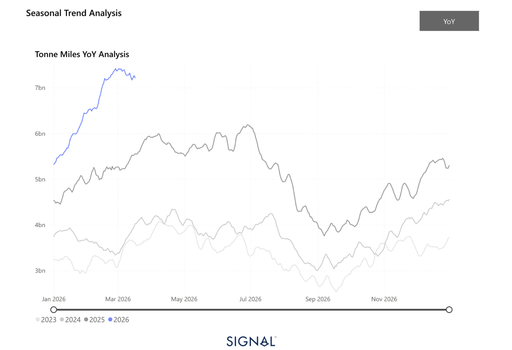
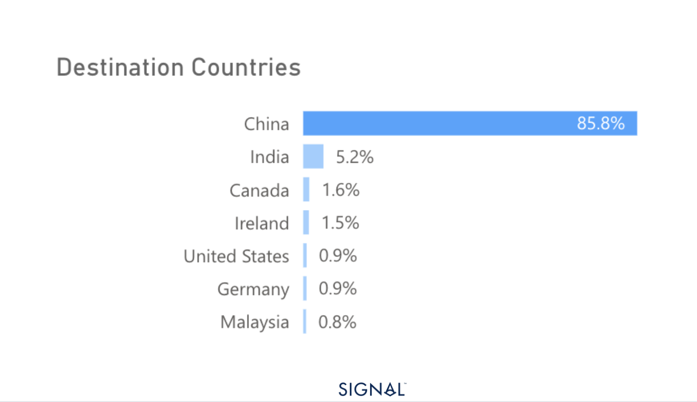
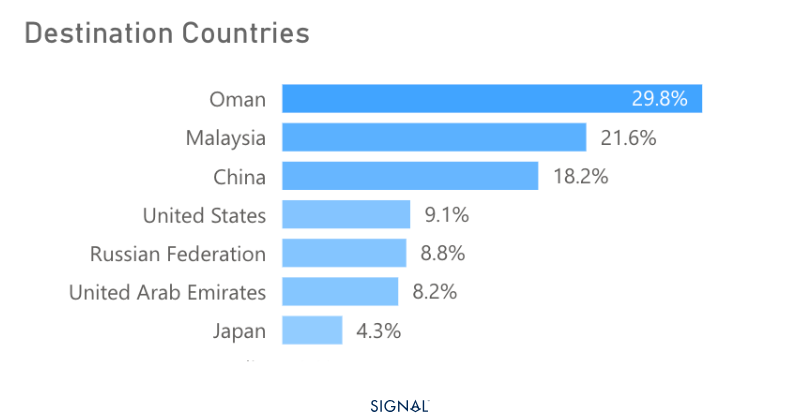

# COMMODITY RADAR | Spotlight: Bauxite

**Date**: March 18, 2026 | **Category**: Minor Bulk | **Section**: Monitors | **Source**: [https://www.thesignalgroup.com/weekly-market-monitor/bauxite-flows-are-redirected-as-the-war-in-the-arabian-gulf-closes-the-strait-of-hormuz](https://www.thesignalgroup.com/weekly-market-monitor/bauxite-flows-are-redirected-as-the-war-in-the-arabian-gulf-closes-the-strait-of-hormuz)

---

## COMMODITY RADAR | Spotlight: BAUXITE

## Bauxite flows are redirected as the war in the Arabian Gulf closes the Strait of Hormuz.

India has emerged as a key destination for bauxite as risks in the Arabian Gulf rise.

- Bauxite flows increased by 22% in February.
- Flows have increased outside of China by 36% y/y.
- Flows to China have increased by 19%.
- India was the destination for close to 1.2 mt of bauxite in February, as flows to the UAE tumble.

*Source:Bauxite carrying Capesize tonne-miles from Signal Ocean https://app.signalocean.com/dry/dynamic/timeseries_dry*

At the start of 2026, seaborne bauxite flows reached 22 mt in February, up 22% from the same period last year. China remains the largest importer of seaborne bauxite, with Signal Ocean tracking a 19% y/y increase in February.

However, the more interesting growth came from India. Bauxite flows to India from shipments departing in February quadrupled. As a result, India received around 1.2 mt of bauxite, compared to the typical 200kt to 300kt.

These additional flows would likely have been destined for the Arabian Gulf, in particular, the UAE. Given the need for low-cost power for the processing of bauxite into alumina and then for turning alumina into aluminium, the Arabian Gulf has been a growing hub for bauxite imports, as there are limited domestic supplies.

Yet, with the war in Iran and the risks of transiting the Strait of Hormuz, many February shipments of bauxite destined for the UAE were diverted to India, given its geographic location and large bauxite processing capacity. As a result, February 2026 saw India leapfrog the UAE to become the largest receiver of seaborne bauxite excluding China, taking 5.2% of global shipments according to Signal Ocean. India typically takes less than 3%.

*Source:Seaborne bauxite flow destinations in February 2026  from Signal Ocean https://app.signalocean.com/dry/dynamic/drybulkflows*

Current bauxite prices have declined by around 50% since January 2025, and with buyers from the Arabian Gulf unlikely to be buying in the market, prices will continue to face some pressure. As a result, we are seeing China increase its market share of imports, moving to over 91% in March 2026 so far. This price slump has not gone unnoticed, with the Guinean government looking at curbing production or strictly enforcing mining companies to keep outputs within their licensed tonnage. This would impact capesize demand.

Bauxite flows to India in March so far have softened, likely a result of slower buying as stocks reach adequate levels. The data is also showing an increased quantity of alumina flowing out of India, 40% up YTD, as domestic production increased due to increased bauxite flows, while domestic aluminium production hasn't kept pace. Since February, Oman has been the largest recipient of Indian alumina, as other Gulf nations are deemed too risky to deliver to, given the Iran war. Oman is located before the opening of the Strait of Hormuz. We expect India to have consistently higher exports of alumina whilst the war in Iran continues.

*Source:India alumina flows in February and March (at-time-of-writing) 2026 from Signal Ocean https://app.signalocean.com/dry/dynamic/drybulkflows*

## The war in Iran has shifted bauxite flows

India’s temporary emergence as a major importer reflects both geographic advantage and latent refining capacity, but is unlikely to be long-lived if the war ends without escalation. In the near term, weaker prices and shifting arbitrage routes will support alumina exports from India. Longer term, supply discipline from Guinea and evolving trade routes will be critical. Yet, given the expectation of aluminium demand growth, albeit modest, bauxite will continue to provide a positive pillar for capesize demand, particularly from West Africa.
