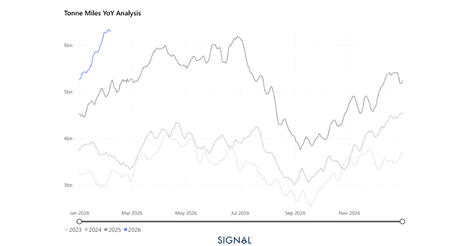
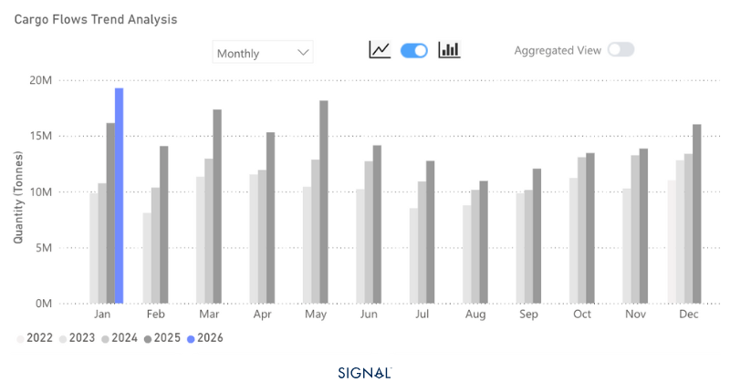
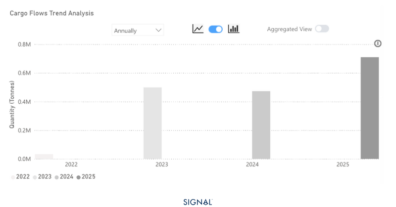

# COMMODITY RADAR | Spotlight: BAUXITE

**Date**: February 10, 2026 | **Category**: Minor Bulk | **Section**: Monitors | **Source**: [https://www.thesignalgroup.com/weekly-market-monitor/bauxite-offers-real-positivity-for-capesizes](https://www.thesignalgroup.com/weekly-market-monitor/bauxite-offers-real-positivity-for-capesizes)

---

## COMMODITY RADAR | Spotlight: BAUXITE

## Bauxite offers real positivity for capesizes

Bauxite continues to climb, with a positive downstream outlook, capesize demand could feel the benefit.

- Bauxite flows increased by 18% in 2025.
- Flows have increased outside of China by 1% y/y.
- Flows to China have increased by 22%.
- 2026 has seen further expansion so far, as January flows up 12% y/y. Deteriorating domestic bauxite quality in China and a rise in alumina production for export could help to continue the increase.

*Source:Bauxite carrying Capesize tonne-miles from Signal Ocean*

Bauxite was the best performing of the three capesize demand-driving commodities in 2025, outpacing iron ore and coal in terms of tonne-mile growth. Bauxite flows reached 258mt, up 18% from 2024. The market is dominated on the supply side by Guinea, the origin for 68% of all the bauxite flows, and on the demand side by China, the destination for 85% of all seaborne bauxite flows on TSOP.

This trend has continued in 2026, with the full January figures showing 25mt of bauxite flows, up 12% y/y. So far, 77% of bauxite flows have originated in Guinea, with China being the destination for 86% of the tonnage.

*Signal Figure*

The first month of 2026 has seen 25mt of bauxite flows, up 14% y/y. Unsurprisingly, Guinea and China dominate in terms of origin and destination, respectively, with 77% originating from the former and 86% of global flows heading to the latter. Flows from Guinea are up 19% y/y in January 2026, equating to 19mt. This increase is matched by China’s increased imports, which are also up 19% over the same period.

China’s increased demand in 2026 is likely to continue. While the 45mt annual cap on aluminium production in China remains, domestic alumina capacity is set to expand to 119mt, 9mt higher than in 2025. This alumina is likely to find its way to Indonesia as the country rapidly expands its own aluminium production capacity.

Indonesia banned bauxite exports in 2023, in order to secure material for its own processing and then export higher-value products. The issue is that, despite such large bauxite reserves and production, alumina production capacity is too low, leading to large bauxite stockpiles that cannot be processed or exported. Indonesia reportedly relies on imports for around half of its alumina needs.

*Source:China's alumina flows to Indonesia from Signal Ocean*

## Bauxite and Simandou keep West Africa a key growth area for Capesize demand

Our view of strong bauxite demand will be a positive light for capesize demand at a time when both iron ore and coal are showing signs of structural decline. What’s more is that with the opening of the Simandou iron ore mine in Guinea, West Africa has further solidified itself as a key origination area for cape demand.

For subscription to our FREE weekly market trends email,please click here, or contact us at: research@thesignalgroup.com

- Republishing is allowed with an active link to the source
