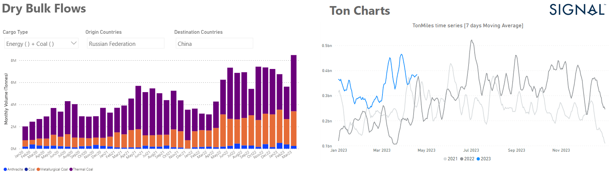

# Weekly Dry Bulk Market Monitor: Week 16, 2023

**Date**: May 18, 2024 | **Category**: Dry bulk | **Section**: Monitors | **Source**: [https://www.thesignalgroup.com/weekly-market-monitor/chart-of-the-week-dry-bulk-flows-russian-coal-to-china](https://www.thesignalgroup.com/weekly-market-monitor/chart-of-the-week-dry-bulk-flows-russian-coal-to-china)

---

## Chart of the Week Dry Bulk Flows: Russian coal to China

*Data Source: TheSignal OceanPlatform, Dry Bulk Demand & Flowshttps://app.signalocean.com/dry/reports/ton-charts-dry-dynamic/drybulkflows*

In the third week of April, there is still more momentum in the larger vessel categories, with Russian coal flows to China leading to an increase in ton-miles to higher levels than in the previous two years. As can be seen in the chart above using Signal Ocean data, the volume of Russian coal flows to China in March 2023 is up 170% compared to a similar period last year, while the coming trend appears to be fuelling optimism for stronger Chinese coal demand from the Russian Pacific. Meanwhile, the grain segment is filled with Ukrainian doubts about the future of the Black Sea grain trade with Russia, which seems to be blocking the inspection of ships.

In the iron ore market, it is interesting to see that India's iron ore exports almost doubled year-on-year to 11.59 million metric tonnes (mt) in January-March FY23, on the back of pent-up demand from China, the country's top market, and improved supplies following the lifting of export duties in mid-November, data analysed by business-line show.

For the latest updates and insights, make sure to visit theSignal Ocean Newsroomwebsite page. Clickhere to request a demo.

For subscription to our FREE weekly market trends email, please contact us: research@thesignalgroup.com
