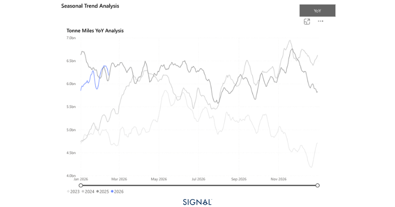
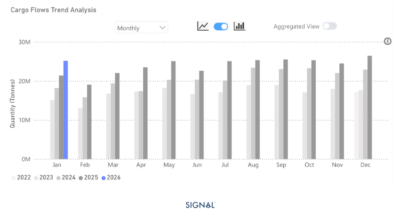
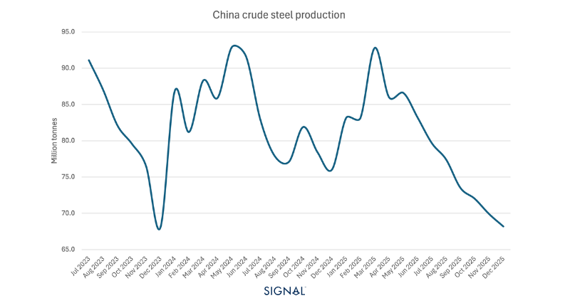

# COMMODITY RADAR | Spotlight: STEEL

**Date**: February 16, 2026 | **Category**: Minor Bulk | **Section**: Monitors | **Source**: [https://www.thesignalgroup.com/weekly-market-monitor/china-drives-growth-in-steel-flows-as-the-rest-of-the-world-sees-a-small-contraction](https://www.thesignalgroup.com/weekly-market-monitor/china-drives-growth-in-steel-flows-as-the-rest-of-the-world-sees-a-small-contraction)

---

## COMMODITY RADAR | Spotlight: STEEL

## China drives growth in steel flows as the rest of the world sees a small contraction

Steel flows climb in 2025 as weak domestic demand in China leads to greater reliance on export markets. This trend has continued into 2026.

- Steel flows in 2025 are 5% higher than in 2024.
- China has driven the increase in outward steel flows, as its exports rose by 15%.
- Elsewhere, outward steel flows fell 1% y/y.
- January 2026 has seen global steel flows 2% higher than the same period last year.

‍

*Source:Steel-driven tonne-miles from Signal Ocean*

Global steel flows reached 283mt in 2025, according to Signal Ocean, an increase of over 5%. This growth was driven entirely by China, which saw outward steel flows reach 119mt, up 15% y/y. China increased its share of steel flow origins from 38% in 2024 to 42% in 2025. Outside of China, combined outward flows fell 1% to 164mt.

The rise in Chinese steel flows indicates how weak domestic steel demand was in 2025. Typically, steel exports make up between 8-10% of total Chinese steel production; this almost jumped to over 12% in 2025. There is an interesting relationship between Chinese crude steel production and Chinese steel exports. When crude steel production is high, exports are typically lower, and when production is weak, exports tend to surge. Exports, therefore, function as the adjustment mechanism when China’s domestic steel market is weak.

We are yet to see China’s crude steel production figures for January 2026, but TSOP has recorded China's steel flows to be up 12% y/y, indicating that crude steel production is likely to be down. CNY also plays a big part in weak production during the first two months of any year.

*Source:China steel exports from Signal Ocean*

Despite expectations of lower steel production in China in 2026, the subsequent typical increase in steel exports will face some headwinds. The most notable is the new structure of export licensing in the country. This new legislation covers 245 steel products, a large increase from the 66 carbon steel products listed in the 2007 version.

Global steel demand is expected to grow modestly in 2026, with stronger performance concentrated in certain regions. This could put pressure on export opportunities due to a smaller pool of destinations. That being said, India is expected to increase consumption by over 9% in 2026. China typically accounts for only 3% of its steel exports to India, but with such a rise in demand forecast, 2026 could see a higher proportion of Chinese steel finding its way to India.

*Source:China crude steel production from the World Steel Association*

## China's steel exports will drive supramax demand

Steel exports make up over 41% of China’s dry bulk seaborne exports, according to TSOP. From that figure, 67% is shipped by supramax. Weaker steel exports from China would weigh on supramax demand in the region. We could see more steel shipped in Handysize vessels, too, if exports become smaller in size and more opportunistic in nature.

For subscription to our FREE weekly market trends email,please click here, or contact us at: research@thesignalgroup.com

- Republishing is allowed with an active link to the source
