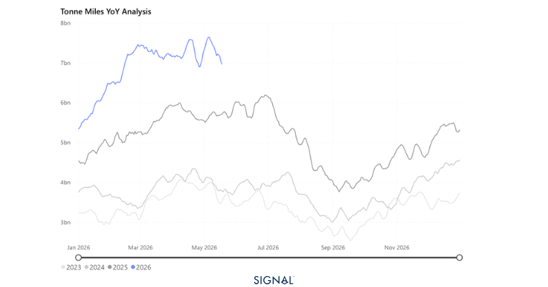
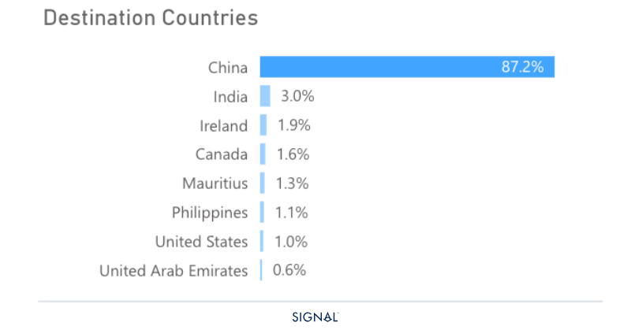
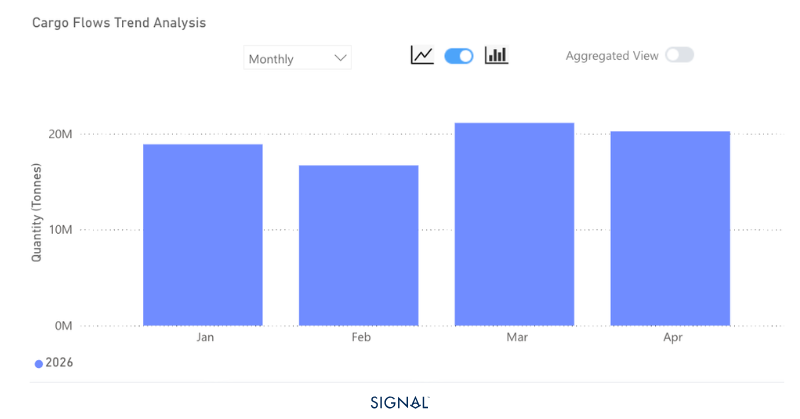

# COMMODITY RADAR | Spotlight: Bauxite

**Date**: May 19, 2026 | **Category**: Minor Bulk | **Section**: Monitors | **Source**: [https://www.thesignalgroup.com/weekly-market-monitor/china-drives-increased-bauxite-flows-but-guineas-cutback-could-drag-on-growth](https://www.thesignalgroup.com/weekly-market-monitor/china-drives-increased-bauxite-flows-but-guineas-cutback-could-drag-on-growth)

---

## COMMODITY RADAR | Spotlight: BAUXITE

## China drives increased bauxite flows, but Guinea's cutback could drag on growth

India has emerged as a key destination for bauxite as risks in the Arabian Gulf rise.

- Global bauxite flows increased by 24% y/y in April.
- Flows to China increased by 26% y/y.
- Flows to the UAE appear to have returned in April, but are 72% lower than the same period last year.
- India continues to see higher bauxite arrivals, rising 24% y/y in April.

*Source:Bauxite carrying Capesize tonne-miles from Signal Ocean https://app.signalocean.com/dry/dynamic/timeseries_dry*

Flows of bauxite in April 2026 continued to be shaped by the blockade of the Strait of Hormuz. The most affected countries have been the UAE, typically the second-largest recipient of seaborne bauxite shipments on Signal Ocean, and India.

According to Signal Ocean, there were no bauxite shipments departing in March for the UAE. This changed in April, with Signal Ocean recording 126kt heading for the UAE, over 71% less than the same period a year earlier. The UAE typically sits as the second largest receiver of seaborne bauxite tonnage, accounting for around 3% of global flows, but in April 2026, it fell to only 0.6% of global flows.

India continues to benefit from the disruption of bauxite flows to the UAE. For Q1 2026, India received 2.5mt of bauxite, up 285% from Q1 2025, and in April, the country received 781kt, 24% more than the same month last year. This has translated into strong alumina production and subsequent export increases of over 66% from January to the end of April 2026. Elsewhere, the largest importer of bauxite, China, also saw bauxite imports grow through April, reaching 23mt, up 24% y/y.

*Source:Seaborne bauxite flow destinations in April 2026  from Signal Ocean https://app.signalocean.com/dry/dynamic/drybulkflows*

The outlook for bauxite remains positive, given expectations of aluminium demand growth of close to 2% in 2026. There are some potential headwinds, however, with bauxite demand in the Arabian Gulf affected by the Strait of Hormuz blockade and Guinea's move to cut export volumes to boost prices.

The cut in Guinea export volumes was introduced in April but has, to date, done little to stop the growth in bauxite flows. The risk is that without meaningful reductions of exports and better prices for bauxite, the ministry will enforce stricter controls on exports. Producer’s margins have already been squeezed by robust supply growth and the shock of surging freight rates in 2026.

The most notable evidence of this is a recent announcement by Guinea that it would consider limiting bauxite exports to 150mt in 2026, down from 178mt in 2025. This would free up around 46 capseize vessels and weigh on the high-performing capseize freight market seen in 2026.

*Source:Exports of bauxite from Guinea in 2026  from Signal Ocean https://app.signalocean.com/dry/dynamic/drybulkflows*

## ‍Guinea’s approach could shift how capes perform in 2026 H2

Looking ahead, the bauxite market outlook is broadly constructive but increasingly bifurcated by risk. China's sustained import growth provides a reliable demand floor, while India's rise as a destination market is structural rather than purely opportunistic, underpinned by a multi-year alumina refinery expansion pipeline from Vedanta and Hindalco that will continue to draw seaborne bauxite regardless of Arabian Gulf normalisation. The key swing factor remains Guinea. If Conakry enforces its 150mt export cap, the knock-on effect for Capesize demand could be significant, unwinding some of the freight market's strong 2026 performance.
