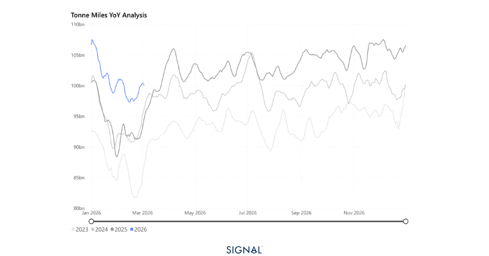
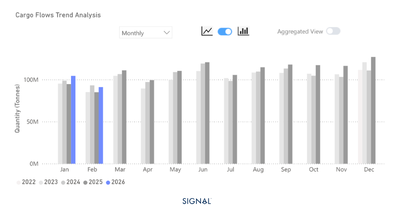
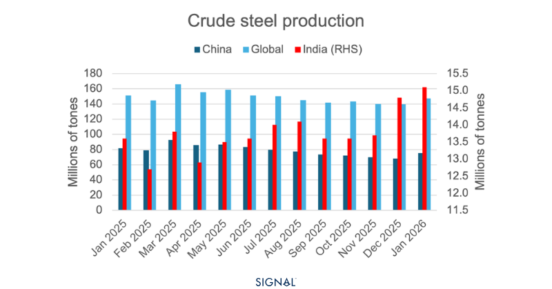

# COMMODITY RADAR | Spotlight: IRON ORE

**Date**: March 3, 2026 | **Category**: Minor Bulk | **Section**: Monitors | **Source**: [https://www.thesignalgroup.com/weekly-market-monitor/china-stays-hungry-for-iron-ore-as-simandou-ramps-up](https://www.thesignalgroup.com/weekly-market-monitor/china-stays-hungry-for-iron-ore-as-simandou-ramps-up)

---

## COMMODITY RADAR | Spotlight: IRON ORE

## China stays hungry for iron ore as Simandou ramps-up

China continues to fill its iron ore stocks as Simandou export starts to climb, and the wet season in Brazil limits export growth

- Iron ore flows in January and February 2026 were up 8% y/y.
- China drives increased demand. January iron ore flows to China rose 10% to 105mt. In February, flows increased by 7%.
- Flows destined to ports outside of China rose by 1% in January and by 11% in February.
- Despite the broader sentiment of lower demand from the steel production sector, and already very high iron ore port stock levels, March flows of iron ore into China currently look to be up y/y.

*Source:Iron ore-driven tonne-miles from Signal Ocean*

Global iron ore flows reached 8% higher in both January and February 2026 than in the same month a year ago. Growth was driven by an 11% increase in flows to China, marking a record high for Chinese iron ore imports on TSOP.  Outside China, flows grew by only 1% in January due to weaker demand for steel in Japan, Korea, and Europe.  In February, however, demand surged in these regions, and Signal Ocean recorded an 11% increase in flows.

Flows from Australia surged in January 13% y/y, while flows from Brazil remained relatively flat with growth of less than 1%. Many in the market were looking to see what flows from Guinea would look like as the Simandou project began exports in late 2025. TSOP recorded January shipments at 344kt, a little over a third of the 1mt expected to be shipped monthly once the mine is fully ramped-up. All of the tonnage from Guinea flowed to China.

*Source:Global iron ore flows to China  from Signal Ocean*

‍

Despite this, China is not expected to consume more iron ore in 2026. Domestic iron ore production fell by over 4% in 2025, so some increases in iron ore imports should be expected. However, given the 2% increase in 2024 and the 4% increase in 2025, lower crude steel production will continue to reduce the incentive to import higher volumes of iron ore.

There are some pockets of growth in iron ore demand forecast, but these remain small in absolute terms. A more notable dynamic is how supply flows may be reshaped by the ramp-up of Simandou in Guinea. Rainfall typically reduces dry bulk loading rates in both Guinea and Brazil. Brazil’s wettest months are generally January to April, while Guinea experiences peak rainfall from July through October. As a result, we could see limited growth, or even y/y declines in exports during each region’s wettest months as the other capitalises on the seasonal advantage. This effect is likely to be most pronounced for Brazil, as Guinea’s exports ramp up from a near-zero base.

*Signal Figure*

## Guinea and Brazil will shape the Atlantic iron ore market

The continued ramp-up of Simandou remains the biggest factor in iron ore flows in 2026. Over the upcoming month, we expect Brazilian iron ore exports to remain under pressure due to the rains, while Guinea exports rise. Yet, in volume terms, Brazil will continue to export much larger volumes than Guinea.

Therefore, West Africa will drive demand for capesize vessels for the foreseeable future as iron ore and bauxite exports from Guinea rise. Guinea-to-China is also slightly longer in distance, so it would increase the tonne-miles and tonne-days of iron ore carried by Capesizes if they replaced material originating in Brazil.
