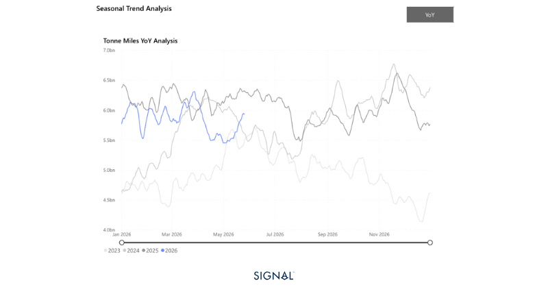
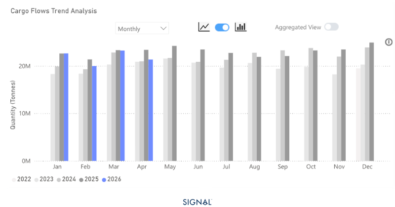
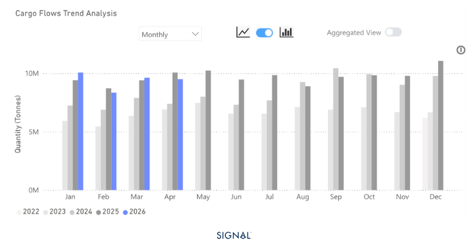

# COMMODITY RADAR | Spotlight: STEEL

**Date**: May 27, 2026 | **Category**: Major Bulk | **Section**: Monitors | **Source**: [https://www.thesignalgroup.com/weekly-market-monitor/chinese-steel-flows-face-ongoing-and-new-headwinds](https://www.thesignalgroup.com/weekly-market-monitor/chinese-steel-flows-face-ongoing-and-new-headwinds)

---

## COMMODITY RADAR | Spotlight: STEEL

## Chinese steel flows face ongoing and new headwinds

Steel flows slip into negative growth in April 2026

- Global steel flows soften 8% y/y in April 2026.
- Flows originating in China increased proportionality to 45%, from a log-run average of 38%, but in tonnage terms, fell by 4% to 10mt.
- Flows from outside of China have decreased by 11%.
- Indonesia continues to receive increased steel flows, up 11% y/y.

*Source:Steel tonne-miles from Signal Oceanhttps://app.signalocean.com/dry/dynamic/timeseries_dry*

Seaborne steel flows reached 21.4mt in April 2026, down 8% y/y and 7% m/m. The ongoing situation in the Strait of Hormuz is having a material impact on flows of Chinese steel, and has led to a y/y decline of 5% as the Arabian Gulf is effectively cut off for Chinese steel exports. China typically sends close to 11% of all its seaborne steel to the Arabian Gulf, but in April 2026, this fell to less than 2%.

Elsewhere, steel flows originating from outside of China also fell, to 11.8mt, an 11% decrease from April 2025.  Again, this decline was exacerbated by the issues within the Strait of Hormuz.

There was an increase in steel flows destined for Indonesia. The rise was close to 10% from the previous year, reaching 1.5mt. Massive domestic infrastructure spending and development have led to a steady surge in steel imports into Indonesia.

*Source:Seaborne steel flows  from Signal Oceanhttps://app.signalocean.com/dry/dynamic/drybulkflows*

‍

Looking ahead, the near-term outlook for seaborne steel flows remains challenging, with headwinds compounding on multiple fronts. The Strait of Hormuz disruption shows little sign of near-term resolution, and with Chinese exports to the Arabian Gulf running at a fraction of typical volumes, a swift recovery in overall flow tonnage looks unlikely by the end of Q2.

Critically, a new domestic pressure point has emerged. The gas explosion at a coking coal mine in China has tightened the domestic coal supply outlook and pushed coking coal prices sharply higher. For Chinese steel mills, which are already navigating weak domestic demand and thin margins, this represents a meaningful cost shock. Blast furnace utilisation rates, which had shown tentative signs of recovery, are now at risk of renewed curtailment as steel production economics deteriorate. Reduced furnace activity translates directly into lower steel output, and by extension, softer export availability in the months ahead.

The net effect is a market caught between supply-side constraints and demand displacement. While Indonesia remains a relatively bright spot, underpinned by structural infrastructure demand, it is unlikely to absorb the broader volume shortfall. Barring a rapid de-escalation in the Hormuz corridor and a stabilisation in Chinese coal prices, seaborne steel flows are on track to remain in negative year-on-year territory well into Q3 2026.

*Source:Chinese steel exports from Signal Oceanhttps://app.signalocean.com/dry/dynamic/drybulkflows*

## China’s steel exports face mounting challenges

The months after April 2026 mark a notable inflection point for seaborne steel markets. A confluence of geopolitical disruption and domestic cost pressures has pushed global flows into negative growth territory, with little near-term relief in sight. The Strait of Hormuz remains the dominant structural headwind, effectively severing a key Chinese export corridor, while rising coking coal costs threaten to suppress blast furnace activity and tighten export availability further. Indonesia stands out as a pocket of resilience, but it cannot offset broader weakness. Signal Ocean data points to continued pressure on flow growth through Q3, with a recovery contingent on geopolitical stabilisation and a normalisation of Chinese input costs.
