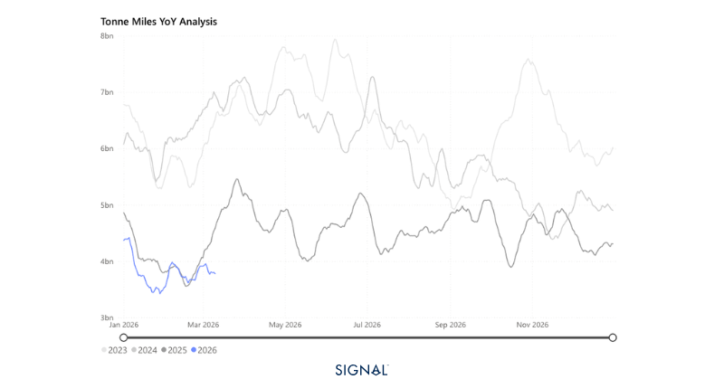
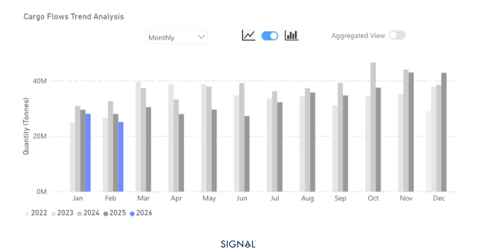
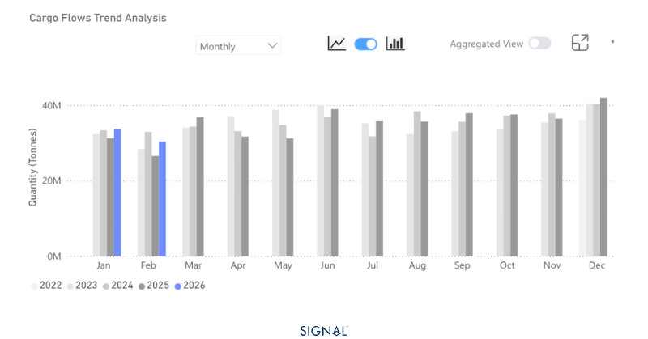

# COMMODITY RADAR | Spotlight: COAL

**Date**: March 11, 2026 | **Category**: Minor Bulk | **Section**: Monitors | **Source**: [https://www.thesignalgroup.com/weekly-market-monitor/coal-demand-could-be-supported-by-war-in-the-arabian-gulf](https://www.thesignalgroup.com/weekly-market-monitor/coal-demand-could-be-supported-by-war-in-the-arabian-gulf)

---

## COMMODITY RADAR | Spotlight: COAL

## Coal demand could be supported by war in the Arabian Gulf

Reduced coal demand in China and lower production quotas in Indonesia have weighed on seaborne coal flows. Yet, with restricted oil and gas flows from the Gulf, coal demand will see some support.

- Global seaborne coal flows fell over 1% in February 2026.
- Coal flows to China decreased by over 10% in February 2026.
- Indonesia's coal exports were almost 13% lower in February 2026.
- Markets expected coal demand to soften through 2026 as China imported less, but given the war in the Gulf, demand for coal may see some support as oil and gas availability is restricted.

*Source:Coal carrying Capesize tonne-miles from Signal Ocean https://app.signalocean.com/dry/dynamic/timeseries_dry*

‍

According to Signal Ocean, China imported 25mt of seaborne coal in February 2026, a 10% decrease from the previous year. This drove the global 1% fall in coal seaborne flows. There were pockets of growth, with India increasing seaborne coal flows by nearly 9% to 19 Mt in February.

The rise in flows to India results from stronger industrial demand, particularly in the steel sector. India is set to increase crude steel production in 2026 by 9%, meaning the country will need more coal for metallurgical processes as well as for power generation.

Seasonal factors are also contributing. India typically experiences peak electricity demand during the summer months from April to June, which leads to a build-up in coal imports during the first three to four months of the year. With power demand expected to be higher this year, coal imports have increased accordingly, and we expect March and April imports to follow suit.

*Source:China thermal coal imports from Signal Ocean https://app.signalocean.com/dry/dynamic/drybulkflow*

‍

The outlook for seaborne coal flows in 2026 was initially negative. China, which accounts for nearly 30% of global seaborne coal volumes, was expected to continue cutting imports as renewable energy gained a larger share of domestic power generation.

The war in the Arabian Gulf, however, may alter this trajectory. Disruptions at the Strait of Hormuz have tightened global LNG and oil markets, driving higher fuel costs. In Asia, price-sensitive nations are likely to respond by increasing coal consumption. India, where LNG typically contributes 6–10% of electricity generation but peaks between April and June, is a key example. With LNG prices surging ahead of the summer demand season, coal imports are expected to rise to offset gas shortfalls and meet growing power requirements.

In Europe, coal demand remains structurally constrained, though temporary increases cannot be ruled out if gas prices remain elevated.

Australia and South Africa are well positioned to supply additional volumes. Indonesian production, previously curtailed to stabilize prices, could potentially expand if rising demand and higher revenues incentivize it, although no concrete evidence of such a reversal has emerged at the time of writing.

Overall, geopolitical disruption in the Arabian Gulf has the potential to reshape 2026 seaborne coal flows, boosting imports into Asia while leaving Europe largely unaffected but with strong upside.

*Source:Australia and South Africa coal exports from Signal Oceanhttps://app.signalocean.com/dry/dynamic/drybulkflows*

## War in the Arabian Gulf will affect coal’s trajectory in 2026

Seaborne coal flows in 2026 face a complex mix of structural and short-term drivers. China’s declining imports continue to weigh on global volumes, while Indonesian export cuts have tightened supply. However, the war in the Arabian Gulf has disrupted LNG and oil markets, supporting coal demand in price-sensitive Asian markets, particularly India. Seasonal factors and rising industrial and power requirements are likely to sustain import growth in the coming months. Australia and South Africa are best positioned to meet additional demand, while Europe remains structurally constrained. Overall, geopolitical tensions create upside risks for seaborne coal flows in Asia

‍
