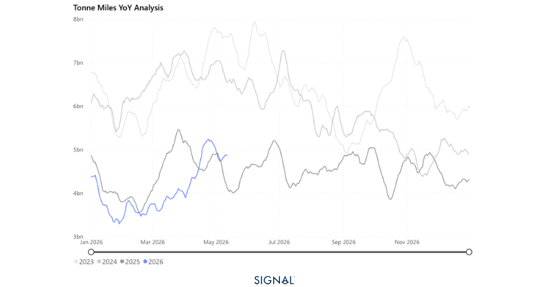
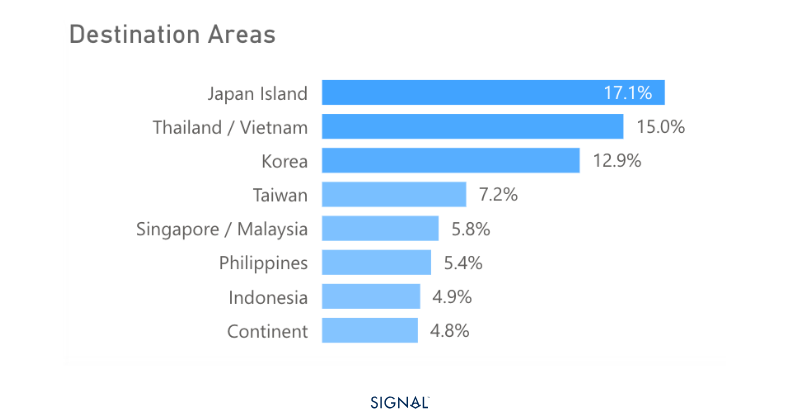
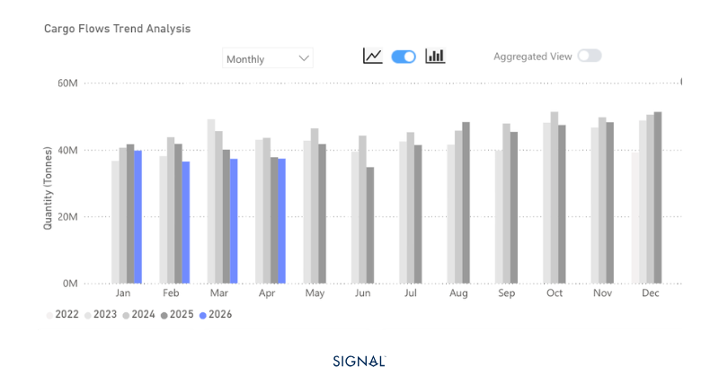

# COMMODITY RADAR | Spotlight: Coal

**Date**: May 13, 2026 | **Category**: Minor Bulk | **Section**: Monitors | **Source**: [https://www.thesignalgroup.com/weekly-market-monitor/coal-demand-in-april-rises-in-line-with-our-expectations](https://www.thesignalgroup.com/weekly-market-monitor/coal-demand-in-april-rises-in-line-with-our-expectations)

---

## COMMODITY RADAR | Spotlight: COALCoal demand in April rises in line with our expectations

The war in Iran and subsequent constriction of energy commodity flows appear to have been supportive of coal demand, as flows in April rise y/y for only the second time in 2026 so far.

- Global seaborne coal flows increased by 6% y/y in April 2026.
- Coal flows to China and India decreased by over 13% in April 2026.
- The increase was driven by flows to Japan, the Republic of Korea, and Vietnam, which saw combined flows increase by 22% y/y in April 2026.
- The disruption of energy commodity flows from the Gulf, particularly LNG, has led large energy-consuming nations to seek coal to secure power requirements.

*Source:Coal carrying Capesize tonne-miles from Signal Oceanhttps://app.signalocean.com/dry/dynamic/timeseries_dry*

Signal Ocean recorded global seaborne coal flows at 115mt in April 2026, up 6% y/y, marking only the second month in 2026 so far that coal flows have seen a y/y increase. This rise came despite the two largest coal importers, China and India, both seeing declines of 16% and 11%, respectively. China and India typically account for 37% of total seaborne coal demand.

The drop in Indian coal imports was unexpected and was offset by increases in domestic production and changes in blending requirements at Indian power stations. Imports did rise m/m, by 3%, as India moves to a higher seasonal power demand period, driven by cooling demand.

The rise globally, therefore, has come from surging demand in many other countries. As we expected, the countries that saw greater coal flows have been those seeking to secure inputs for domestic power generation, as LNG flows in particular have been restricted due to the war in Iran. So flows to Japan, the Republic of Korea, and Continental Europe have seen large increases y/y in April.

*Source:Coal destination areas in April 2026, excluding China and India, from Signal Ocean https://app.signalocean.com/dry/dynamic/drybulkflows*

The outlook for coal through 2026 continues to remain closely tied to the Strait of Hormuz. While Europe may be entering the summer months, where power demand is lower, Japan and the Republic of Korea typically see power demand, from cooling, rise from June. The same is true for India, which may try to offset import demand by continuing to ramp up domestic coal production. The largest importer, China, will likely continue to see coal demand wane as the nation increases renewable energy production and cuts back steel production.

In terms of supply, Indonesia remains the top exporter globally. At the start of 2026, the Indonesian government pushed for reduced coal output in order to support prices as global demand was expected to be weak. Yet, in an attempt to capitalise on the increased demand for coal following the war in Iran, the Indonesian government has relaxed export licensing for coal producers. This would allow for more material to hit the market and support Panamax demand in the South Pacific.

*Source:Indonesian coal exports from Signal Oceanhttps://app.signalocean.com/dry/dynamic/drybulkflows*

## War in Iran remains the most impactful factor on coal performance

The Iran conflict has effectively reshuffled the global energy import map, with LNG-dependent economies pivoting to coal to shore up power security, a dynamic we expect to persist through Q3 at minimum. China's structural retreat from seaborne coal imports, driven by renewables expansion and weaker steel output, will continue to act as a ceiling on any sustained demand rally. The wildcard remains Indonesia: if relaxed export licensing translates into a meaningful supply response, freight markets could face headwinds even as import volumes rise elsewhere. For now, the balance of risks points to continued y/y growth in global seaborne coal flows through H2 2026, contingent on the Strait of Hormuz remaining constrained and no significant demand-side deterioration in Japan, Korea, or Vietnam.
