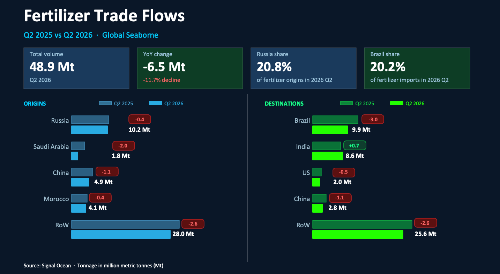
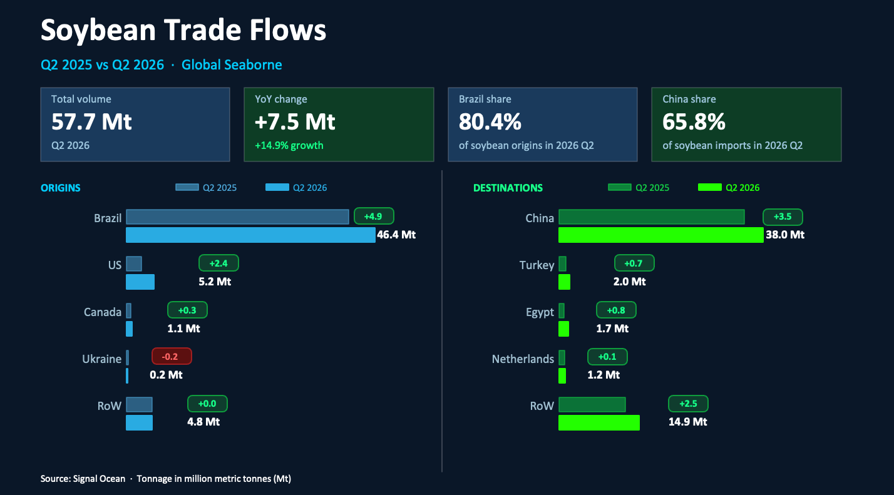
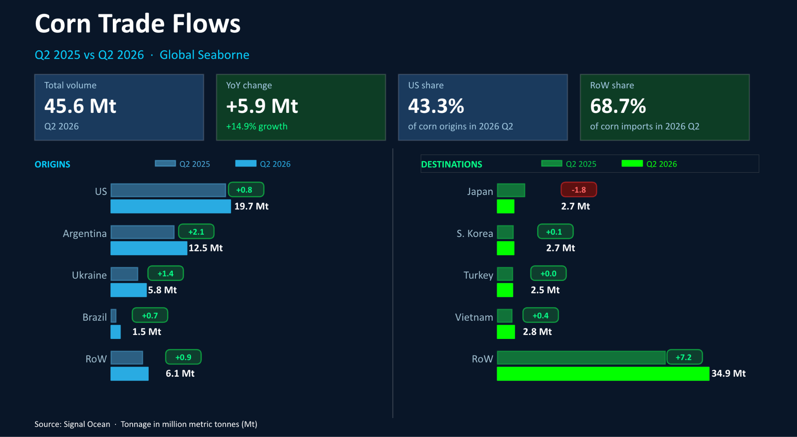

# COMMODITY RADAR | Agriculture Look Back 2026 Q2

**Date**: July 28, 2026 | **Category**: Major Bulk | **Section**: Monitors | **Source**: [https://www.thesignalgroup.com/weekly-market-monitor/commodity-radar-agriculture-look-back-2026-q2](https://www.thesignalgroup.com/weekly-market-monitor/commodity-radar-agriculture-look-back-2026-q2)

---

## COMMODITY RADAR | Agriculture Look Back 2026 Q2

The second quarter of 2026 saw strong growth in soybean and corn flows driven by a record Brazilian harvest, while fertilizer flows fell sharply as Arabian Gulf supply disruptions hit Saudi Arabian exports and Brazilian import demand softened.

- Global seaborne fertilizer flows fell 12% to reach 48.9 Mt in 2026 Q2
- Global seaborne soybean flows grew by nearly 15% to 57.7 Mt in 2026 Q2
- Global seaborne corn  flows grew by over 14% to 45.6 Mt in 2026 Q2

## Global seaborne bulk fertilizer

Global seaborne fertilizer flows declined by 11.7% y/y to 48.9 Mt in Q2 2026. All major exporting regions recorded lower shipments, with Saudi Arabia accounting for the largest decline, as exports fell by around 2 Mt. The Arabian Gulf is one of the world's most important fertilizer exporting regions, and shipments were significantly disrupted by the conflict involving Iran and the resulting disruption to shipping through the Strait of Hormuz.

Among the largest importers, only India recorded growth, as buyers accelerated purchases ahead of the peak kharif planting season. Elsewhere, tighter supply and elevated prices weighed on import demand, with buyers delaying purchases or sourcing from alternative exporting regions where possible.

*Source:Seaborn bulk fertilizer flows origins and destinations from Signal Oceanhttps://app.signalocean.com/dry/dynamic/drybulkflows*

## Global seaborne bulk soybean

Global seaborne soybean flows increased by 14.9% year-on-year to 57.7 Mt in Q2 2026, supported by strong export availability from South America. Brazil's large soybean harvest enabled the country to ship an additional 4.9 Mt compared with the same period a year earlier, reinforcing its position as the leading global supplier during the first half of the year. U.S. exports also increased, supported by a low comparison base in Q2 2025 and renewed Chinese buying interest.

Of the 7.5 Mt increase in global soybean flows, almost half was directed to China, where imports rose by 3.5 Mt as buyers capitalised on competitive Brazilian prices following the strong harvest.

*Source:Seaborn bulk soybean  flows origins and destinations from Signal Oceanhttps://app.signalocean.com/dry/dynamic/drybulkflows*

## Global seaborne bulk corn

Global seaborne corn trade expanded by 14.6% year-on-year to 45.6 Mt during the second quarter of 2026. Higher shipments were observed across every major exporting hub, led by Argentina, where volumes rose by 2.1 Mt over the previous year. Robust harvests and enhanced export surpluses within the primary producing nations underpinned this upward trend in international trade.

The bulk of this surplus was utilized by buyers outside the four largest traditional markets. China emerged with the most significant gains, as its seaborne corn intake more than doubled compared to Q2 2025. This surge was driven by a combination of stock rebuilding, sustained demand for animal feed, and attractive pricing that encouraged importers to secure competitive supplies from key global origins.

*Source:Seaborn bulk corn flows, origins, and destinations from Signal Oceanhttps://app.signalocean.com/dry/dynamic/drybulkflows*
