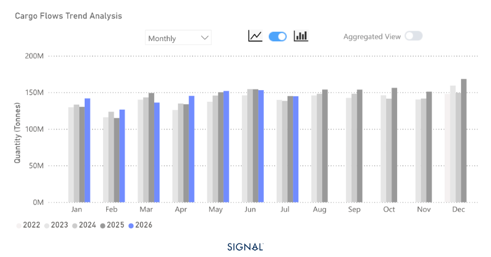
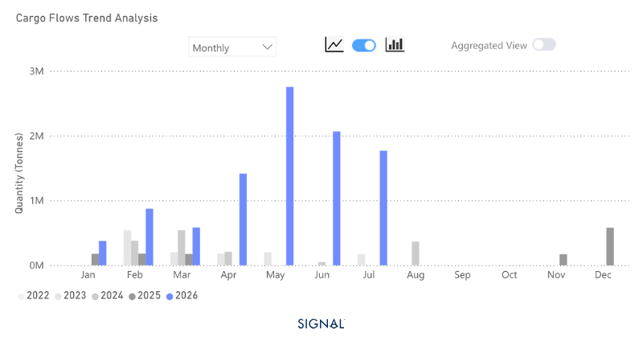
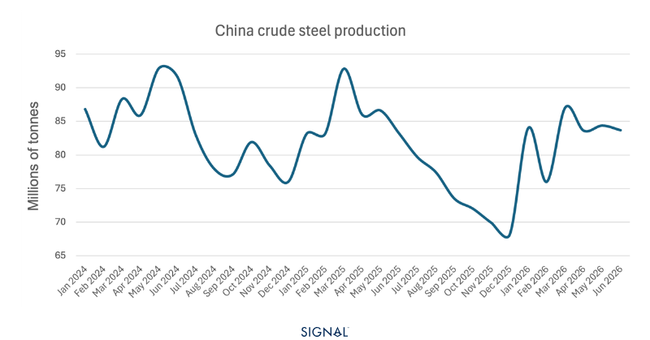

# COMMODITY RADAR | Chinese port stocks rise further as steel demand softens

**Date**: August 10, 2026 | **Category**: Major Bulk | **Section**: Monitors | **Source**: [https://www.thesignalgroup.com/weekly-market-monitor/commodity-radar-chinese-port-stocks-rise-further-as-steel-demand-softens](https://www.thesignalgroup.com/weekly-market-monitor/commodity-radar-chinese-port-stocks-rise-further-as-steel-demand-softens)

---

## COMMODITY RADAR | Spotlight: IRON ORE

## Chinese port stocks rise further as steel demand softens

Iron ore market fundamentals softened further in July as Chinese steel demand remained subdued and port inventories continued to build. While Australia's and Brazil's exports face growing headwinds, Simandou is steadily establishing itself as a new source of high-grade supply, with implications that extend beyond the iron ore market.

- Global iron ore flows in July 2026 were down 1% y/y.
- Flows to China increased by 2% y/y.
- Flows destined to ports outside of China fell by 6% y/y.
- Iron ore flows from Guinea were 1.8 mt, down from 2mt in June

*Source:Total iron ore flows from Signal Oceanhttps://app.signalocean.com/dry/dynamic/drybulkflows*

Global seaborne bulk iron ore flows reached 145 mt in July 2026, down 1% on the same period last year, but over 5% lower than the previous month. Flows to the largest seaborne bulk importer, China, increased by 2% to reach 108.2 mt. June remains the only month so far in 2026 when China imported less iron ore than the year earlier. Iron ore flows destined for ports outside of China fell by over 6% year-on-year, indicating weak demand from the steel industry.

Exports from the Simandou project have slowed over the past two months after peaking at 2.8 mt in May. The July figure was recorded at 1.8 mt. Australia and Brazil remain the dominant iron ore exporters, with exports in July 2026 of 77.4 mt and 34.3 mt, respectively.

*Source:Iron ore flows from Guinea from Signal Oceanhttps://app.signalocean.com/dry/dynamic/drybulkflows*

The latest Chinese crude steel production figures from NBS show the country is running 3% behind the volume produced at the same point last year. However, June’s monthly figure, the latest available, did show a jump of 20% from that of May, rising to 24.3% if comparing it on a daily production basis. Chinese iron ore port stocks remain elevated, having risen over the last two weeks of July to 174 mt, more than 22% higher than the same period a year earlier.

The combination of rising port stocks and weaker demand from the steel industry is expected to ripple back and put pressure on iron exports from both Brazil and Australia, with Australia being the most likely to face the more immediate challenges due to its lower iron ore quality. The Simandou project will continue its slow and controlled ramp-up and, given the higher iron ore quality, likely cement itself as the preferred source of high-quality feed for the Chinese steel industry.

Despite the expected slowdown in iron ore demand going forward, the capesize market is well positioned to benefit. Any tonnage replaced by iron ore from Simandou represents a significant increase in tonnes-miles, which will help to support capesize market rates.

*Source:China crude steel production from NBShttps://data.stats.gov.cn/dg/website/page.html#/pc/national/en/monthData*

## Market continues to be shaped by slower ore demand but stronger tonne-miles

Iron ore demand is losing momentum, but the implications for shipping are more nuanced than the headline volumes suggest. Elevated Chinese port inventories and softer steel production point to weaker import requirements in the months ahead, creating downside risks for Australian and Brazilian exports. At the same time, Simandou's gradual ramp-up is beginning to reshape trade flows rather than simply add supply.

As higher-grade Guinean ore captures a larger share of Chinese imports, average voyage distances increase, supporting tonne-mile demand even if seaborne volumes soften. For the capesize market, the evolving geography of iron ore trade could partially offset weaker cargo demand, reinforcing the growing divergence between cargo volumes and vessel demand.
