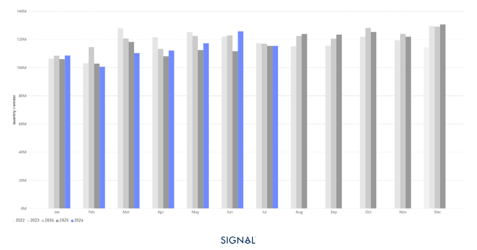
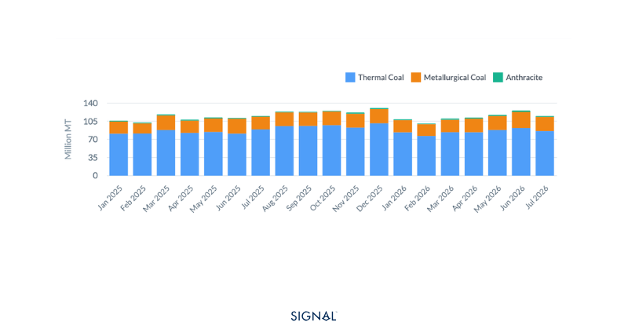
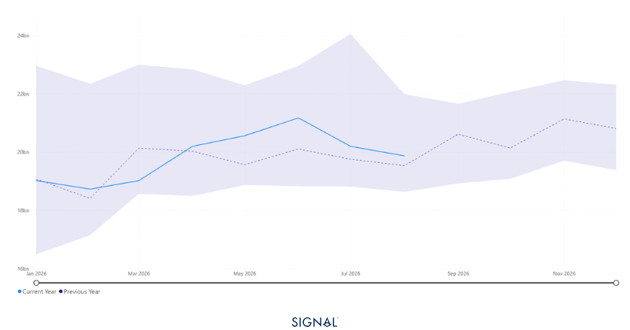

# COMMODITY RADAR | Divergence in the coal market offers opportunities

**Date**: August 18, 2026 | **Category**: Major Bulk | **Section**: Monitors | **Source**: [https://www.thesignalgroup.com/weekly-market-monitor/commodity-radar-divergence-in-the-coal-market-offers-opportunities](https://www.thesignalgroup.com/weekly-market-monitor/commodity-radar-divergence-in-the-coal-market-offers-opportunities)

---

## COMMODITY RADAR | Spotlight: COAL

## Divergence in the coal market offers opportunities

Global seaborne coal flows mask a sharp divergence between thermal and metallurgical coal markets. Thermal coal volumes declined as weaker European and U.S. demand offset resilient Asian imports, while met coal flows surged on stronger demand from China and Japan. Looking ahead, seasonal power demand and Q3 steel procurement should keep coal trade and associated tonne-miles elevated through August.

- Global seaborne coal flows increased by 1.0% y/y to reach 116.5 mt in July 2026.
- Global seaborne thermal coal flows fell 2.3% to 87.3 mt in July 2026.
- Global seaborne met coal jumped 11.8% to reach 27.2 mt in July 2026.
- China remains the top destination for thermal coal, accounting for 32% of market share in July 2026.
- India remains the top destination for met coal, accounting for just under 20% of market share in July 2026.

*Source:Total coal flows from Signal Oceanhttps://app.signalocean.com/dry/dynamic/drybulkflows*

Global seaborne coal flows were 116.5 mt in July 2026, up 1% y/y, a small change overall, yet the underlying data below the headline figure points to the two main coal types performing very differently.

Thermal coal flows declined by over 2% to 87.3 million tonnes, while metallurgical coal rose nearly 12% to 27.2 million tonnes. Notably, Asian thermal coal imports remained robust through July, with the top four importers (China, India, Japan, and South Korea) experiencing an 18.3% year-over-year increase. These regions continue to use coal to stabilise grid infrastructure during the typically high power demand summer months, when domestic and industrial cooling is ramped up.

Therefore, the drag on the global demand for seaborne bulk thermal coal flows has come from other regions, mostly Europe and the U.S. These regions have shifted to using a greater proportion of renewables in the energy mix, firstly, and secondly are preferring to run down domestic coal stockpiles rather than enter the market.

Met coal flows in July surged despite India, the largest met coal importer, seeing a decline of 18% y/y. The increase was driven by flows to Japan and China, which saw y/y increases of 24% and 30% respectively. The reasons for increased flows are slightly different, with Japan’s steel sector expected to have begun to turn a corner and China looking to replace volumes that domestic coal mining is missing.

*Source:Met coal flows vs thermal coal flows from Signal Ocean https://app.signalocean.com/dry/dynamic/drybulkflows*

Looking ahead, Signal Ocean data shows that August met coal flows typically increase m/m, as many steel mills open their Q3 procurement budgets. Given met coal flows are currently running close to 6% higher than the same period last year, it is expected that flows in August 2026 will be above that of the same month last year. This is despite weak global steel production, which WSA has currently 0.7% behind the same period last year.

The outlook for thermal coal is similarly positive, particularly with regard to demand from the big four importers. China, Japan and South Korea are experiencing heatwaves, leading to a rising demand for power for cooling. The heat and drought in India have led to much lower hydropower output and more reliance on coal-fired power. This is unlikely to reverse in the very near term.

The knock-on effects for shipping are that tonne-miles of coal-carrying vessels are likely to remain above 2025 levels and may peak above 2023, for the first time this year.

*Source:Tonne-miles of coal-carrying vessels from Signal Oceanhttps://app.signalocean.com/dry/dynamic/timeseries_dry*

## Diverging Coal Markets Support Shipping Demand

While headline seaborne coal volumes continue to show only modest growth, the divergence between thermal and metallurgical coal is becoming increasingly important for both commodity and freight markets. Thermal coal demand is being sustained by weather-driven power generation across Asia, even as Europe and the U.S. continue their structural decline in coal consumption. At the same time, stronger metallurgical coal imports into China and Japan are offsetting weaker Indian demand, highlighting shifting regional dynamics rather than a broad-based recovery in steel markets. Looking ahead, seasonal procurement by steel mills, continued summer power demand, and tighter domestic coal availability in key markets should keep seaborne trade well supported. As a result, coal-carrying tonne-miles are likely to remain above 2025 levels, providing a constructive backdrop for Panamax and Capesize freight demand through the remainder of the quarter
