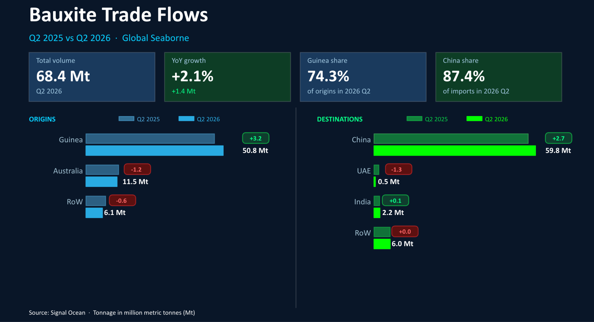
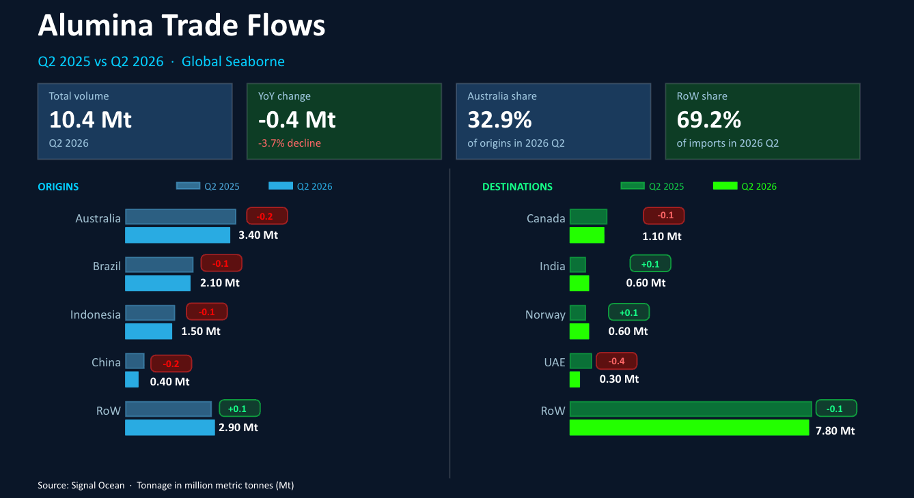
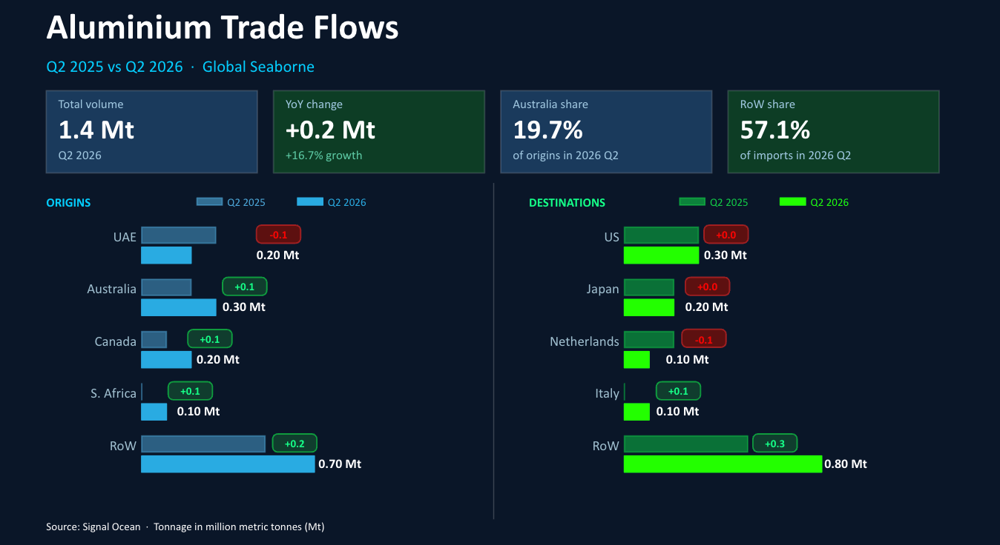

# COMMODITY RADAR | Spotlight: Aluminium Chain Q2 2026

**Date**: July 16, 2026 | **Category**: Major Bulk | **Section**: Monitors | **Source**: [https://www.thesignalgroup.com/weekly-market-monitor/commodity-radar-spotlight-aluminium-chain-q2-2026](https://www.thesignalgroup.com/weekly-market-monitor/commodity-radar-spotlight-aluminium-chain-q2-2026)

---

## Hormuz Disruption Weighs on Alumina as Aluminium Flows Surge

The second quarter of 2026 saw further disruption to the aluminium supply chain, particularly weighing on aluminia flows to the Arabian Gulf.

A surge in aluminium flows was driven by incremental increases in exports originating from Australia and Canada. The outlook for the chain remains dependent on the re-escalation of the conflict between the US and Iran.

- Global seaborne bauxite flows rose 2% to reach 68.4mt in 2026 Q2
- Global seaborne alumina flows fell by almost 4% to 9.5mt in 2026 Q2
- Global seaborne aluminium flows grew by over 16% to 1.4mt in 2026 Q2

## Global seaborne bauxite

Global seaborne bulk bauxite flows rose by 2% to reach 68.4mt in 2026 Q2. Of the two largest exporters, only Guinea saw exports increase, but this was more than enough to offset losses of exports from Australia.China and India both saw imports increase, whilst the UAE saw imports fall as major ports became inaccessible due to the conflict in the wider Gulf region.

*Source:Seaborne bauxite flows origins and destinations from Signal Ocean*

## Global seaborne alumina

Global seaborne bulk alumina trade declined by close to 4% to 10.4Mt in Q2 2026, primarily due to the closure of the Strait of Hormuz, which disrupted access for key alumina-importing nations. The loss of these buyers weighed on global trade, leading to reduced exports from several major alumina-producing countries.If the conflict continues to re-escalate, the alumina trade is likely to remain disrupted, particularly on routes through the Gulf. Over the medium term, however, Indonesia's expanding aluminium smelting capacity is expected to support stronger regional alumina demand and reshape global trade flows

*Source:Seaborne aluminal flows origins and destinations from Signal Ocean*

‍

## Global seaborne aluminium

Global seaborne bulk aluminium flows increased by 17% to reach 1.4mt in 2026 Q2. Three of the four largest export countries saw growth; the exception was the UAE, which experienced a decline of 4%, a result of disruption in the Strait of Hormuz.

The United States saw similar levels of seaborne bulk aluminium imports in 2026 Q2 as it did in 2025 Q2. This was despite an increased tariff on aluminium imports from 24% to 50% introduced in June 2025.

*Source:Seaborne aluminium flows, origins, and destinations from Signal Ocean*

Explore the data yourself:All flow figures in this report are drawn fromThe Signal Ocean Platform, where you can filter by commodity, route, and date range to track the aluminium chain in real time.Get in touchfor a walkthrough of our dry bulk flows module.
