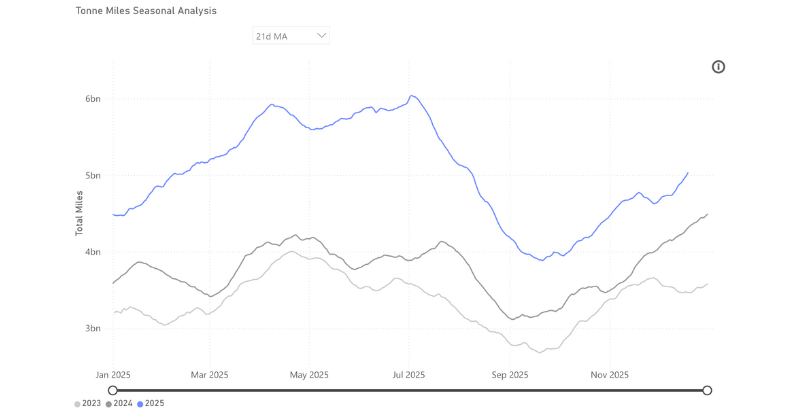
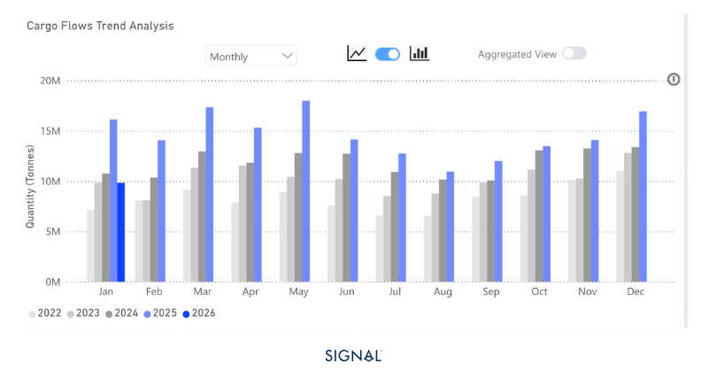
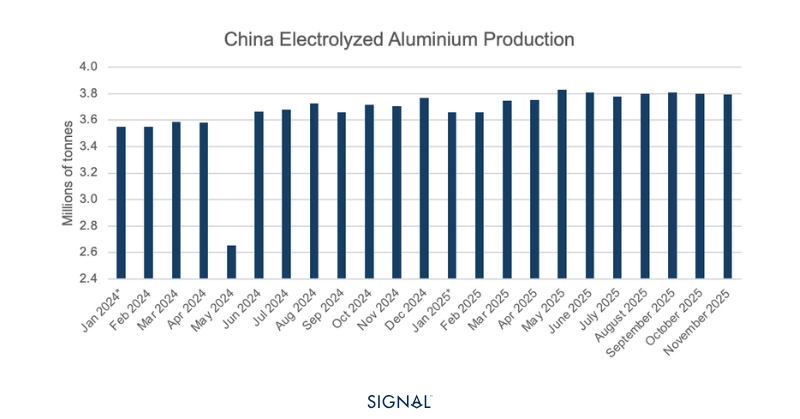
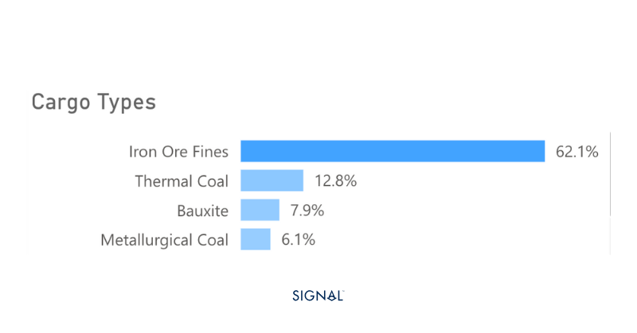

# COMMODITY RADAR | Spotlight: BAUXITE

**Date**: December 23, 2025 | **Category**: Minor Bulk | **Section**: Monitors | **Source**: [https://www.thesignalgroup.com/weekly-market-monitor/commodity-radar-spotlight-bauxite](https://www.thesignalgroup.com/weekly-market-monitor/commodity-radar-spotlight-bauxite)

---

## COMMODITY RADAR | Spotlight: BAUXITE

## Bauxite helps to hold the capesize market

A 22% increase YTD in bauxite exports from Guinea has helped to stabilise the capesize market as coal has waned.

- Bauxite flows in 2025 sit above 2024 by 18%.
- China has driven all the increased demand, with imports rising by 22%.
- Elsewhere, imports have remained flat y/y in 2025.
- Overall, bauxite export tonnage will face challenges in 2026, as China aims to keep aluminium production capped at 45mt, a figure it is likely to hit in 2025.

*Source:Bauxite  carrying Capesize tonne-miles to China from Signal Ocean*

‍

Bauxite exports from Guinea have experienced uninterrupted y/y growth every month so far in 2025, with the final month of December likely to be no different. As a result, bauxite exports from Guinea are likely to reach 175mt, 22% higher than in 2024. This has led to bauxite being the best-performing capesize commodity behind iron ore on a tonne-mile basis.

Guinea is the largest bauxite exporter, accounting for 69% of all bauxite exports in 2025. This is way ahead of second-placed Australia, which accounts for 18%. The countries are much closer in terms of bauxite production, 130mt vs 100mt, but Australia processes bauxite domestically into alumina, whereas Guinea does not have the capacity to do so. Guinea, therefore, needs to export bauxite.

*Source:Guinea bauxite exports from Signal Ocean*

China consumed 86% of all bauxite exports in 2025 to feed its aluminium industry. In China, aluminium production has a self-imposed cap of 45mt tonnes per annum, introduced in 2017 to curb emissions and help prevent oversupply. According to China’s National Bureau of Statistics, Chinese aluminium production for the first 11 months of 2025 sits at 41.4mt, meaning December production can be no more than 3.6mt to be within the cap. This figure is much lower than the 3.8mt monthly average 2025 has produced.

Given the cap restarts in January, the outlook for bauxite demand in China remains strong in the short term. Adding to this, the strong performance of copper prices has helped to increase demand for aluminium as a substitute. The outlook for copper prices is that they will soften somewhat from the current levels in 2026 but remain relatively high. This will be positive for aluminium demand and pull all the way through to bauxite demand. China could look to import greater volumes of bauxite, process them into alumina, and then export that to places like Indonesia, where aluminium smelting capacity is growing.

*Source:China aluminium production from the National Bureau of Statistics*

Looking further ahead to 2030, bauxite exports raise more intriguing questions. Guinea plans to achieve roughly 7mtof alumina production annually by that year, which would require about 14mt of bauxite. Based on 2025 export levels, this could reduce global bauxite exports by around 5%. While this initial decline is modest, additional alumina capacity could be brought online rapidly if government revenues increase as expected from higher-value alumina exports. Over time, this may drive a steady and prolonged contraction in Guinea’s bauxite exports.

Weaker bauxite exports would compound the expectations of weaker coal exports and weigh heavily on capesize freight markets.

*Source:Capesize demand by commodity.*

## ‍Bauxite will continue to drive capesize …

Chinese aluminium production will continue to drive demand for bauxite, with the domestic production cap providing a soft ceiling. The supply of bauxite will remain consistent from the largest producer, Guinea, but the longer-term risks of more being processed domestically will be something the market needs to be ready for in the next few years.

As a result, we do expect bauxite to persist as a strong driver for capesize demand. The first quarter of the year is often weaker for bauxite exports, but given the trends, 2026 Q1 is expected to be above the same period in 2025, before ramping up in Q2, which tends to be the better-performing quarter.For the latest updates and insights, make sure to visit theSignal Ocean Newsroomwebsite page. Clickhere to request a demo.

For subscription to our FREE weekly market trends email,please click here, or contact us at: research@thesignalgroup.com

- Republishing is allowed with an active link to the source
