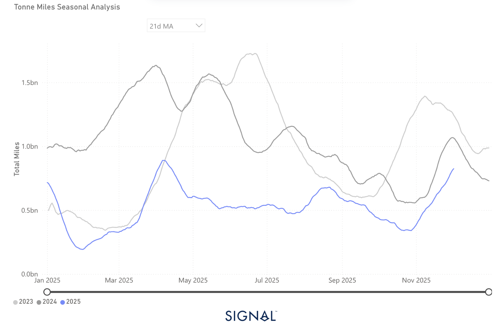
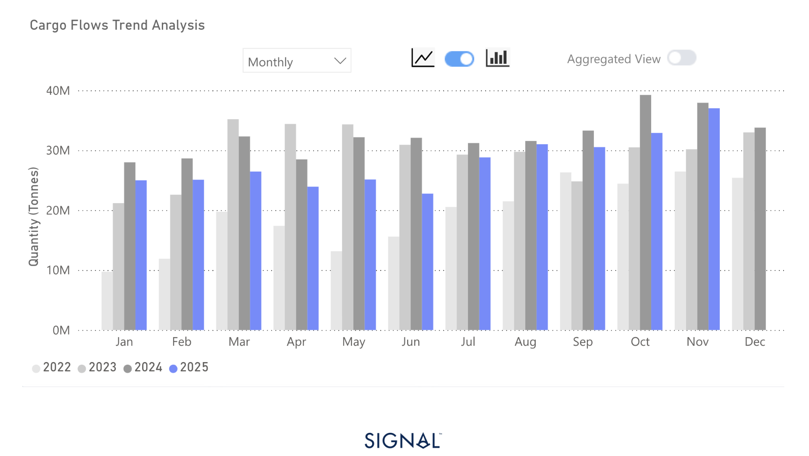
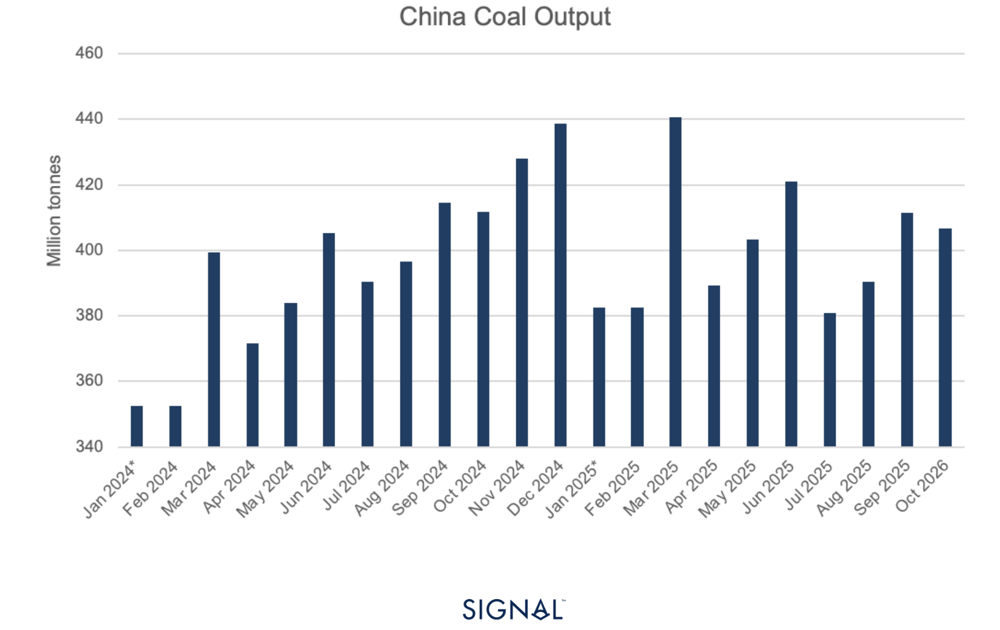
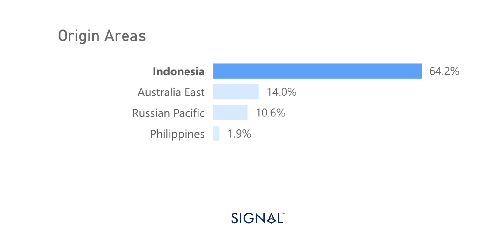

# COMMODITY RADAR | Spotlight: COAL

**Date**: December 3, 2025 | **Category**: Minor Bulk | **Section**: Monitors | **Source**: [https://www.thesignalgroup.com/weekly-market-monitor/commodity-radar-spotlight-coal](https://www.thesignalgroup.com/weekly-market-monitor/commodity-radar-spotlight-coal)

---

## COMMODITY RADAR | Spotlight: COAL

## Coal continues to lose power in the China-bound capesize market

China’s import of thermal coal so far this year trails the same period in 2024 by over 14%, weighing on global capesize demand.

- Chinese seaborne thermal coal demand weakened in 2025 due to two key factors:Stronger domestic coal production, up 1.5% y/y in the first 10 months of 2025.Rapid expansion of renewable energy infrastructure, displacing thermal power generation.
- Stronger domestic coal production, up 1.5% y/y in the first 10 months of 2025.
- Rapid expansion of renewable energy infrastructure, displacing thermal power generation.
- China has imported 52mt less coal so far in 2025 as a result.
- Global thermal coal tonne-miles have fallen below 2024 levels, with shipments to China also below both 2024 and 2023.
- This downtrend is expected to continue as China increases its reliance on renewable energy.

- Stronger domestic coal production, up 1.5% y/y in the first 10 months of 2025.
- Rapid expansion of renewable energy infrastructure, displacing thermal power generation.

‍

*Source:Coal carrying Capesize tonne-miles to China from Signal Ocean*

China has imported less thermal coal each month, year-over-year, since the start of 2025. The results of which have seen Chinese thermal coal imports down by around 52mt YTD.

China is the destination for approximately 30% of all thermal coal shipments, and thermal coal makes up around 13% of the total demand for capesize vessels. Given the weaker demand from China for thermal coal, capes carrying thermal coal have seen much weaker tonne-days and tonne-miles performances so far in 2025.

This also weighed on total cape demand, which has seen tonne-miles and tonnes-days below that of 2024 for much of the year. In recent weeks, performance has improved to above 2024 levels, but this is a result of 2025 not following the seasonal weaker start to Q4 seen in previous years.

*Source:China thermal coal imports from Signal Ocean*

Thermal coal drives Chinese electricity generation, yet the importance of coal has waned as the country has rapidly expanded non-fossil fuel electricity generation. Reports state that China used coal for around 70% of electricity generation in the mid-2000’s but this fell to around 60% in 2023, the latest official number.

The latest figure for China’s electricity generation from thermal sources as a percentage of total electricity generation is 64% in October 2025. This is a slight reduction from the figure in October 2024, which was 65%. However, in terms of thermal energy actually produced, October 2025 saw an 8% increase in kWh compared to October 2024, meaning more coal was likely burned.

Balancing out this need for more coal has been Chinese domestic coal production. The latest figures from the National Bureau of Statistics for China show coal production in 2025 is currently running 3.4% higher than last year. This figure is heavily weighted on the first half of 2025 H1, which ran 6.8% above the previous year, with the second half of 2025 so far running 1.5% lower than 2024.

Typically, Chinese coal demand increases in the final quarter of the year. This is unsurprising due to the extra power demand needed for heating in the cooler months of the year. Given that domestic coal production has started to slow and continues to lose some of the gains it had over production in 2024, China may start to import more coal to keep consistent stock levels over winter.

*Source:China coal production from the National Bureau of Statistics*

Weaker coal production through the final quarter of 2025, at a time when demand is expected to rise, will draw down domestic stocks of thermal coal. Therefore, if Chinese coal stocks are to be replenished over the next month, we would expect greater coal imports into China. This will likely come from Indonesia, given that 64% of all Chinese coal imports have originated from Indonesia since 2022.

Beyond the end of the year, the first couple of months of 2026 are expected to be relatively strong periods of coal demand, given the season. As a result, we can expect consistent import volumes of coal, giving support to Panamax vessel demand from Indonesia. There would be downward pressure on demand if the winter in China is mild, but given the stock drawdown, it is likely that buyers will continue to import coal regardless to rebuild stocks.

*Source:Origin areas of China’s coal imports from Signal Ocean*

## Coal imports will keep falling, but by how much…

The performance of coal imports into China will continue to depend on domestic coal production and the demand for coal in the energy mix. As renewable infrastructure builds out in China, thermal power will lose its share.

This will weigh on the demand for China-bound capesize vessels, extending the trends already seen through the end of 2024 and 2025. Yet, Indonesia will remain a key coal trade partner for China, with smaller shipments, primarily panamax-sized, going forward.For the latest updates and insights, make sure to visit theSignal Ocean Newsroomwebsite page. Clickhere to request a demo.

For subscription to our FREE weekly market trends email,please click here, or contact us at: research@thesignalgroup.com

- Republishing is allowed with an active link to the source
