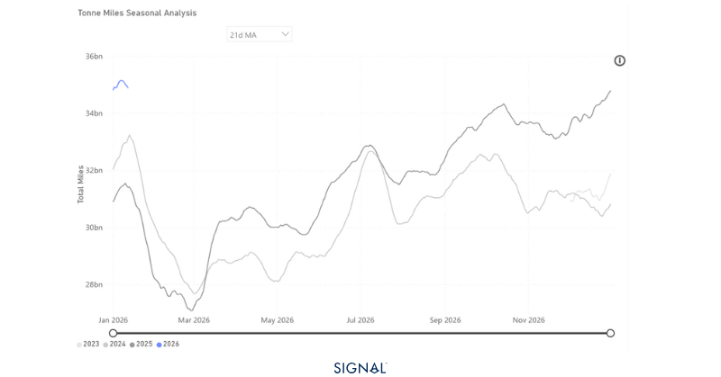
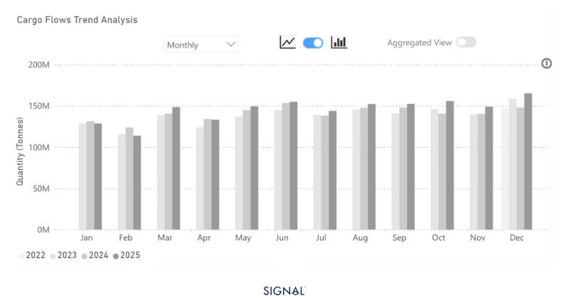
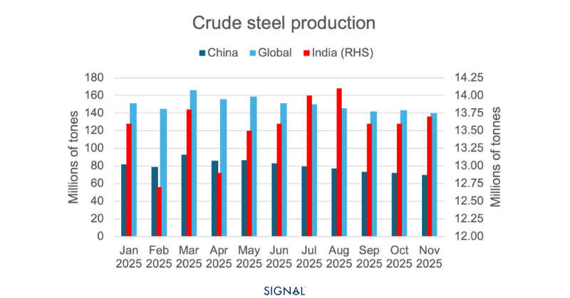

# COMMODITY RADAR | Spotlight: IRON ORE

**Date**: January 20, 2026 | **Category**: Minor Bulk | **Section**: Monitors | **Source**: [https://www.thesignalgroup.com/weekly-market-monitor/commodity-radar-spotlight-iron-ore](https://www.thesignalgroup.com/weekly-market-monitor/commodity-radar-spotlight-iron-ore)

---

## COMMODITY RADAR | Spotlight: IRON ORE

## How long can China continue to grow its iron ore stocks?

A 3% increase in global iron ore flows masks weak downstream demand

- Iron ore flows in 2025 3% higher than in 2024.
- Demand from China, up 4% y/y, and India, up 72% y/y, drove the global increase.
- Elsewhere, outward steel flows were marginally lower y/y.
- Outlook to 2026, weak domestic steel demand and already high port stocks in China will impact demand, but India’s steel expansions offer upside, albeit limited.

## ‍

*Source:Iron ore-driven tonne-miles from Signal Ocean*

Global iron ore flows reached 1.7bt in 2025, 3% higher than in 2024. The growth was driven by strong growth in flows to China and extremely strong growth in flows to India. China saw an increase in iron ore flows of 3%, resulting in an extra 52mt of iron ore flowing to China. Iron ore flows into India surged by 72%, yet the absolute growth figure is just shy of 6mt.

The origin of iron ore was dominated unsurprisingly by Australia and Brazil, with annual growth from both regions. The two countries accounted for over 78% of the global seaborne iron ore on TSOP. The next largest originator for iron ore was Canada, with a share of less than 4%.

These flow figures would indicate a well-performing global steel sector, one that is seeing production increases in line with the improved flow figures. This is not the case, however. The WSA has member crude steel production for the first eleven months of 2025 down by 2%, with very few pockets of growth. Both China and Japan, the top two receivers of the most iron ore flows on TSOP, saw steel production decline by 4%.

*Source:Global iron ore exports from Signal Ocean*

‍

China’s steel production decline and increased imports of iron ore have led to a surge in iron ore stock levels in the country. Now, stock builds before the CNY period are not unusual but this time around, stocks have consistently building from the summer. Adding to this, downstream demand for steel has underperformed, leading to pressure on steel mills, which have cut back, and iron ore port stocks are now sitting at multi-year highs. The outlook for 2026 is that steel production in China will continue to decline, as the government looks control the over-capacity within the industry and trade barriers impact both the demand and supply side.

Indian steel production performed well, growing by over 10% in the first eleven months of 2025. This increased production drove the additional 6mt of iron ore flows into the country. The Indian steel outlook for 2026 is also incredibly positive. The government has implemented several policies to support domestic steel producers, and the nation plans to increase its steel production capacity by 50% to 300 million tonnes by 2030.

Yet, given that China consumes over 75% of the seaborne iron flows on TSOP, the overall market is heavily dependent on China, and even a stellar year for India would not significantly impact the market.

The opening and ramping up of the Simandou project in Guinea does offer a positive upside for 2026. The project will export 120mt of iron ore once at full capacity, but this isn't expected until late 2028 and is dependent on all systems and blocks being fully utilised. Rio Tinto has reported they expect the project to take 30months to reach 60mt of output, 50% of the total operational capacity.  Despite this, the Guinea to China route is over double the nautical miles that iron ore from Australia travels to China. Meaning that if demand falls for iron ore, but the source of this iron ore shifts to Guinea, freight rates will be supported.

*Source:Crude steel production from the World Steel Association*

## Shifting trade will change capesize outlook

The outlook for weaker Chinese steel production is the largest factor weighing on iron ore demand in 2026, which will ripple back through to capesize prices. The expected increase in India and elsewhere will be unable to meaningfully change this.

The upside from Simandou coming online is there, but it may take some time for impactful change. The much greater distance between Guinea and China, and the likelihood that Simandou displaces iron ore from Australia, is a net positive for capesize utilisation. It will take time to assess whether this will be enough to drag price higher y/y or whether continued weaker demand will be the heaviest factor.For the latest updates and insights, make sure to visit theSignal Ocean Newsroomwebsite page. Clickhere to request a demo. For theprevious radar click here.

For subscription to our FREE weekly market trends email,please click here, or contact us at: research@thesignalgroup.com

- Republishing is allowed with an active link to the source
