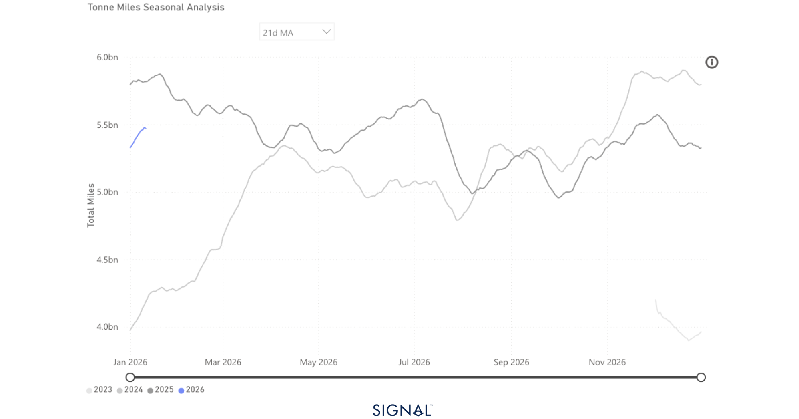
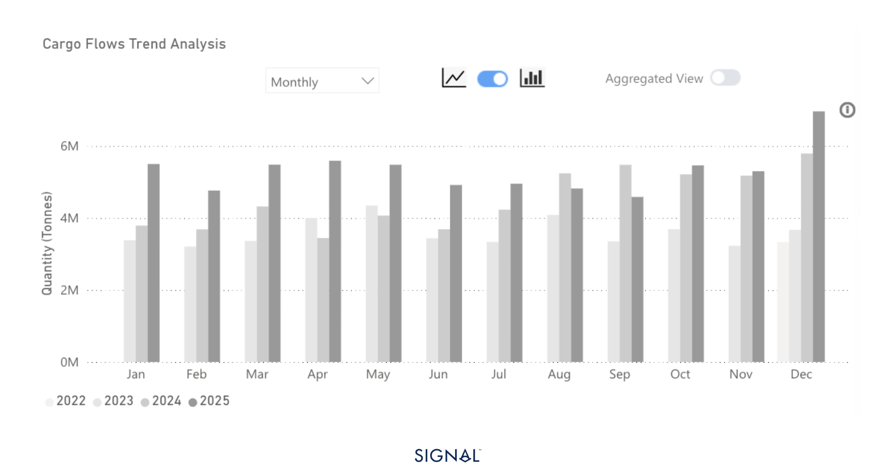
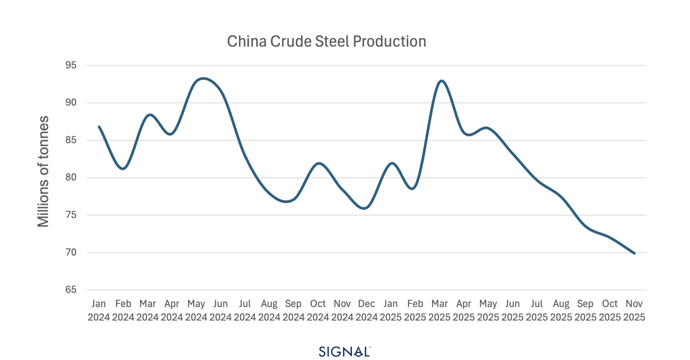

# COMMODITY RADAR | Spotlight: STEEL

**Date**: January 13, 2026 | **Category**: Minor Bulk | **Section**: Monitors | **Source**: [https://www.thesignalgroup.com/weekly-market-monitor/commodity-radar-spotlight-steel](https://www.thesignalgroup.com/weekly-market-monitor/commodity-radar-spotlight-steel)

---

## COMMODITY RADAR | Spotlight: STEEL

## China continues to target export markets

A 5% increase in global steel exports in 2025 was driven by a surge in Chinese exports.

- Steel flows in 2025 are 5% higher than in 2024.
- China has driven the increase in outward steel flows, as its exports rose by 19%.
- Elsewhere, outward steel flows fell 2% y/y.
- Outlook to 2026, weak domestic steel demand will see continued emphasis on export markets, but global demand and trade barriers will offer challenges.

*Source:Steel-driven tonne-miles from Signal Ocean*

‍

Global steel flows reached 234mt in 2025, 5% higher than in 2024. The entirety of this growth has been driven by China, which saw steel exports increase 19% to 92mt. Outside of China, global flows have actually contracted by 2% in 2025, led by a 1.8% drop in Japanese export flows, the largest exporter after China on TSOP.

China accounted for nearly 40% of all seaborne steel tonnage exported, according to TSOP, in 2025, up from 35% in 2024. This increase in share accounts for almost 15mt of extra steel products leaving China. More notable is the proportion of Chinese steel being exported as a share of total crude steel production. From 2022 to 2024, TSOP recorded China's steel export flows as between 6-8% of domestic crude steel production. This figure for 2025 is 10%, as production falls and exports rise.

*Source:China steel exports from Signal Ocean*

Chinese steel production capacity is around 1bt, vastly outpacing second-place India, which has a capacity of around 200mt moving to a targeted 300mt by 2030.  Yet, continued weak performances of the domestic construction industry have heavily impacted steel demand, forcing prices lower and leading to steel mills cutting back production. The most recent figures for Chinese steel production show it 4% lower than over the same period in 2024, with only December data to come.

The start of 2026 will see a seasonal dip in steel production due to the CNY holidays. This follows into exports, with Q1 often seeing weaker export figures. The market expects continued slowdowns of China’s steel industry in 2026, which will weaken both production and demand outlooks domestically.

This would shift focus to export markets, but the new government-imposed export licenses will add a barrier. This reintroduced measure will mean exporters will need to obtain permission to export steel, with some in China expecting this to curb export volumes; however, no comments around the policy having this as a target were mentioned as the policy was unveiled. The rules seem to be aimed at increasing China’s VAT revenue. Weaker exports would put more pressure on domestic prices, placing more pressure on producers to cut production.

*Source:China crude steel production from the World Steel Association*

## China's steel exports will drive supramax demand

Chinese steel exports drive over 57% of all supramax demand from the country. A slow start to 2026 could drag on vessel demand in the region, weighing on supramax rates. This could be compounded further by any complications arising from the new export licensing framework that started on January 1st. A more positive observation is that the wider regions of South and South East Asia are seeing steel demand increase, which will require greater imports as they build their own domestic steel capacity.For the latest updates and insights, make sure to visit theSignal Ocean Newsroomwebsite page. Clickhere to request a demo.

For subscription to our FREE weekly market trends email,please click here, or contact us at: research@thesignalgroup.com

- Republishing is allowed with an active link to the source
