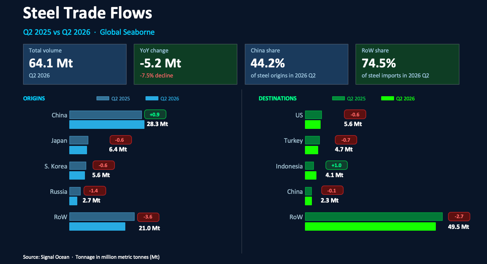
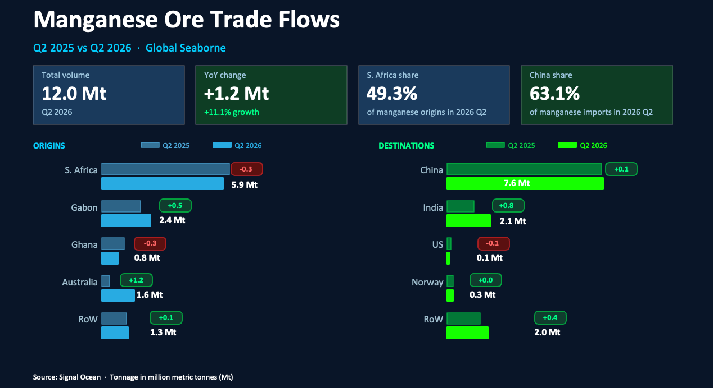
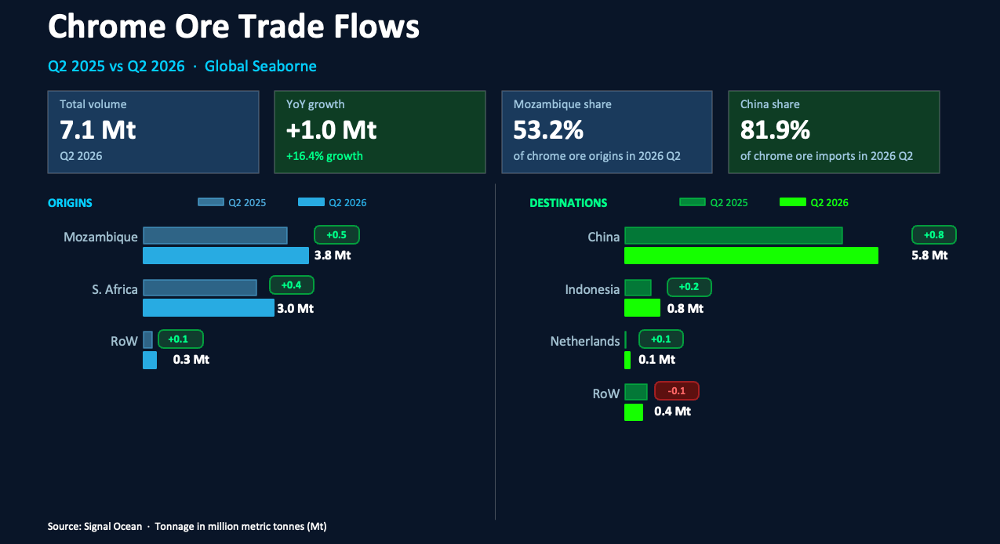
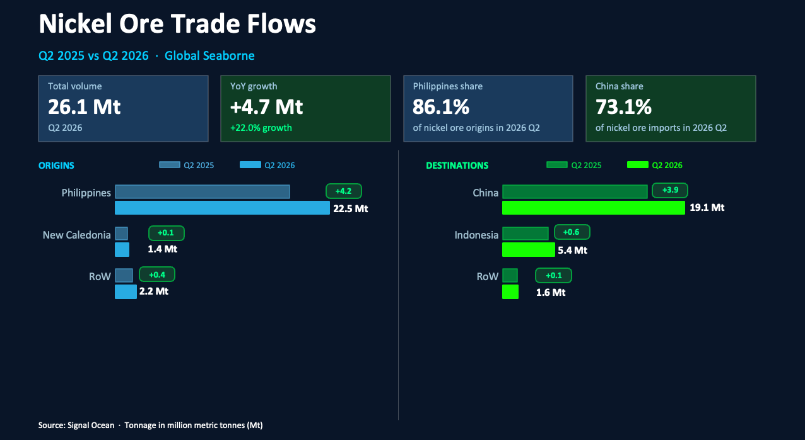

# COMMODITY RADAR | Steel Chain Look Back 2026 Q2

**Date**: July 23, 2026 | **Category**: Major Bulk | **Section**: Monitors | **Source**: [https://www.thesignalgroup.com/weekly-market-monitor/commodity-radar-steel-chain-look-back-2026-q2](https://www.thesignalgroup.com/weekly-market-monitor/commodity-radar-steel-chain-look-back-2026-q2)

---

## COMMODITY RADAR | Steel Chain Look Back 2026 Q2

The second quarter of 2026 saw sharp divergence across the steel chain. Alloying commodities saw noticeably strong increases in bulk seaborne flows, while bulk steel flows declined by close to 8%.

- Global seaborne steel flows fell 8% to reach 64.1mt in 2026 Q2
- Global seaborne manganese ore flows grew by over 11% to 12mt in 2026 Q2
- Global seaborne chrome ore flows grew by over 16% to 7.1mt in 2026 Q2
- Global seaborne nickel ore flows grew by over 22% to 26.1mt in 2026 Q2

## Global seaborne bulk steel

Global seaborne bulk steel flows fell sharply in Q2 2026, declining 7.5% year-on-year to 64.1 Mt. Among the four largest steel exporting countries, only China recorded an increase in shipments, as weakening domestic demand encouraged mills to place more material into overseas markets. Indonesia was the only one of the four largest steel importers to register a year-on-year increase, emerging as a key destination for additional Chinese export volumes.

The Arabian Gulf typically accounts for a significant share of China’s steel exports, representing around 11% of shipments. However, disruption to shipping through the Strait of Hormuz during the Iran conflict materially reduced the attractiveness of the region as an export destination. As a result, Chinese exports were likely constrained relative to what could have been achieved in a more stable trading environment.

*Source:Seaborn steel  flows origins and destinations from Signal Oceanhttps://app.signalocean.com/dry/dynamic/drybulkflows*

## Global seaborne manganese ore

Global seaborne bulk manganese ore flows increased by 11% to reach 12mt in 2026 Q2. Both Gabon and Australia saw export rises outpace the small contraction from South Africa and Ghana. The large jump in Australian output comes as a result of mine production ramp-ups following cyclones in 2024. The recent announcement of the closure of Australia’s only manganese smelter, due to the financial impact of supply disruptions from the cyclone that hit in 2024, will allow for more manganese ore to find its way to the export market.

Major steel producers, China and India, saw manganese ore imports rise. India saw the biggest rise as domestic steel production rose and domestic manganese grades are insufficient to meet the demand. This trend is likely to continue, and should see 2026 Q3 imports above those of 2025 Q3.

*Source:Seaborn manganese ore  flows origins and destinations from Signal Oceanhttps://app.signalocean.com/dry/dynamic/drybulkflows*

## Global seaborne chrome ore

Global seaborne chrome ore flows increased by more than 16% y/y to reach 7.1 Mt in Q2 2026. Exports from South Africa and Mozambique rose sharply, adding nearly 1 Mt of additional seaborne supply compared with the same period last year. This growth has been supported by the continued idling of ferrochrome smelting capacity in South Africa, where elevated electricity costs, power supply challenges, and weak alloy margins have encouraged producers to export raw ore rather than process it domestically.

The shift in beneficiation has been reflected in Asia, where Chinese ferrochrome production has increased to offset lower South African alloy output. Meanwhile, Indonesia's ferrochrome industry continued to expand, supported by growing stainless steel production and integrated processing capacity. As a result, both China and Indonesia imported more chrome ore than in Q2 2025, underpinning the strong growth in global seaborne trade.

‍

*Source:Seaborn chrome ore  flows, origins, and destinations from Signal Oceanhttps://app.signalocean.com/dry/dynamic/drybulkflows*

## Global seaborne nickel ore

Global seaborne nickel ore flows increased in Q2 2026, driven by higher exports from the Philippines as mining activity recovered during the dry season and operational conditions improved.

Stronger output enabled miners to capitalise on firm demand from Indonesia's rapidly expanding nickel processing industry, where additional RKEF and HPAL capacity continued to require imported ore to supplement domestic supply. China also remained a significant importer, supporting nickel pig iron production despite softer stainless steel demand. Favourable mining conditions, combined with sustained downstream demand across Asia, resulted in a notable increase in Philippine exports compared with the same period in 2025.

*Source:Seaborn nickel ore  flows, origins, and destinations from Signal Oceanhttps://app.signalocean.com/dry/dynamic/drybulkflows*
