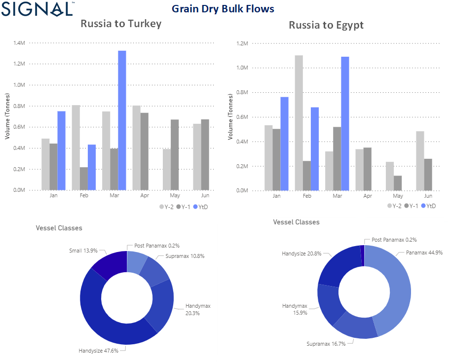

# Weekly Dry Bulk Market Monitor: Week 13, 2023

**Date**: May 18, 2024 | **Category**: Dry bulk | **Section**: Monitors | **Source**: [https://www.thesignalgroup.com/weekly-market-monitor/dry-bulk-week-13-2023](https://www.thesignalgroup.com/weekly-market-monitor/dry-bulk-week-13-2023)

---

## Chart of the Week Dry Bulk: Grain Dry Bulk flows from Russia to Turkey & Egypt

*Data Source: TheSignal OceanPlatform, Dry Bulk Flowshttps://app.signalocean.com/dry/dynamic/drybulkflows*

The last few days of March brought positive momentum for the smaller vessel categories as we have begun to see clearer signs of demand growth, with grain flows supporting firmness in the second quarter of the year. We have already indicated that the extension of the Black Sea grain trade for the next few days in April and May will boost demand-side sentiment. However, port congestion and vessel supply will challenge the euphoria, as the number of ballast vessels in the Handysize segment is still excessive. Interestingly, Russian grain exports to Egypt and Turkey recorded very high volumes in the first quarter of the year, especially in March when Handysize vessels reached a 48% share of Russian grain exports to Turkey and Panamax vessels reached a 45% share of exports to Egypt. (see image above)

Meanwhile, the earlier rise in Capesize rates is being threatened by news that China, the largest steel producer, is considering cutting its annual crude steel output by about 2.5% this year to reduce emissions. However, the China Iron and Steel Association (CISA) forecast in February that the steel sector will see an upward trend in 2023, supported by a stabilised property market and the recovery of other steel-consuming industries such as vehicles, ships and household appliances.

For the latest updates and insights, make sure to visit theSignal Ocean Newsroomwebsite page. Clickhere to request a demo.

For subscription to our FREE weekly market trends email, please contact us: research@thesignalgroup.com
