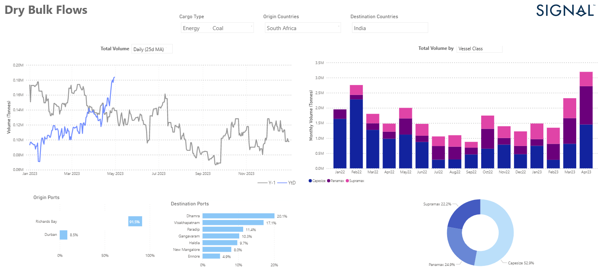

# Weekly Dry Bulk Market Monitor Week 19, 2023

**Date**: May 18, 2024 | **Category**: Dry bulk | **Section**: Monitors | **Source**: [https://www.thesignalgroup.com/weekly-market-monitor/dry-bulk-week-19-2023](https://www.thesignalgroup.com/weekly-market-monitor/dry-bulk-week-19-2023)

---

## ‍Rise in April to highest level in a year, with Dharma the top destination port

*Signal Figure*

In the second week of May, we saw weaker dynamics in freight rates, with the Capesize segment registering some firmness. Interestingly, the Indian economy is seeing strong South African coal imports, with the Capesize segment gaining strength in this type of trade, with recent weekly volumes reaching their highest levels in the last year. (See chart of 25-day moving average above left). In the previous month, the Capesize and Panamax segments reached peak levels in shipments of South African coal for the Indian economy.

In the grain segment, the freight market is still uncertain whether the Black Sea Grain Initiative will be extended beyond May 18. However, Ukraine's agriculture minister said the country has alternative grain transportation options if the agreement is not extended on May 18. Reuters news agency reports that Moscow has threatened to terminate the initiative on May 18 unless a number of demands to remove barriers to Russian grain and fertiliser exports are met.

For the latest updates and insights, make sure to visit theSignal Ocean Newsroomwebsite page. Clickhere to request a demo.

For subscription to our FREE weekly market trends email, please contact us: research@thesignalgroup.com
