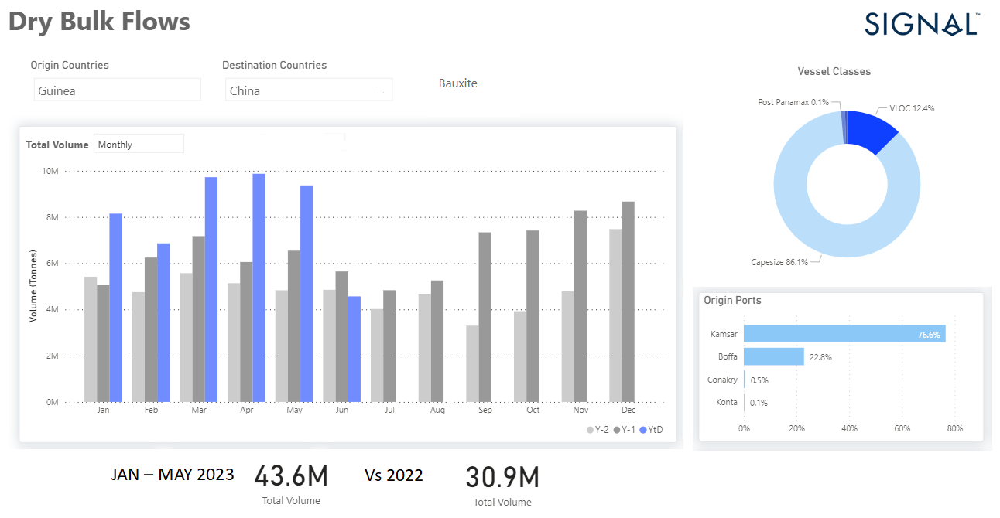

# Weekly Dry Bulk Market Monitor - Week 23, 2023

**Date**: May 18, 2024 | **Category**: Dry bulk | **Section**: Monitors | **Source**: [https://www.thesignalgroup.com/weekly-market-monitor/dry-bulk-week-23-2023](https://www.thesignalgroup.com/weekly-market-monitor/dry-bulk-week-23-2023)

---

## The monthly volume of bauxite exports to China has increased by 40% in the first five months

*Data Source: TheSignal OceanPlatform, Dry Bulk Flows, Bauxite Guinea to Chinahttps://app.signalocean.com/dry/dynamic/drybulkflows-downloadable*

‍

The iron ore market experienced a notable increase in prices due to the recent news regarding the Chinese economy stimulus package. According to a report by Mining.com, the most-traded September iron ore on China's Dalian Commodity Exchange concluded daytime trading with a 2.2% rise, reaching 759 yuan ($106.68) per tonne. Earlier in the session, it even reached a peak of 770 yuan, marking its highest level since April 20. The recently announced Chinese stimulus has instilled a sense of optimism for a potential rebound in the Capesize iron ore market by the end of the first half of the year. Furthermore, the supply of ballasters has continued to stay at elevated levels, surpassing the annual average. This development suggests a potentially favourable outlook for the iron ore market in the coming months.

Meanwhile, there is an intriguing observation in the realm of minor dry bulk commodities. Specifically, the monthly volume of bauxite shipments from Guinea to China has witnessed a remarkable surge of approximately 40% during the initial five months of this year, in comparison to the same period in 2022 (refer to the accompanying image for reference). This substantial growth in Guinean bauxite trade serves as a pivotal factor contributing to increased vessel employment within the Capesize segment. On the other hand, the grain segment continues to face significant challenges and risks. Recent reports suggest that there may not be a further extension in the Black Sea Grain Initiative for the upcoming July, further amplifying the uncertainties in this sector.

For the latest updates and insights, make sure to visit theSignal Ocean Newsroomwebsite page. Clickhere to request a demo.

For subscription to our FREE weekly market trends email, please contact us: research@thesignalgroup.com

-Republishing is allowed with an active link to the source
