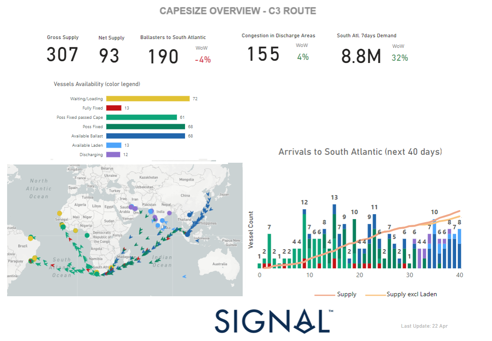
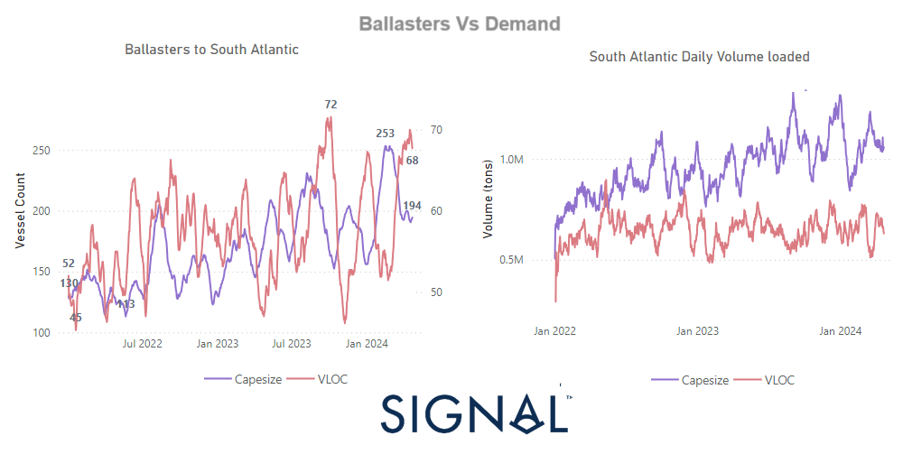
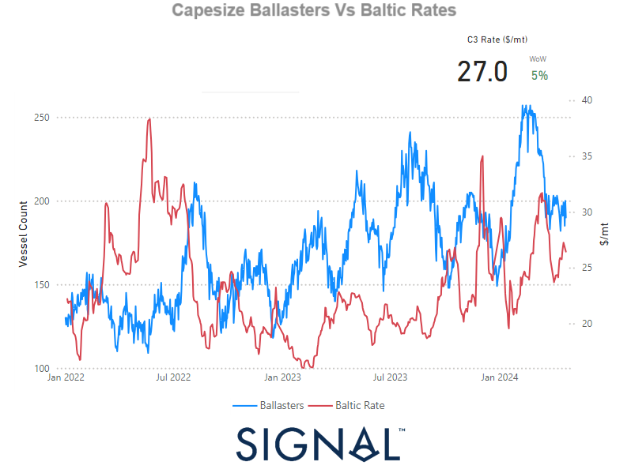
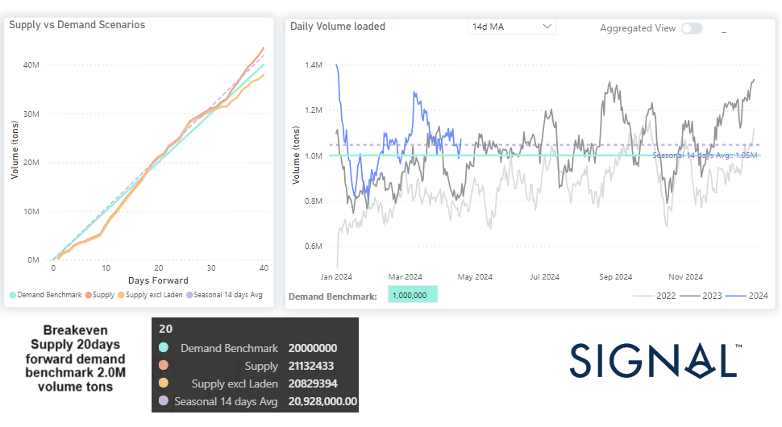

# Dry Weekly Market Monitor - Signal Ocean Capesize Market Insights

**Date**: May 18, 2024 | **Category**: Dry bulk | **Section**: Monitors | **Source**: [https://www.thesignalgroup.com/weekly-market-monitor/dry-signal-ocean-capesize-market-insights](https://www.thesignalgroup.com/weekly-market-monitor/dry-signal-ocean-capesize-market-insights)

---

## Capesize C3 Route South Atlantic Overview Supply

*Image 1: Supply Overview, Map for Vessel Arrivals*

‍

According to the Capesize C3 South Atlantic overview provided in the image below, during the third week of April, there was a notable 4% decrease in ballast vessels bound for the South Atlantic, coupled with a significant surge of 72 vessels waiting to load. Analysis of forthcoming arrivals in the South Atlantic over the next 40 days reveals a discernible uptick in vessel supply, both laden and unladen, within the 10 to 20-day timeframe. However, beyond the 30-day mark, there appears to be a pronounced increase in the availability of ballast vessels.

‍

## Gross supply criteria for the C3 route:

1. Ensure that the Estimated Arrival Time (ETA) to Tubarao is under 40 days.

2. If a ship is heading to the South Atlantic, it's automatically counted.

3. Include Ballast vessels opening in Singapore/Malaysia, Argentina & Uruguay Thailand/Vietnam, East Coast India, and East Africa. If the forecasted load area is South Atlantic or unknown.

4. Include laden vessels opening on the Singapore/Malaysia, Pakistan/West Coast India, and Atlantic or unknown.

5. Exclude vessels with AIS destinations in Australia/ Indonesia/ South Atlantic: Brazil, Africa, Atlantic Coast, South Africa.

‍

## Net supply criteria:

Including Available Ballast, Available Laden, Waiting to Discharge and Discharging vessels

Congestion in the discharge areas: North China, South China, Central China, Pakistan/West Coast India, East Coast India, Arabian Gulf

‍

## South Atlantic Demand:

Total loading volume (tonnes) from South Atlantic of last 7 days compared with the total volume of previous 7 days. South Atlantic areas: Brazil, Africa, Atlantic Coast, South Africa.

‍

## Ballasters to South Atlantic comparison with VLOC

*Image 2: Ballasters View, South Atlantic Demand comparison with VLOC*

‍

Ballast vessel movement heading towards the South Atlantic in the Capesize sector has recently experienced a downturn, descending from its peak of 250 to below 200. Meanwhile, there's been a noticeable increase in ballast vessels for Very Large Ore Capesizes, as the daily volume loaded in the South Atlantic aims to find stability since mid-March. On the demand side, the outlook is uncertain, characterised by significant volatility swinging between highs and lows. The trajectory of April's demand remains ambiguous, with Baltic rates starting to steady by the conclusion of the third week.

‍

‍

## Capesize Ballasters Vs Baltic Rates

‍

*Image 3: Ballasters View Capesize Vs Baltic Rates, 2022-2024*

‍

Image 3 presents a comprehensive view of the correlation between the vessel count of Capesize Ballasters and the performance of C3 rates ($/mt). Notably, the surge in the number of ballast vessels exceeding 250 in mid-February coincided with a downturn in C3 rates, dipping below the $25/ton mark.

However, the recent decline in the number of ballast vessels to below 200 has sparked optimism for a stronger momentum in C3 rates. Should this trend persist and the daily average of ballast vessels remain below the 200 mark towards the end of the month, it could potentially propel C3 rates towards the $30/ton threshold. This suggests a potential shift in market dynamics, with favourable implications for rate performance in the near future.

‍

## Supply Demand Scenarios for C3 breakeven point

*Image 4: Supply - Demand Scenarios (10-40 days forward)*

‍

## Expanding on the features of the Signal Ocean Platform Market Insights

Within theSignal Ocean PlatformMarket Insights, users gain access to invaluable scenarios depicting the delicate balance between supply and demand within the freight market. This tool allows for real-time monitoring of critical breakeven points, where supply and demand imbalances are reconciled, ultimately influencing the direction of freight rates.

In the image provided, a pivotal breakeven point is highlighted, projected at 20 days forward. Here, the demand benchmark reaches 20 million units, intersecting with the supply curve. This convergence triggers a notable downward pressure on rates, indicative of a potentially aggressive trend shift.

Specifically, the next 14 day average based on 2023 historical numbers for the daily volume loaded in the South Atlantic currently hovers above the demand benchmark of 1 million tons. However, it remains below the prevailing supply trend, encompassing vessels in both laden and unladen states.

‍

‍You can start your journey to commercial vessel tracking for free after signing up to our free edition.To learn more about our Signal Ocean platform, talk to an expert by clicking the linkhere.

‍

Stay tuned for our special features, offering detailed insights into Capesize, Panamax, and Supramax vessels. We'll delve into diverse routes, providing comprehensive comparisons of supply-demand scenarios. Uncover the dynamic trends and trajectories of freight routes as we navigate through the intricacies shaping the maritime industry.
