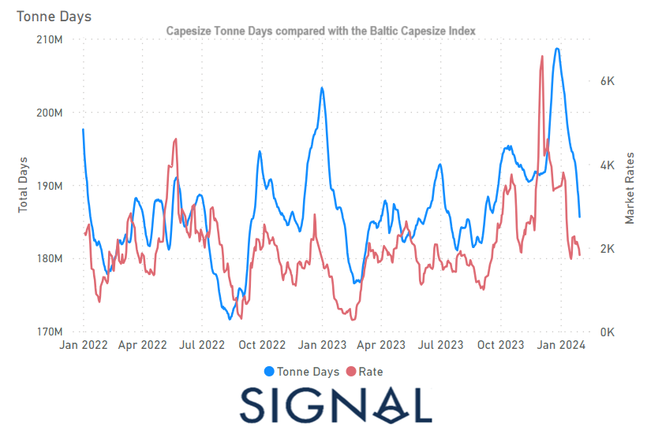

# Weekly Dry Market Monitor - Week 05, 2024

**Date**: May 18, 2024 | **Category**: Dry bulk | **Section**: Monitors | **Source**: [https://www.thesignalgroup.com/weekly-market-monitor/dry-week-05-2024](https://www.thesignalgroup.com/weekly-market-monitor/dry-week-05-2024)

---

## The downward revision in the growth of Capesize tonne days in January with the BCI dropping

*Signal Figure*

In the last week of January, the dry freight market sustained weakness in the Capesize segment, while the number of ballasters in the Southeast (SE) continued to grow amid declining demand. As depicted in the accompanying image, the growth outlook for Capesize tonne days in January has been adjusted downward, coinciding with a notable decline in the Baltic Capesize Index (BCI).

Despite the weakening trend in Capesize freight rates, the iron ore market experienced a notable surge in prices before the close of January. This upswing was underpinned by the prevailing optimism that the world's largest buyer of the steel raw material, China, is implementing substantial stimulus measures to enhance demand. This positive sentiment managed to overshadow China's soft steel production data for December. On January 26, iron ore contracts traded in Singapore concluded at $135 per metric ton, marking a weekly increase after two consecutive weeks of declines. However, concerns re-emerged in the market as news broke about a Hong Kong court ordering the liquidation of China Evergrande Group, the world's most indebted developer. This development, associated with China's struggling property market, reintroduced a denting sentiment into the market as February began.

For the latest updates and insights, make sure to visit theSignal Ocean Newsroomwebsite page. Clickhere to request a demo.

For subscription to our FREE weekly market trends email, please contact us: research@thesignalgroup.com

-Republishing is allowed with an active link to the source
