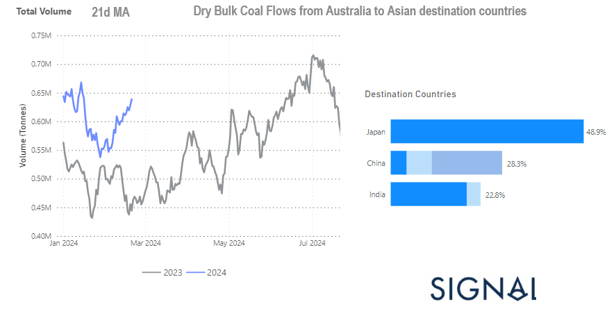

# Weekly Dry Market Monitor - Week 08, 2024

**Date**: May 18, 2024 | **Category**: Dry bulk | **Section**: Monitors | **Source**: [https://www.thesignalgroup.com/weekly-market-monitor/dry-week-08-2024](https://www.thesignalgroup.com/weekly-market-monitor/dry-week-08-2024)

---

## Australian coal flows to Asia hover above last year’s volume tonnes

*Signal Figure*

In the final days of February, the dry bulk freight market appeared to maintain a relatively stable momentum, particularly evident in the large vessel size categories where rates remained close to the highs reached in the third week, notably on the Capesize Brazil to North China route and Panamax Continent to Far East route. However, there remains cause for concern regarding the recent market momentum, as the weekly growth rates in demand tonne days continue to decline significantly compared to the peaks observed at the end of last year.

The performance of the Chinese economy post-Lunar New Year is of paramount importance, as the country grapples with the challenge of revitalising its economy. This challenge comes amid critical times, prompting the Central Bank to announce cuts in key interest rates aimed at bolstering the ailing property sector.

Meanwhile, in the Panamax vessel size segment, there is a noticeable resurgence in Australian coal flows to key destinations such as China, India, and Japan. This resurgence is evidenced by the 21-day moving average, which has surpassed last year's levels for the first two months of the year.

For the latest updates and insights, make sure to visit theSignal Ocean Newsroomwebsite page. Clickhere to request a demo.

For subscription to our FREE weekly market trends email, please contact us: research@thesignalgroup.com

-Republishing is allowed with an active link to the source
