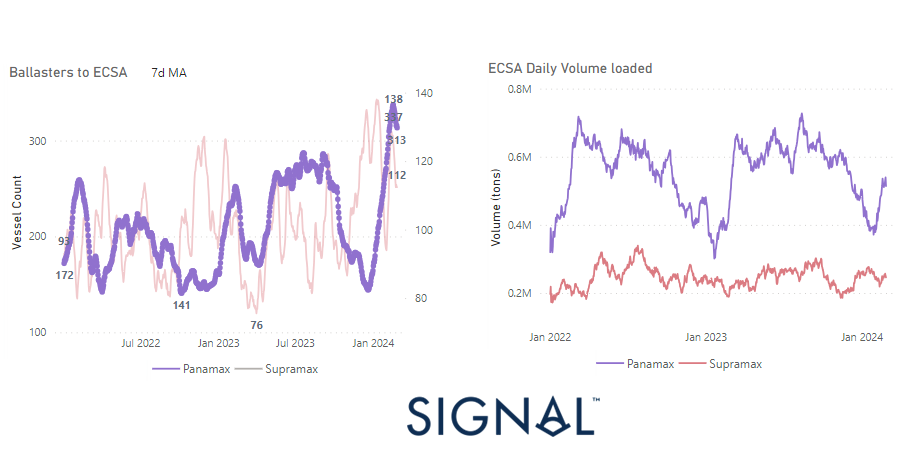

# Weekly Dry Market Monitor - Week 09, 2024

**Date**: May 18, 2024 | **Category**: Dry bulk | **Section**: Monitors | **Source**: [https://www.thesignalgroup.com/weekly-market-monitor/dry-week-09-2024](https://www.thesignalgroup.com/weekly-market-monitor/dry-week-09-2024)

---

## A decreasing trend in the number of ballasters to ECSA with a recent peak in the daily volume loaded

*Signal Figure*

At the end of the month, there's a notable upturn in the Capesize Brazil to N China route, with rates reaching new highs since the year's outset. However, it remains uncertain whether this firmness will persist into March. Interestingly, despite signs of a stronger freight market sentiment, there's a decrease in the growth of tonne days, particularly notable in the Handysize segment. Additionally, there's a decrease in the number of ballasters for large vessel size categories, following several weeks of peaks lasting over a month. In the Panamax segment, there's a noteworthy record in the P6 route for ballasters to ECSA, showing a recent decline after consistently peaking for many weeks until the end of February, while there's a recovery in the growth of ECSA daily volume loaded. (see image above)

In the realm of the world's second-largest economy, China, this week saw intriguing developments regarding the setting of economic growth targets by the country's provincial-level regions for 2024. These targets vary, ranging from 4.5 to 8 percent, with over 20 regions aiming to surpass 5 percent GDP growth. Particularly noteworthy is that these provinces share common priorities, including the development of "new productive forces," the stimulation of consumption, and enhancements to the business environment.

For the latest updates and insights, make sure to visit theSignal Ocean Newsroomwebsite page. Clickhere to request a demo.

For subscription to our FREE weekly market trends email, please contact us: research@thesignalgroup.com

-Republishing is allowed with an active link to the source
