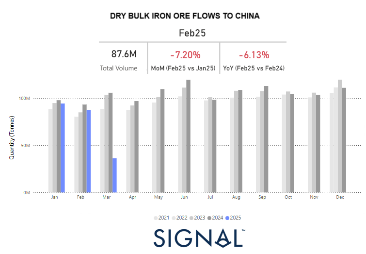

# Weekly Dry Market Monitor: Week 10, 2025

**Date**: March 12, 2025 | **Category**: Dry bulk | **Section**: Monitors | **Source**: [https://www.thesignalgroup.com/weekly-market-monitor/dry-week-10-2025](https://www.thesignalgroup.com/weekly-market-monitor/dry-week-10-2025)

---

*https://app.signalocean.com/dry/dynamic/drybulkflows-downloadable*

‍

The second week of March confirmed signs of a firming sentiment in Capesize Brazil-to-North China rates, with the vessel count of ballasters continuing to hover at lower volumes compared to the peak levels observed in February. This recent rebound appears to be largely driven by a temporary release of oversupply burden rather than a significant surge in demand. A closer examination of the monthly volume of iron ore dry bulk flows to China reveals a weaker start to the year, with the first two months ending at lower levels compared to previous years. February, in particular, is estimated to have closed with a 6% year-over-year decline, reflecting subdued demand pressures and cautious market sentiment.

Adding to the uncertainty, concerns persist over the growth trajectory of the world’s second-largest economy, China. With global trade still adjusting to the lingering impact of US-imposed tariffs from the Trump administration, major commodity trading patterns remain in uncharted waters. The volatility in commodity prices, driven by geopolitical tensions and shifting trade policies, continues to influence the dry bulk shipping market, leaving freight rates susceptible to abrupt shifts in sentiment.

Looking ahead, the iron ore freight industry is likely to remain heavily influenced by Chinese demand dynamics, as well as broader macroeconomic factors. The pace of economic recovery and industrial activity in China will be key in determining market stability. Meanwhile, the gradual release of the oversupply burden will be a crucial factor in shaping freight market performance, as owners and operators navigate the ongoing challenges of balancing vessel capacity with fluctuating demand.

For the latest updates and insights, make sure to visit theSignal Ocean Newsroompage & subscribe to weekly reports. Clickhere to request a demo.

For subscription to our FREE weekly market trends email, please contact us: research@thesignalgroup.com

-Republishing is allowed with an active link to the source
