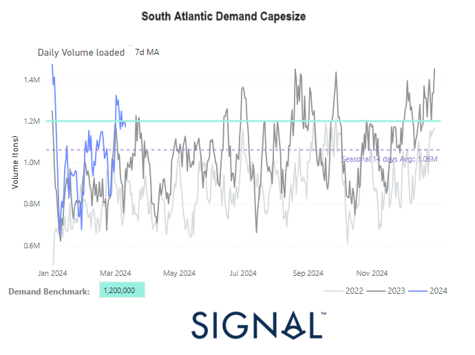

# Weekly Dry Market Monitor - Week 11, 2024

**Date**: May 18, 2024 | **Category**: Dry bulk | **Section**: Monitors | **Source**: [https://www.thesignalgroup.com/weekly-market-monitor/dry-week-11-2024](https://www.thesignalgroup.com/weekly-market-monitor/dry-week-11-2024)

---

## South Atlantic daily volume loaded surpassed the demand benchmark in March as the freight market is firming

‍

*Signal Figure*

During the second week of March, there's a notable surge in freight rates, particularly in the larger vessel categories, accentuated by a diminishing number of ballasters. The demand indicator reflected in the volume of South Atlantic daily loaded shipments appeared robust and exceeded the benchmark demand as indicated by the 7-day moving average.

In the iron market, iron ore futures prices continued their downward trend for a second consecutive session on Monday, reaching their lowest levels in over four months. This decline was primarily driven by the persistent weakness in the fundamentals of this vital steelmaking component, particularly in China, the largest consumer of iron ore globally. This downward pressure on prices is mainly attributed to a temporary supply glut stemming from better-than-expected shipments in the first quarter of the year, coupled with a slower-than-anticipated demand recovery. This combination has exerted significant downward pressure on iron ore prices, underscoring the delicate balance between supply and demand dynamics in the global steel industry.

For the latest updates and insights, make sure to visit theSignal Ocean Newsroomwebsite page. Clickhere to request a demo.

For subscription to our FREE weekly market trends email, please contact us: research@thesignalgroup.com

-Republishing is allowed with an active link to the source
