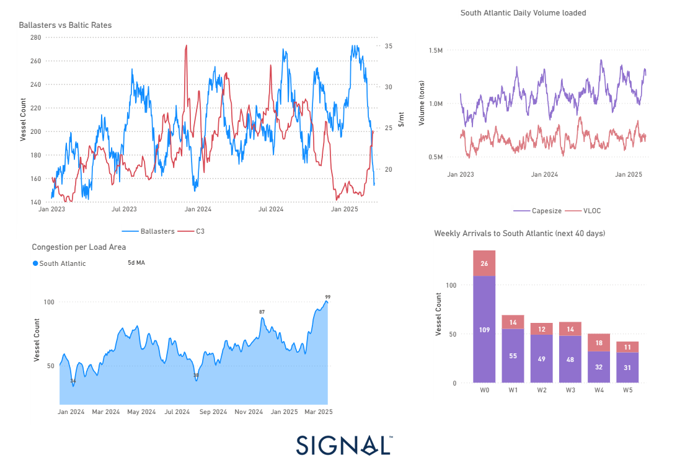

# Weekly Dry Market Monitor: Week 12, 2025

**Date**: March 19, 2025 | **Category**: Dry bulk | **Section**: Monitors | **Source**: [https://www.thesignalgroup.com/weekly-market-monitor/dry-week-12-2025](https://www.thesignalgroup.com/weekly-market-monitor/dry-week-12-2025)

---

*https://app.signalocean.com/dry/dynamic/capes_insights_downloadable*

‍

The dry bulk freight market is currently experiencing a significant upswing, primarily fuelled by a notable decrease in the number of ballasters on the C3 route. This has led to anticipation of a market undersupply in the coming weeks, fostering a bullish sentiment among market participants.

## Iron Ore Dynamics and China’s Strategic Positioning

China is preparing to significantly increase its iron ore imports in 2025, despite weakening steel demand. This move coincides with production increases by major suppliers in Australia and Brazil and the expected launch of the Simandou iron ore project. These supply-side changes are expected to reshape global iron ore trade flows and contribute to the ongoing decline in iron ore prices.

## Brazilian Iron Ore Shipments Surge

Chinese importers are strategically increasing their purchases of Brazilian iron ore during the dry season, leading to an expected surge in shipments in March and April. This seasonal pattern reflects China's proactive approach to securing raw materials at favourable prices and ensuring a stable supply amid potential market volatility.

## Congestion and Market Implications

The C3 Brazil-to-China market remains strong, as evidenced by the congestion of nearly 100 vessels in the South Atlantic, the highest level in the past year. This supply chain bottleneck is further exacerbated by strong activity in the region, with daily volume loaded consistently exceeding 1 million tonnes and approaching 1.3 million tonnes. This congestion could continue to put upward pressure on freight rates.

## Supply-Demand Disparity in the South Atlantic

Weekly arrivals of Capesize vessels to the South Atlantic are expected to decline over the next 40 days. With fewer incoming vessels, the gap between supply and demand is widening, providing additional support for elevated freight rates. This trend suggests that demand-side pressures may intensify, reinforcing the bullish outlook for the C3 route in the short term. The anticipated decline in Capesize vessel arrivals to the South Atlantic over the next 40 days will likely widen the gap between supply and demand. This will put additional upward pressure on freight rates and suggests that demand-side pressures may intensify, reinforcing the bullish outlook for the C3 route in the short term.

## Conclusion

The lack of available vessels and increased iron ore shipments from Brazil have tightened the supply side, creating a favorable environment for freight rates, particularly on the C3 route. This is further exacerbated by China's aggressive import strategy, which, combined with seasonal surges in Brazilian exports, is expected to continue market volatility. Traders and shipowners would be well advised to monitor congestion trends and vessel availability, as these will be key factors in determining future freight market dynamics.

For the latest updates and insights, make sure to visit theSignal Ocean Newsroompage & subscribe to weekly reports. Clickhere to request a demo.

For subscription to our FREE weekly market trends email, please contact us: research@thesignalgroup.com

-Republishing is allowed with an active link to the source
