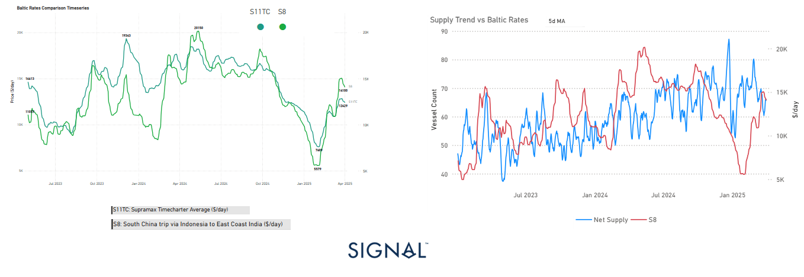

# Weekly Dry Market Monitor: Week 14, 2025

**Date**: April 2, 2025 | **Category**: Dry bulk | **Section**: Monitors | **Source**: [https://www.thesignalgroup.com/weekly-market-monitor/dry-week-14-2025](https://www.thesignalgroup.com/weekly-market-monitor/dry-week-14-2025)

---

‍

*https://app.signalocean.com/dry/dynamic/market-prices-dry*

‍

## Supramax Market Analysis: S8 Route Surges Amidst Tightening Tonnage Supply

Over the past several weeks, the Supramax freight market has witnessed a remarkable recovery, particularly on the Baltic Exchange’s S8 route — which covers South China via Indonesia to East Coast India, a key corridor for coal shipments.

## Recovery Timing:

The recovery in the Supramax market for theS8 routeappears to havestarted in early February 2025.

- On theleft chart, the S8 rate (green line) bottomed out aroundlate January 2025, at approximately$5,797/day, and then began a sharp upward movement into February and March.
- TheS11TC(Supramax Timecharter Average) followed closely, starting to rise inmid to late February 2025to above $12,000/day by the end of March, indicating a slightly lagged broader market reaction.

## Tonnage Supply and Rate Correlation

The most striking element behind this rally is the significant contraction in net vessel supply in the region. As depicted in the right-hand graph, the number of available Supramax vessels fell steeply during the same period that S8 rates began to climb. When net supply dipped below the 70-vessel mark in early March — freight rates started to respond with an upward trend, highlighting the highly elastic nature of pricing in the face of tightening tonnage.

## Broader Market Impacts – S11TC Tracking the Move

The Baltic Supramax Timecharter Average (S11TC) has also shown a concurrent upward trend, climbing alongside the S8 route. Currently hovering around $12,500/day, the S11TC is approaching the levels recorded in November 2024.

## Market Outlook

Looking forward, the outlook remains cautiously optimistic. If vessel supply remains constrained in Southeast Asia — whether due to port delays, weather disruptions, or prolonged ballast voyages — Supramax rates, especially on the S8, may find further upward support. Additionally, if Indian coal imports remain firm and Chinese coastal demand picks up, we could see further tightening in the near term.

However, market participants should remain alert to the possibility of rapid correction. A rebound in vessel availability, possibly from vessels repositioning from the Pacific or Indian Ocean, could cap further upside. Similarly, any softening in demand, whether from seasonal factors or policy shifts in India or China, could temper the momentum.

In summary, the recent surge in the S8 rate underscores the sensitivity of the Supramax market to shifts in regional supply-demand dynamics. With both the S8 and S11TC indices pointing higher, the current rally appears well-grounded — but sustained strength will ultimately depend on whether supply remains tight or begins to normalise.

For the latest updates and insights, make sure to visit theSignal Ocean Newsroompage & subscribe to weekly reports. Clickhere to request a demo. Check out ourprevious week's report here.

For subscription to our FREE weekly market trends email, please contact us: research@thesignalgroup.com

-Republishing is allowed with an active link to the source
