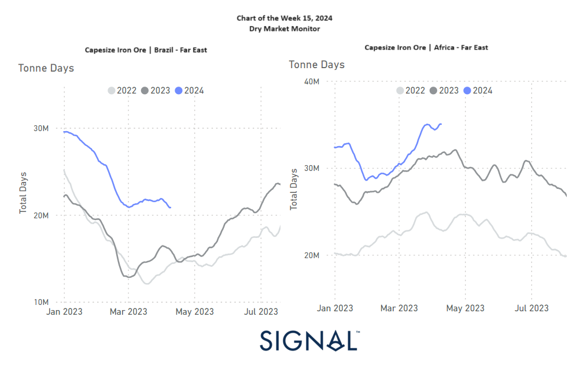

# Weekly Dry Market Monitor - Week 15, 2024

**Date**: May 18, 2024 | **Category**: Dry bulk | **Section**: Monitors | **Source**: [https://www.thesignalgroup.com/weekly-market-monitor/dry-week-15-2024](https://www.thesignalgroup.com/weekly-market-monitor/dry-week-15-2024)

---

## The first quarter of the year ended with a downward revision to the growth in tonne-days for iron ore flows from Brazil to the Far East, while there was a change to an upward revision from Africa.

*Signal Figure*

In the second week of April, we observed a decline in the Capesize Brazil to North China rates. The outlook for Chinese iron ore demand remains uncertain, as expectations are tied to potential new stimulus plans. Iron ore prices showed some positivity on Thursday, with the most-traded September iron ore contract on China’s Dalian Commodity Exchange (DCE) closing 1.29% higher at 826 yuan ($114.14) per metric ton. However, doubts persist regarding solid Chinese demand, as a Reuters poll suggests that the country's economy is expected to grow by 4.6% in the first quarter compared to the previous year, marking the slowest growth in a year despite some signs of stabilisation.

Meanwhile, the first quarter concluded with a downward adjustment to the growth in tonne-days for iron ore shipments from Brazil to the Far East, while shipments from Africa saw an upward revision.

For the latest updates and insights, make sure to visit theSignal Ocean Newsroomwebsite page. Clickhere to request a demo.

For subscription to our FREE weekly market trends email, please contact us: research@thesignalgroup.com

-Republishing is allowed with an active link to the source
