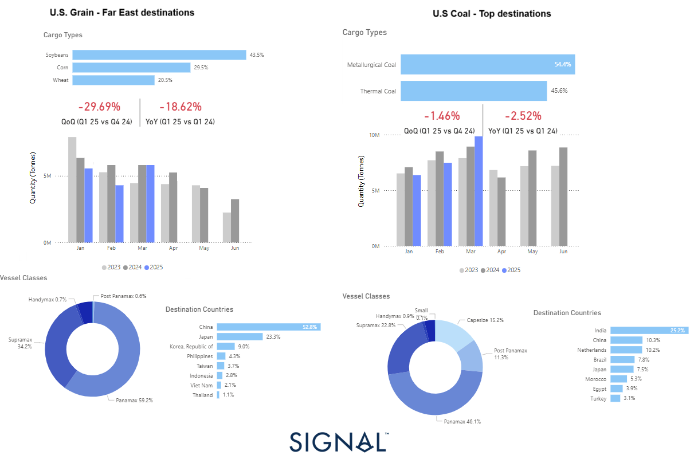

# Weekly Dry Market Monitor: Week 15, 2025

**Date**: April 9, 2025 | **Category**: Dry bulk | **Section**: Monitors | **Source**: [https://www.thesignalgroup.com/weekly-market-monitor/dry-week-15-2025](https://www.thesignalgroup.com/weekly-market-monitor/dry-week-15-2025)

---

*https://app.signalocean.com/dry/dynamic/drybulkflows-downloadable*

‍

‍

## Escalation of U.S.-China Trade Tensions: Implications for Dry Bulk Freight

On April 4th, China announced a 34% tariff on all U.S. imports, a retaliatory response to recent U.S. protectionist trade measures, effective April 10th. This escalation in the trade dispute is set to have a direct impact on key U.S. dry bulk exports—particularly soybeans and corn—based on recent cargo flow and vessel deployment data from the Signal Ocean Platform and supporting trade intelligence.

## Grain Trade at Risk: China as the Top Buyer

According to Q1 2025 data, China accounts for52.8%of U.S. grain exports to Far East destinations, with Japan and South Korea following at23.3%and9.0%, respectively. These flows are heavily reliant onPanamax vessels (59.2%), followed by Supramax (34.2%). The primary cargo types—soybeans (43.5%),corn (29.5%), andwheat (20.5%)—are all sensitive to Chinese demand.

Comparing quarterly performance, U.S. grain shipments to Far East destinations declined:

- -29.69% quarter-on-quarter (Q1 2025 vs Q4 2024)
- -18.62% year-on-year (Q1 2025 vs Q1 2024)

This downward trend is likely to accelerate as the newly imposed tariffs deter Chinese buyers, potentially redirecting volumes to alternative markets such as Southeast Asia. However, these substitute markets may offer lower margins and may not be able to fully absorb the volume previously destined for China.

## U.S. Coal May Also See Dampened Demand

While China is not the top importer of U.S. coal, it does source10.3%of U.S. coal exports, making it the second-largest Asian destination after India (25.2%). The coal trade—split betweenmetallurgical (54.4%)andthermal coal (45.6%)—has so far shown relative stability, with only modest contractions:

- -1.46% QoQ
- -2.52% YoY

Coal exports primarily rely onPanamax (46.1%),Supramax (22.8%), andCapesize (15.2%)vessels, making the trade more diverse in both cargo type and ship class. However, the imposition of tariffs could make U.S. coal less competitive in Asia, especially as China already has strong import ties with Australia, Russia, and Indonesia.

Following China's announcement of retaliatory tariffs—34% on U.S. imports including key agricultural goods—grain markets reacted sharply. U.S. soybean futures dropped by 4% as traders anticipated a significant reduction in Chinese demand. The tariffs, combined with China's move to curb foreign grain purchases like barley and sorghum, added downward pressure on prices. Meanwhile, exporters such as Brazil have seen increased demand, boosting their market share and insulating Chinese buyers from U.S. supply disruptions.

In the coal market, the immediate price reaction was more muted. Despite a 15% tariff on U.S. coal, prices for seaborne coal and coking coal remained relatively stable. This resilience is partly due to the small share of U.S. coal in China’s overall imports and the quick redirection of U.S. cargoes toward alternative markets like India. However, the broader market remains cautious, with uncertainty around long-term demand and trade flows likely to maintain price volatility.

For the latest updates and insights, make sure to visit theSignal Ocean Newsroompage & subscribe to weekly reports. Clickhere to request a demo. Check out ourprevious week's report here.

For subscription to our FREE weekly market trends email, please contact us: research@thesignalgroup.com

-Republishing is allowed with an active link to the source
