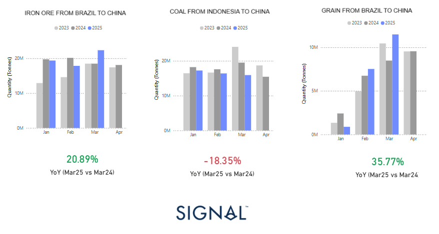

# Weekly Dry Market Monitor: Week 17, 2025

**Date**: April 23, 2025 | **Category**: Dry bulk | **Section**: Monitors | **Source**: [https://www.thesignalgroup.com/weekly-market-monitor/dry-week-17-2025](https://www.thesignalgroup.com/weekly-market-monitor/dry-week-17-2025)

---

*https://app.signalocean.com/dry/dynamic/drybulkflows-downloadable*

‍

The first quarter of 2025 has shown mixed signals in China's dry bulk import profile, reflecting commodity-specific trends and the broader strategic shifts underway amid the U.S.-China trade war. The above charts reveal YoY volume comparisons for March 2025 vs. March 2024, highlighting divergent patterns in iron ore, coal, and grain flows to China.

## Iron Ore from Brazil to China: +20.89% YoY (Mar25 vs Mar24)

The significant increase in iron ore imports from Brazil aligns with China's intensifiedurban renewal initiatives. According to the Chinese Ministry of Finance, the central government will continue to support urban renewal projects in 2025, focusing on addressing pressing concerns of the people and driving high-quality urban development. These projects, particularly in mega and super-large cities along key river basins, are expected to boost demand for construction materials, including steel, thereby increasing iron ore imports.​ Increased volumes from Brazil also underscore a preference for long-haul Capesize shipments, boosting tonne-mile demand and providing upward support to freight rates on routes like C3 (Brazil-China).

## Coal from Indonesia to China: -18.35% YoY (Mar25 vs Mar24)

Coal flows present a markedly different narrative. The 18.35% year-over-year decline likely reflects a mix of tightening environmental regulations, volatile power sector demand in China, and evolving geopolitical dynamics. Notably, Indonesia has been deepening trade ties with the U.S. and India. While coal hasn't been directly targeted in the ongoing trade war, the realignment of global alliances may indirectly influence China’s import preferences.

In the first quarter of 2025, coal-fired electricity generation in China fell by around 4.7% year-over-year, despite a 1% increase in overall electricity demand. High domestic coal inventories and a drop in March imports suggest a pivot toward local sourcing, especially as domestic coal prices have hit four-year lows. Adding to this shift, Indonesia’s implementation of a benchmark coal price has made its exports less competitive in China.

Geopolitical considerations are further influencing these trade patterns. Indonesia’s commitment to boosting U.S. imports by up to $19 billion—including $10 billion in energy products—is part of a broader strategy to reduce its trade surplus with Washington and avoid future tariffs. This rebalancing could come at the expense of exports to China, particularly in the coal sector.

At the same time, China has voiced concerns over nations that appear to be aligning more closely with the U.S., warning of retaliatory measures if its economic interests are undermined. These developments highlight how shifting global alliances are shaping more and more of China's energy import decisions.

## Grain from Brazil to China: +35.77% YoY (Mar25 vs Mar24)

Grain imports have soared, highlighting food security as a critical pillar of China's strategic trade calculus. With U.S. grain increasingly weaponised via tariffs and restrictions, China has deepened its agri-commodity trade with Brazil. The 35.77% increase in March aligns with seasonal procurement cycles but is likely amplified by the geopolitical imperative to decouple from American supply chains. This shift benefits the Supramax and Panamax segments engaged in transatlantic grain trade. It also reflects Beijing’s desire to preempt disruptions in a volatile trade environment. It underscores Brazil’s rising role as a key agri-export partner amid a realignment of global trade flows.

## Geopolitics Steering Trade Routes

The data reveals a clear shift in China’s commodity sourcing strategy, driven not just by economic and seasonal factors but also by broader strategic realignments amid the ongoing trade war with the U.S. Iron ore and grain imports from Brazil are rising sharply, supporting long-haul dry bulk demand. In contrast, coal imports from Indonesia are falling, signalling a more selective or deliberately redirected approach to procurement.

‍

For the latest updates and insights, make sure to visit theSignal Ocean Newsroompage & subscribe to weekly reports. Clickhere to request a demo. Check out ourprevious week's report here.

For subscription to our FREE weekly market trends email, please contact us: research@thesignalgroup.com

-Republishing is allowed with an active link to the source
