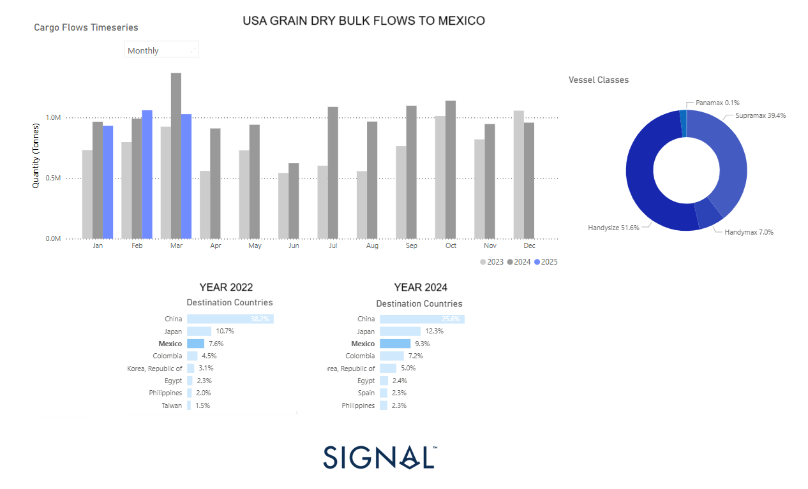

# Weekly Dry Market Monitor: Week 19, 2025

**Date**: May 06, 2025 | **Category**: Dry bulk | **Section**: Monitors | **Source**: [https://www.thesignalgroup.com/weekly-market-monitor/dry-week-19-2025](https://www.thesignalgroup.com/weekly-market-monitor/dry-week-19-2025)

---

## This week’s highlight focuses on the shifting trends in grain dry bulk flows from the  U.S. to Mexico

‍

*‍https://app.signalocean.com/dry/dynamic/drybulkflows-downloadable*

‍

‍

Between 2022 and 2024, US grain exports to Mexico have shown a significant upward trend, with Mexico's share rising from 7.6% in 2022 to 9.3% in 2024, indicating a strong and growing demand from its southern neighbour. This 1.7 percentage point increase reflects deeper trade ties and potentially changing sourcing strategies amid ongoing global uncertainties.

A notable trend accompanying this growth is the increased utilization of smaller vessel classes, particularly Handysize (51.6%) and Supramax (39.4%), which together account for over 90% of total cargo shipments. The preference for these vessels likely stems from Mexico’s port infrastructure limitations and the relatively shorter distances involved, favouring more flexible and cost-efficient smaller tonnage. Panamax participation is negligible at just 0.1%, reinforcing this trend.

Looking forward to 2025, the upward momentum of US grain exports to Mexico could very well continue. The ongoing US-China trade war may incentivize US exporters to further pivot towards reliable and politically stable markets such as Mexico. In this context, Mexico emerges as a vital outlet for US agricultural goods, absorbing capacity and supporting freight volumes in the Handysize and Supramax segments.

However, if a thaw in US-China relations occurs in 2025, a potential revamp in grain purchases from China could redirect a portion of export volumes away from Latin America. While this would be bullish for total export demand, it could lead to a shift in the vessel mix, with larger Panamax vessels regaining market share due to their suitability for longer Pacific voyages.

In summary, the current growth of exports to Mexico and the prominence of smaller vessels underscore a robust and regionally integrated trade dynamic. Yet, the geopolitical landscape, particularly the trajectory of US-China relations, will play a critical role in shaping 2025’s export flows and fleet deployment strategies.

‍

For the latest updates and insights, make sure to visit theSignal Ocean Newsroompage & subscribe to weekly reports. Clickhere to request a demo. Check out ourprevious week's report here.

For subscription to our FREE weekly market trends email, please contact us: research@thesignalgroup.com

-Republishing is allowed with an active link to the source
