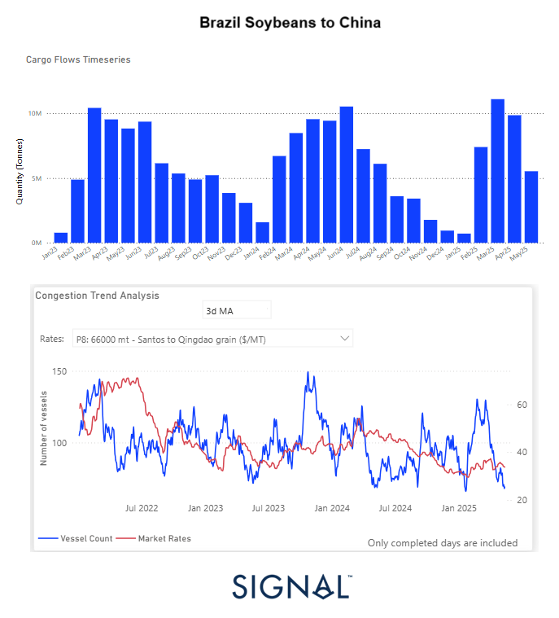

# Weekly Dry Market Monitor: Week 20, 2025

**Date**: May 14, 2025 | **Category**: Dry bulk | **Section**: Monitors | **Source**: [https://www.thesignalgroup.com/weekly-market-monitor/dry-week-20-2025](https://www.thesignalgroup.com/weekly-market-monitor/dry-week-20-2025)

---

## ‍Brazil solidifies dominance in China’s soybean market‍

*https://app.signalocean.com/dry/dynamic/drybulkflows-downloadable*

‍

Brazil continues to strengthen its position as China's primary soybean supplier, with this dominance mainly attributed to the country's record harvests, competitive pricing, and the absence of tariffs that continue to impact U.S. soybeans. Recent news revealed that China has lifted suspensions on five Brazilian soybean exporters, enhancing trade flows ahead of Brazilian President Lula da Silva's visit to Beijing. Additionally, China is investing in South American infrastructure, such as expanding Brazil's Santos port and constructing a $3.5 billion deep-water port in Peru, to streamline agricultural imports.

Despite the recent 90-day tariff truce between the U.S. and China—and China’s decision to reduce soybean import tariffs from 145% to 10%, effective May 14th—American soybean exports remain under pressure. Many U.S. farmers remain skeptical about the impact of these developments, pointing out that unless there is a significant disruption in South American supply, China is unlikely to substantially increase its purchases from the U.S. Reflecting these concerns, some market forecasts are already projecting a 20% decline in U.S. soybean exports, which could drive prices down to around $9 per bushel, compared to the current level of $10.60.

In addition, China’s strategic pivot to Latin America is exemplified by a recent summit in Beijing where President Xi Jinping announced a $9 billion investment credit line and other incentives to strengthen partnerships. Brazil's President Lula emphasized the "unbreakable" nature of Brazil-China relations, highlighting the benefits Brazil has reaped from the U.S.-China trade rift, especially in the soybean sector.

Exploring the latest Signal Ocean dry bulk flows data on soybeans from Brazil to China, there is a clear confirmed trend in all the above. In the first months of 2025, U.S. soybean exports to China experienced a marked surge, continuing a recurring seasonal pattern but reaching new highs. Starting from a low base in January (~1M tonnes), volumes sharply increased in February and March, peaking in April at over11 million tonnes—the highest monthly figure since the start of the year 2023. Compared to April 2024, which registered approximately 9.5M tonnes, the April 2025 figure represents ayear-on-year increase of over 15%, underscoring strengthened trade flows and possibly improved bilateral logistics or tariff conditions. May 2025, while slightly lower than April, still maintained historically elevated levels, indicating sustained demand beyond the traditional peak.

An analysis of the latestSignal Ocean dry bulk flow datareveals a strong and sustained trend in soybean shipments from Brazil to China. In early 2025, U.S. soybean exports to China showed a significant seasonal surge, but with volumes surpassing previous benchmarks. From a modest starting point of around 1 million tonnes in January, exports rose sharply through February and March, reaching a peak of over 11 million tonnes in April—the highest monthly total since early 2023. This represents a year-on-year increase of more than 15% compared to April 2024, when volumes stood at approximately 9.5 million tonnes. Although May has not yet concluded, preliminary data from the first half of the month already shows volumes at 50% of April’s total, signalling that Brazilian soybean shipments are likely to remain strong through the end of the month.

Although we have seen strong volumes of soybean voyage shipments to China, Baltic rates on the Santos–Qingdao route have yet to show a meaningful rebound. This is likely due to relatively smooth port operations in Santos, as reflected in theSignalOceancongestiontimeseriesdata, where vessel counts remain well below the peaks observed in early 2023 and mid-2024. Despite increased cargo movement, the lack of significant congestion keeps freight rates under pressure, as logistical efficiency limits any upward momentum in pricing. However, if the elevated export volumes seen in March and April continue into the summer—and especially if weather-related or operational disruptions arise—there is potential for a delayed market response. A rise in vessel queues, similar to historical seasonal peaks indicated in the data, could begin to exert upward pressure on rates. The next few weeks will be critical in determining whether market dynamics shift as demand and fleet positioning evolve.

For the latest updates and insights, make sure to visit theSignal Ocean Newsroompage & subscribe to weekly reports. Clickhere to request a demo. Check out ourprevious week's report here.

For subscription to our FREE weekly market trends email, please contact us: research@thesignalgroup.com

-Republishing is allowed with an active link to the source
