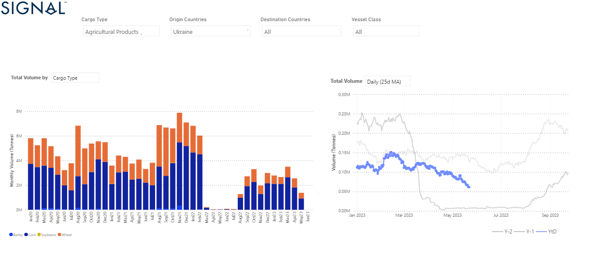

# Weekly Dry Market Monitor - Week 21, 2023

**Date**: May 18, 2024 | **Category**: Dry bulk | **Section**: Monitors | **Source**: [https://www.thesignalgroup.com/weekly-market-monitor/dry-week-21-2023](https://www.thesignalgroup.com/weekly-market-monitor/dry-week-21-2023)

---

## Despite signs of recovery in the 1Q, the volume of flows is still lower than last year

*Data Source: The Signal Ocean Platform, Dry Bulk Flowshttps://app.signalocean.com/dry/dynamic/drybulkflows*

‍

In the closing days of May, the freight market experienced a notable slowdown in momentum, primarily observed in the Capesize segment. Conversely, the smaller vessel size segments have maintained a relatively stable outlook. However, uncertainty continues to prevail as the demand picture remains relatively weak. Growing concerns surround China's economic growth and its iron ore import needs, as there are indications of moderation in the iron ore spot price.

Turning to the grain segment, the market witnessed an extension of the Black Sea Grain Initiative, which is a positive development. Nevertheless, challenges pertaining to ship inspections at Black Sea ports remain a significant consideration. The volume of Ukraine grain exports to all destinations is still striving to establish a consistent growth pace. As depicted in the provided image, there were some signs of recovery in the first quarter regarding the volume of Ukrainian grain exports. However, this progress was later undermined by the recent weakness in May, with levels dropping even lower than those of the previous year. The upcoming month will shed light on whether there will be a turnaround following the extension deal.

For the latest updates and insights, make sure to visit theSignal Ocean Newsroomwebsite page. Clickhere to request a demo.

For subscription to our FREE weekly market trends email, please contact us: research@thesignalgroup.com

-Republishing is allowed with an active link to the source
