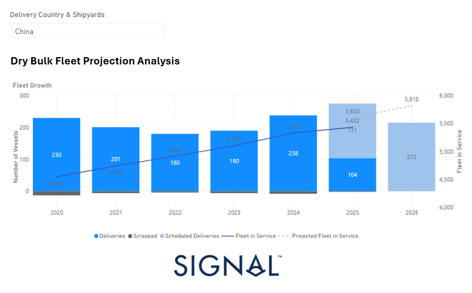

# Weekly Dry Market Monitor: Week 21, 2025

**Date**: May 22, 2025 | **Category**: Dry bulk | **Section**: Monitors | **Source**: [https://www.thesignalgroup.com/weekly-market-monitor/dry-week-21-2025](https://www.thesignalgroup.com/weekly-market-monitor/dry-week-21-2025)

---

## With growing industry attention focused on the latest USTR port fees, we take a closer look at the evolution of the dry bulk fleet (with delivery country and shipyards in China), particularly in light of a noticeable slowdown in new contracting activity.

‍

*Signal Figure*

‍

https://app.signalocean.com/dry/dynamic/orderbook_dry

‍

According toSignal Ocean Orderbook Data Analytics – Dry Bulk Fleet Projection Analysis, between 2020 In 2024, the global dry bulk fleet experienced steady expansion, increasing from 4,545 vessels in 2020 to 5,330 vessels by the end of 2024. This growth was primarily supported by sustained newbuilding deliveries and relatively low levels of scrapping activity.

In 2020, deliveries surged to 230 vessels, likely reflecting the resumption of shipyard activity following early pandemic disruptions. Deliveries then declined year over year, falling to 201 vessels in 2021, 180 in 2022, and 190 in 2023, before climbing again to 238 vessels in 2024—the highest figure during this period. Scrapping volumes remained limited throughout, ranging from -13 vessels in 2020 to between -4 and -8 vessels in the subsequent years.

This supply-side dynamic, characterised by continued inflows and limited vessel removals, drove consistent fleet growth. By 2023, the fleet in service had reached 5,100 vessels, and by 2024, it stood at 5,330, reflecting a compound annual growth of over 3% since 2020.

Looking ahead to 2025 and 2026, projections fromSignalOcean’sorderbookdatasuggest that the dry bulk fleet will continue to expand. Deliveries are expected to sharply decline to 104 vessels in 2025, with a 75% decrease in scrapping activity from 2024. However, this apparent slowdown in delivery volumes is offset by the inclusion of scheduled deliveries, amounting to 171 vessels in 2025 and 215 vessels in 2026. As a result, the fleet is projected to increase to 5,603 vessels in 2025 and 5,818 vessels by 2026.

This forecasted slowdown in actual newbuilding deliveries is occurring alongside rising cost pressures and policy headwinds—most notably the impact of U.S. Trade Representative (USTR) port fees, which have discouraged U.S.-linked shipowners from contracting vessels at Chinese shipyards. Given China’s dominant role in the global shipbuilding industry, the tariffs have introduced new friction into the orderbook pipeline. There is growing evidence that some shipowners have either postponed newbuilding commitments or redirected interest toward non-Chinese yards, despite their generally higher costs and longer delivery times. The recent decline in scheduled deliveries for 2025 and 2026 may, at least in part, reflect this shift in contracting behaviour.

While the fleet is still projected to grow by nearly 500 vessels by the end of 2026, the composition and timing of that growth are changing. If scrapping activity remains limited and demand growth does not match capacity additions, there is potential for a supply overhang in the dry bulk sector by the end of 2026.

For the latest updates and insights, make sure to visit theSignal Ocean Newsroompage & subscribe to weekly reports. Clickhere to request a demo. Check out ourprevious week's report here.

For subscription to our FREE weekly market trends email, please contact us: research@thesignalgroup.com

-Republishing is allowed with an active link to the source
