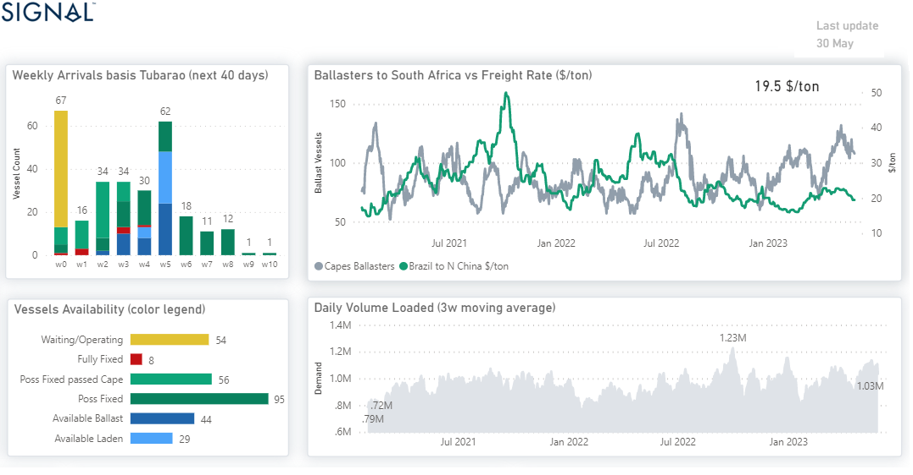

# Weekly Dry Market Monitor: Week 22, 2023

**Date**: May 18, 2024 | **Category**: Dry bulk | **Section**: Monitors | **Source**: [https://www.thesignalgroup.com/weekly-market-monitor/dry-week-22-2023](https://www.thesignalgroup.com/weekly-market-monitor/dry-week-22-2023)

---

## The number of ballasters has been steadily increasing since the beginning of April

*Data Source: TheSignal OceanPlatform,C3 Dashboard*

The Chinese economy is grappling with challenges as the property sector weakens and iron ore prices slide. Chinese demand for iron ore is on a decreasing trend, while it seems that we are nearing the end of an era for Chinese construction. Chinese steel producers have expressed the need for production cuts this year due to a batch of worrisome macroeconomic and property sector data. The decline in property investment by 16.2% in April has intensified the pressure, leading to a contraction in new housing prices for the 12th consecutive month. Furthermore, the bearish sentiment has been reinforced by abundant supply, with key producers Australia and Brazil reporting robust output.

Observing the image above, it is evident that there has been a consistent rise in the number of Capesize ballasters heading to South Africa since the start of April. This increase coincides with the Brazil to North China rates plummeting to below $20/ton. The current levels are among the lowest recorded this year, indicating a prevailing negative sentiment for Capesize Brazil to North China rates. This downward trend is expected to persist throughout the second half of the year.

For the latest updates and insights, make sure to visit theSignal Ocean Newsroomwebsite page. Clickhere to request a demo.

For subscription to our FREE weekly market trends email, please contact us: research@thesignalgroup.com

-Republishing is allowed with an active link to the source
