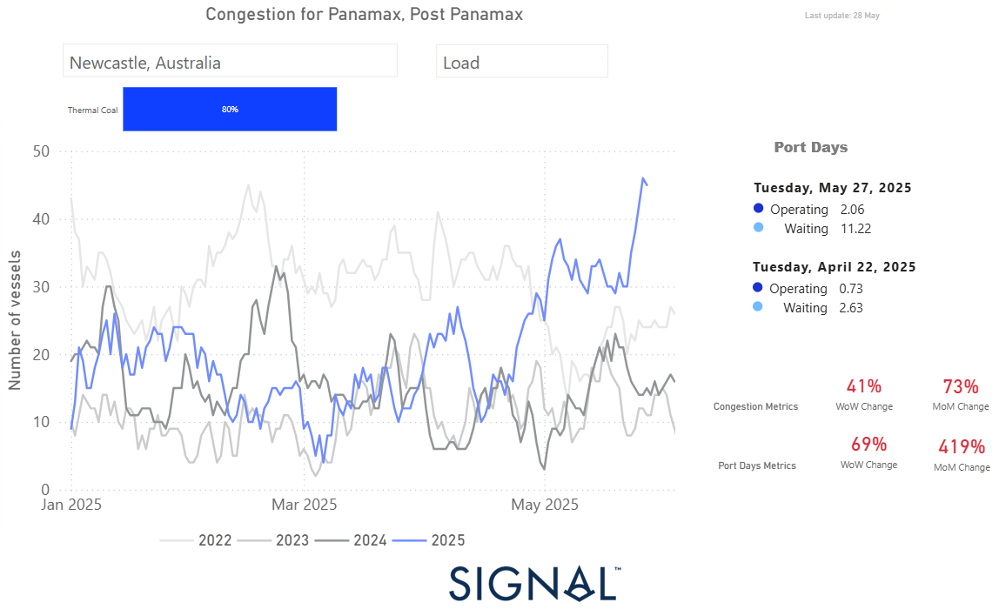

# Weekly Dry Market Monitor: Week 22, 2025

**Date**: May 28, 2025 | **Category**: Dry bulk | **Section**: Monitors | **Source**: [https://www.thesignalgroup.com/weekly-market-monitor/dry-week-22-2025](https://www.thesignalgroup.com/weekly-market-monitor/dry-week-22-2025)

---

‍

*https://app.signalocean.com/dry/dynamic/port_insights_dry_download*

‍

This week’s Market Monitor focuses on Australian dry bulk port congestion,following last week’s news of debris disrupting operations at Newcastle, the country’s largest thermal coal port. Newcastle’s loading port efficiency appears to be under serious turbulence due to severe rainfall leading to flooding across the Hunter River tributaries, a key region for coal mining. This has already signalled a significant impact on key congestion metrics, with an increase in port days in waiting status.

As of May 27th, congestion levels reflect the impact of extreme weather conditions, with vessel queues at Newcastle peaking at more than 40 ships waiting to load thermal coal. In addition, waiting days have surged to 11 from just 3 a month ago. Currently, congestion has spiked to levels not seen since the start of 2022.

Congestion metrics from Signal Ocean Data Port Insights record a 41% weekly increase in the number of Panamax and Post-Panamax dry bulk vessels, and a 73% monthly increase. In terms of port days metrics, there is a 69% weekly increase, while on a monthly basis, the figure has spiked, showing a 419% change.

The coming days will reveal whether this upward trend in congested volumes will persist or ease as weather conditions normalize. The recent situation underscores how severe weather can disrupt port efficiency and the importance of port infrastructure to prevent operational disruptions in the event of a natural disaster.

There remains cautious uncertainty about the immediate recovery of the increased congestion metrics. When it comes to the volume of Australian thermal coal exports, the first quarter Signal Ocean Cargo Flows Trend Analysis indicated a 12% decrease compared to the activity seen during the first quarter of the previous year, while on a monthly level, year-to-date data shows a 26% decrease. Thus, the scenario of a sustained spike in waiting port days for loading thermal coal at Newcastle seems unlikely to be maintained once the operational issues are resolved, as the monthly volume of thermal coal exports from Australia has not yet significantly increased to justify such a sharp rise in port delays. This suggests we may soon see an easing trend in Australian dry bulk port congestion.

In the scenario of a delayed resolution, the debris issue could lead to further operational inefficiencies and support an increase in loading congestion metrics at other alternative Australian ports. In the case of Australian Port Walcott, the first signs have already appeared, with a 35% increase in the number of Capesize vessels for iron ore loading and a rise in the number of waiting days to 9, up 160% on a weekly basis. Meanwhile, it is worth noting that North Chinese ports, especially Tianjin, also experienced a record spike in congestion for the Supramax vessel segment in mid-April. This was primarily due to adverse weather, particularly fog, which increased port waiting times. Fortunately, conditions have started to normalize as warmer temperatures return to Tianjin. In the large vessel size category of the VLOC, a slowdown in the number of vessels congested at Ponta da Madeira is observed at levels lower than those recorded in 2022, 2023, and 2024. For Capesize vessels, the congestion trend also indicates significantly lower volumes compared to the peak seen in March 2024, with a recent 3% monthly increase.

For the latest updates and insights, make sure to visit theSignal Ocean Newsroompage & subscribe to weekly reports. Clickhere to request a demo. Check out ourprevious week's report here.

For subscription to our FREE weekly market trends email, please contact us: research@thesignalgroup.com

-Republishing is allowed with an active link to the source
