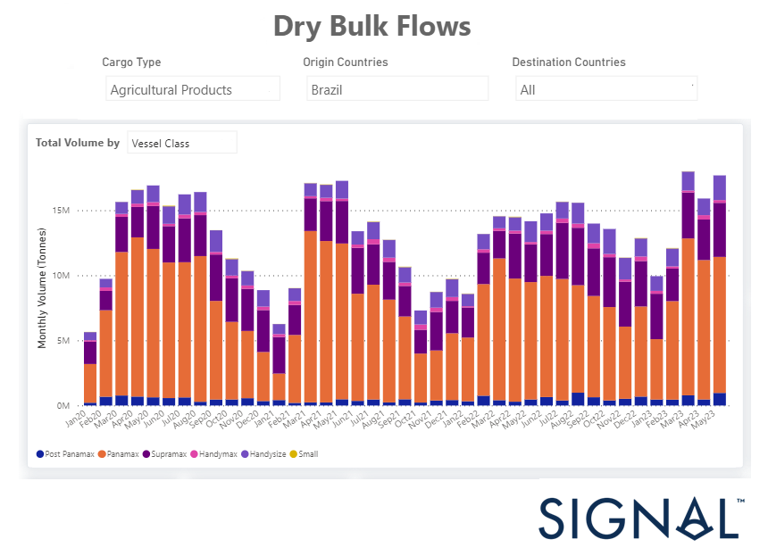

# Weekly Dry Market Monitor - Week 24, 2023

**Date**: May 18, 2024 | **Category**: Dry bulk | **Section**: Monitors | **Source**: [https://www.thesignalgroup.com/weekly-market-monitor/dry-week-24-2023](https://www.thesignalgroup.com/weekly-market-monitor/dry-week-24-2023)

---

## Jan-May ‘23: 80% increase in the monthly volume of Brazilian agricultural exports to all destinations

*Data Source: TheSignal OceanPlatform*

The Capesize and Panamax freight rates are showing signs of a revival, suggesting a positive turnaround in the shipping industry. Furthermore, the number of Capesize vessels ballasting in SE Africa has experienced a significant downward trend after maintaining persistently high levels above the annual average for several weeks. This decline in ballasters can potentially reinforce the recent recovery in the sector. Despite the fragile nature of the Panamax freight market recovery, there has been a substantial surge in the monthly volume of seaborne agricultural products being shipped from Brazil to multiple destinations. Particularly noteworthy is the growing market share of Panamax vessels in the trading business, as illustrated in the provided image.

In the iron ore market, after a sustained period of growth, the iron ore price faced a setback, registering its first decline in nine consecutive sessions. The retreat was accompanied by a cautionary note from Goldman Sachs Group, which emphasised the potential long-term ramifications of China's property weakness on its economy. According to data from Fastmarkets MB, the benchmark price for 62% Fe fines, frequently imported into Northern China, was recorded at $111.72 per tonne on Monday morning, denoting a 3.76% decrease.

For the latest updates and insights, make sure to visit theSignal Ocean Newsroomwebsite page. Clickhere to request a demo.

For subscription to our FREE weekly market trends email, please contact us: research@thesignalgroup.com

-Republishing is allowed with an active link to the source
