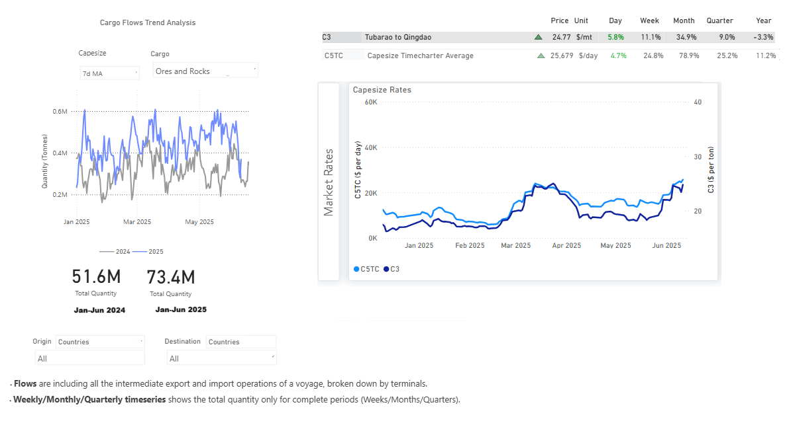

# Weekly Dry Market Monitor: Week 24, 2025

**Date**: June 13, 2025 | **Category**: Dry bulk | **Section**: Monitors | **Source**: [https://www.thesignalgroup.com/weekly-market-monitor/dry-week-24-2025](https://www.thesignalgroup.com/weekly-market-monitor/dry-week-24-2025)

---

*https://app.signalocean.com/dry/dynamic/drybulkflows-downloadable*

‍

This week’s Market Monitor highlights the strong performance in Capesize iron ore flows, which have continued to support demand throughout the year. This trend is reflected in the recent strengthening of the Baltic Capesize Index and average earnings on the C5TC route.

Bauxite shipments have also played a notable role in supporting Capesize fleet employment, with a significant increase in volumes fromGuinea to Chinaduring the first quarter of the year. However, there are growing concerns about the sustainability of this trend into the second and third quarters.West Africa's wet season, which typically spans from May to October, could disrupt mining and logistics operations and reduce loading efficiency at ports such as Kamsar. This seasonal pattern could lead to a drop in bauxite exports, particularly in Q3, placing downward pressure on Capesize employment from this trade.

Meanwhile, the broader strength of the Baltic Dry Index continues to be supported by the Capesize segment. Voyage data estimates show a firm 7-day moving average in iron ore shipments, indicating consistent demand for Capesize vessels.

On the supply side, while there are indications of a decline in the number of ballast vessels, today’s market sentiment appears primarily driven bycargo demand rather than vessel supply tightening. This suggests that the current bullish trend may remain stable in the near term, provided demand for key cargoes like iron ore and bauxite holds.‍

For the latest updates and insights, make sure to visit theSignal Ocean Newsroompage & subscribe to weekly reports. Clickhere to request a demo.

For subscription to our FREE weekly market trends email, please contact us: research@thesignalgroup.com

-Republishing is allowed with an active link to the source
