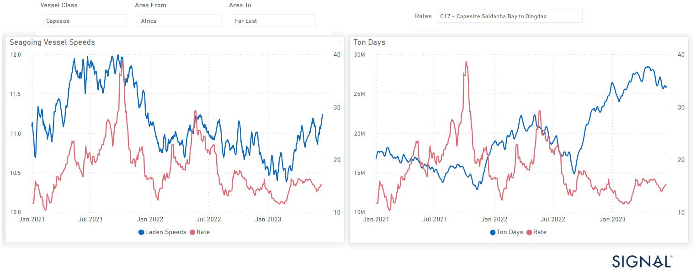

# Weekly Dry Market Monitor - Week 25, 2023

**Date**: May 18, 2024 | **Category**: Dry bulk | **Section**: Monitors | **Source**: [https://www.thesignalgroup.com/weekly-market-monitor/dry-week-25-2023](https://www.thesignalgroup.com/weekly-market-monitor/dry-week-25-2023)

---

## A remarkable turnaround in ton days for Capesize West Africa to China has increased rates and laden speed in the Q2

*Data Source: TheSignal OceanPlatform data*

There has been a remarkable turnaround in ton days for Capesize shipments from West Africa to China, as illustrated in the provided image, leading to increased rates and improved laden speed during the second quarter. This positive shift signifies improved performance in terms of cargo volume and transportation efficiency in this specific trade route. The higher rates and faster laden speed highlight favorable market conditions and potentially enhanced operational capabilities within the Capesize segment for this particular route.

The third week of June started on a positive note with firmness observed in the Capesize segment. Additionally, there was a notable reduction in the number of ballast vessels for the SE Africa trade route. However, the smaller vessel size segment faced challenges in maintaining rates, leading to discussions about potential downward revisions. Despite this, the increased congestion at Chinese ports for smaller ships played a role in preventing a collapse of freight rates. Meanwhile, uncertainties surround the extension of the Black Sea Grain Initiative into July, adding an element of unpredictability to the market. These various factors contribute to the dynamic and evolving nature of the shipping industry, necessitating careful monitoring and assessment of market conditions.

For the latest updates and insights, make sure to visit theSignal Ocean Newsroomwebsite page. Clickhere to request a demo.

For subscription to our FREE weekly market trends email, please contact us: research@thesignalgroup.com

-Republishing is allowed with an active link to the source
