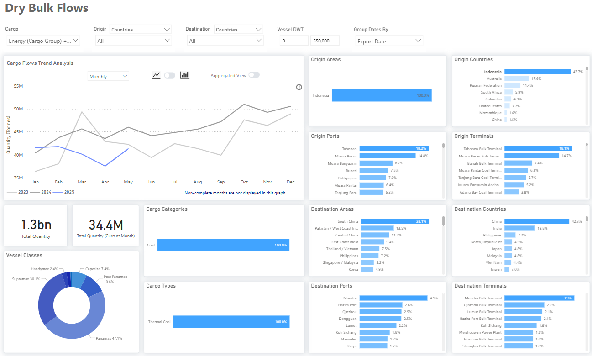

# Weekly Dry Market Monitor: Week 26, 2025

**Date**: June 26, 2025 | **Category**: Dry bulk | **Section**: Monitors | **Source**: [https://www.thesignalgroup.com/weekly-market-monitor/dry-week-26-2025](https://www.thesignalgroup.com/weekly-market-monitor/dry-week-26-2025)

---

*https://app.signalocean.com/dry/dynamic/drybulkflows-downloadable*

‍

This week’sMarket Monitorhighlights a notable shift in thermal coal trade flows, particularly in the evolving import strategies of China and India. According to the latest dry bulk flow data,Indonesiacontinues to account for 48% of global thermal coal exports, with Taboneo and Muara Berau remaining the most active origin terminals. However, Chinese and Indian buyers are increasingly turning to higher-grade coal alternatives from countries such as Australia and Russia. This trend appears to be mainly driven by the current downturn in global coal prices, which has made energy-dense coal from non-Indonesian sources more cost-competitive.

World Bankdata confirms that Australia’s Newcastle 6,300 kcal/kg FOB coal price averaged $104.41/t in May 2025, up approximately 6% from $98.61 in April, but down about 26.5% compared to $142.01 in May 2024. Meanwhile, as early as March, trends indicated that railborne coal imports fromMongoliaand Russia were gaining share, as improved infrastructure made land transport cheaper than seaborne alternatives.

Chinacontinues to dominate, receiving 42% of Indonesian coal shipments, followed by India at 19%. However, both nations are showing a clear shift toward sourcing coal with higher calorific values. At the same time, Chinese seaborne coal imports are being gradually displaced by rising domestic coal production, which is a trend reinforced by policy support and the continued approval of new coal-fired power plants.

InQ12025,Chinaapproved 11.3 GW of new coal plant capacity, surpassing the 10.3 GW approved in the entire first half of 2024, signaling continued support for domestic coal infrastructure. In early June, the China Coal Transportation & Distribution Association projected thatcoal importscould decline by 50–100 million tonnes in 2025, stemming from significantly higher domestic production and state directives to reduce imports and stockpile local coal.‍

For the latest updates and insights, make sure to visit theSignal Ocean Newsroompage & subscribe to weekly reports. Clickhere to request a demo. Click here to see theprevious dry bulk weeklyreport.

For subscription to our FREE weekly market trends email, please contact us: research@thesignalgroup.com

-Republishing is allowed with an active link to the source
