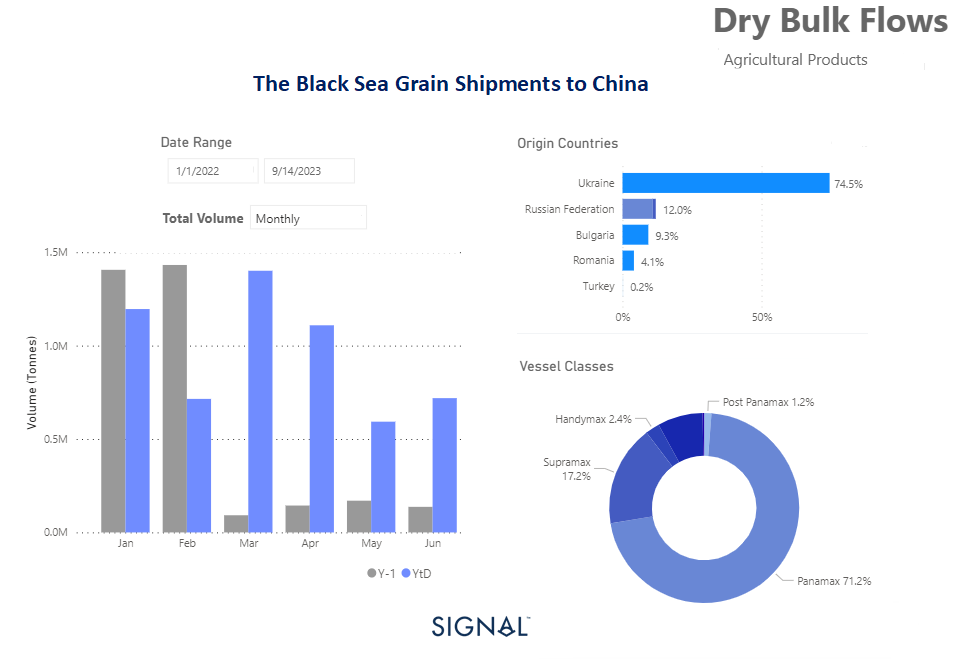

# Weekly Dry Market Monitor - Week 27, 2023

**Date**: May 18, 2024 | **Category**: Dry bulk | **Section**: Monitors | **Source**: [https://www.thesignalgroup.com/weekly-market-monitor/dry-week-27-2023](https://www.thesignalgroup.com/weekly-market-monitor/dry-week-27-2023)

---

## Dominant Destination: China Receives the Lion's Share of Black Sea Grain Shipments

*Data Source: TheSignal OceanPlatform Data*

‍

The initial days of July concluded on a positive note, with a buoyant sentiment surrounding vessel freight rates in the Capesize segment. Additionally, both the Panamax and Supramax segments experienced a firmer momentum. However, the uncertainty surrounding the potential extension of the Black Sea Grain Initiative casts a shadow over the outlook for smaller vessel sizes.

The increasing volume of grain exports from Black Sea countries, particularly to China, is a noteworthy development in the industry. The Panamax vessel size plays a vital role in facilitating these shipments, as depicted in the provided image. The surge in Black Sea grain shipments has been significant, with China emerging as the primary destination, receiving the highest volume of grain from this region. Amidst the ongoing uncertainty surrounding the potential extension of the Black Sea Grain Initiative in mid-July, notable developments are taking place in China's iron ore industry aimed at improving air quality.

Recent decisions made by China indicate a mixed sentiment of concerns regarding Chinese demand. This sentiment has led to a slip in iron ore prices following the order from Tangshan, China's top steelmaking hub, for local steel mills to reduce production as part of their efforts to enhance air quality.

For the latest updates and insights, make sure to visit theSignal Ocean Newsroomwebsite page. Clickhere to request a demo.

For subscription to our FREE weekly market trends email, please contact us: research@thesignalgroup.com

-Republishing is allowed with an active link to the source
