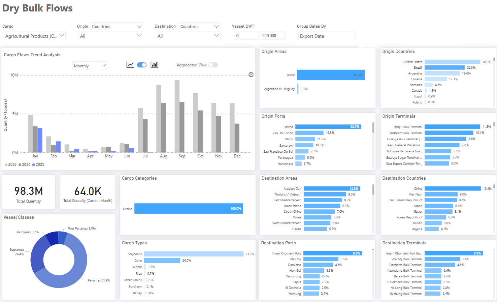

# Weekly Dry Market Monitor: Week 28, 2025

**Date**: July 9, 2025 | **Category**: Dry bulk | **Section**: Monitors | **Source**: [https://www.thesignalgroup.com/weekly-market-monitor/dry-week-28-2025](https://www.thesignalgroup.com/weekly-market-monitor/dry-week-28-2025)

---

*‍https://app.signalocean.com/dry/dynamic/drybulkflows-downloadable*

‍

This week’sChart Monitor highlights increasing constraints on Brazilian corn exports,even as the country nears its second-largest harvest on record. Brazil’s National Supply Company (Conab) projects 2024–2025 corn production at nearly 5 billion bushels (about 126.2 million metric tons), a 10% year-over-year increase fueled by favorable weather in April and May, which boosted yields across key producing states, especially for thesecond crop(safrinha), which makes up roughly 78% of national output.

Despite this bumper harvest, export momentum is waning. After peaking in the second half of 2023, corn shipments have slowed significantly throughout 2024 and are likely to stay subdued through 2025. The main reason is rising domestic demand, particularly from Brazil’s livestock sector and a rapidly growing corn ethanol industry, both of which are absorbing a larger share of the crop. As a result, the exportable surplus is shrinking, and Brazil is expected to focus more on domestic consumption rather than exports, possibly limiting its role as a global corn supplier through 2025.

Current dry bulk flow data from the Signal Ocean Platform confirms this slowdown. As of early July 2025, corn accounts for 26% of Brazil’s total agricultural shipments, with Panamax and Supramax vessel classes dominating at an 86% share. However, year-to-date volumes are trending at a multi-year low, especially when compared to the higher export activity seen in July, August, and September of 2023 and 2024. July had already started with extremely low shipment levels, marking a significant drop from seasonal norms and reinforcing expectations of subdued export flows for the rest of the year. The downward trend has also begun to be depicted in the growth of tonne days for agricultural shipments from Brazil to all destinations (as analyzed in the demand section).

The declining trend is now also reflected in the growth of tonne-days for Brazilian agricultural shipments across all destinations (as detailed in the demand section).‍

For the latest updates and insights, make sure to visit theSignal Ocean Newsroompage & subscribe to weekly reports. Clickhere to request a demo. Click here to see theprevious dry bulk weeklyreport.

For subscription to our FREE weekly market trends email, please contact us: research@thesignalgroup.com

-Republishing is allowed with an active link to the source
