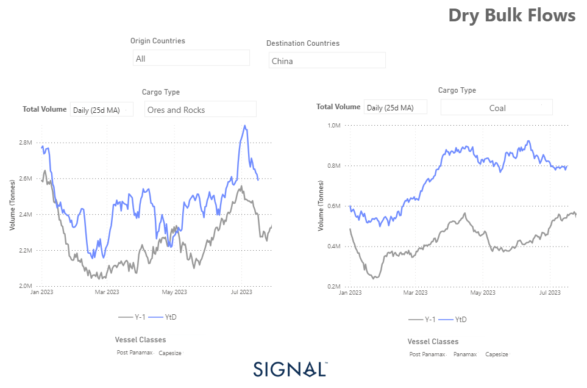

# Weekly Dry Market Monitor - Week 29, 2023

**Date**: May 18, 2024 | **Category**: Dry bulk | **Section**: Monitors | **Source**: [https://www.thesignalgroup.com/weekly-market-monitor/dry-week-29-2023](https://www.thesignalgroup.com/weekly-market-monitor/dry-week-29-2023)

---

## Iron ore and coal dry bulk flows to China daily (25d MA) above year-earlier level

*Data Source: TheSignal OceanPlatform Data*

The third week of July sustained the downward trend of freight market rates of the previous days of July, however, signs of an upward trend were recorded in the Panamax Continent to Far East rates. On the supply side, the number of ballast ships increased significantly across all vessel size categories implying that freight rates are potentially likely to keep struggling to perform at higher levels, while uncertainty looms around Chinese economic performance. Amid concerns on Chinese solid demand, we can see that a higher volume of coal and iron ore is heading to the second world’s largest economy from all origin countries.

As we see in the image above, the daily 25 days moving average is surpassing throughout the year the levels recorded a year ago per month. This gives a pillar of resistance for freight rates to fall sharply to weaker levels than those recorded throughout July for the Capesize and Panamax vessel size segments.

Meanwhile, it is worth noting that most research houses have lowered their forecast for iron ore prices for the remainder of the year. But the market is fuelling optimism over a Chinese stimulus package to support the industry, in general. Currently, iron ore is trading at around $112 a tonne.

For the latest updates and insights, make sure to visit theSignal Ocean Newsroomwebsite page. Clickhere to request a demo.

For subscription to our FREE weekly market trends email, please contact us: research@thesignalgroup.com

-Republishing is allowed with an active link to the source
