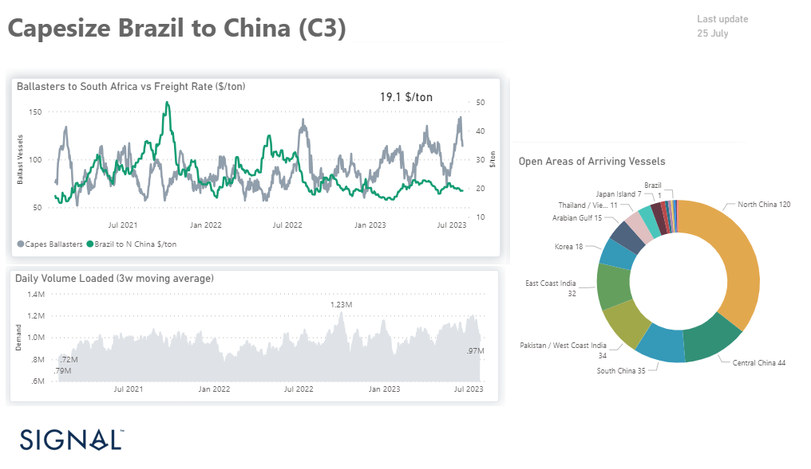

# Weekly Dry Market Monitor - Week 30, 2023

**Date**: May 18, 2024 | **Category**: Dry bulk | **Section**: Monitors | **Source**: [https://www.thesignalgroup.com/weekly-market-monitor/dry-week-30-2023](https://www.thesignalgroup.com/weekly-market-monitor/dry-week-30-2023)

---

## July’s spikes in the number of ballasters with rates dropping throughout the month

*Data Source: TheSignal OceanPlatform Data*

The last days of July are still quiet with a weaker sentiment of freight rates in all size classes, while all eyes are on the Black Sea grain market after Russia decided to not extend the agreement  that allows the safe shipment of Ukrainian grain through the Black Sea ports.

The third quarter of this year brings several challenges, such as the increasing number of Capesize vessels and uncertainty about the level of Chinese economic activity. State news agency Xinhua reported this week that China will step up economic policy adjustments, focusing on expanding domestic demand, boosting confidence, and avoiding risks, as the second quarter of this year brought insufficient domestic demand.

July is nearing its end with an increase in the number of ballast vessels from the lows recorded at the end of June, while the daily volume shipped (3w MA) falls to below 1 million in terms of demand (see image above). The downward revision of expectations for the iron ore industry is already reflected in the profits of iron ore companies.

Rio Tinto will reportedly be the first of the global iron ore groups to report lower half-year profits this week, as supply chains normalise after COVID-19 and attention turns to how suppliers in the Chinese steel industry view customer demand.

For the latest updates and insights, make sure to visit theSignal Ocean Newsroomwebsite page. Clickhere to request a demo.

For subscription to our FREE weekly market trends email, please contact us: research@thesignalgroup.com

-Republishing is allowed with an active link to the source
