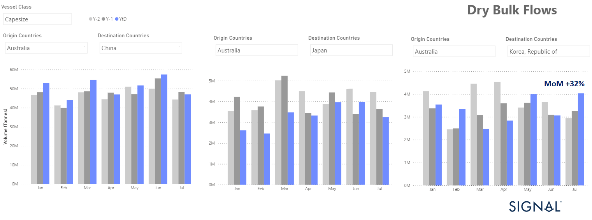

# Weekly Dry Market Monitor - Week 31, 2023

**Date**: May 18, 2024 | **Category**: Dry bulk | **Section**: Monitors | **Source**: [https://www.thesignalgroup.com/weekly-market-monitor/dry-week-31-2023](https://www.thesignalgroup.com/weekly-market-monitor/dry-week-31-2023)

---

## Downward revision of Capesize iron ore flows from Australia to China and Japan in July

*Signal Figure*

In early August, Atlantic Capesize freight rates posted significant increases on both a weekly and monthly basis, driving the Baltic C5TC (Timecharter Average $/d) to a weekly increase of 32%. Capesize route C8 (Transatlantic Round Gibraltar/Hamburg $/d) saw a 70% increase and the C7 route (Bolivar to Rotterdam $/mt) saw a 26% increase (WoW). Overall, the Baltic Dry Index ended yesterday up 16.5% (WoW), with Capesize and Panamax routes showing an upward trend, while downward pressure continued in the smaller ship size segments.

It is interesting to note that challenges remain in the iron ore market, as July ended with a downward revision in monthly volumes for Capesize iron ore flows from Australia to China and Japan; however, in the case of Japan, there was a notable increase. Specifically, the monthly volume of iron ore flows from Australia to China was about 47 million tonnes, while the volume to Japan was 3.3 million tonnes, down 18% from the previous month (see image above).

On the other hand, Capesize iron ore flows to Korea recorded significant growth, reaching around 4 million tonnes, representing a remarkable 32% month-on-month increase and a substantial 24% year-on-year. the ongoing challenges, there is a glimmer of hope as signs of mild optimism emerged towards the end of July, signalling an end to the previous downward spiral.

It remains to be seen whether the latest policy measures announced by the Chinese government at its Politburo meeting in the last week of July, aimed at boosting domestic demand and supporting private investment in underdeveloped areas, will have a significant impact on demand for steel and iron ore in the coming quarters.

For the latest updates and insights, make sure to visit theSignal Ocean Newsroomwebsite page. Clickhere to request a demo.

For subscription to our FREE weekly market trends email, please contact us: research@thesignalgroup.com

-Republishing is allowed with an active link to the source
