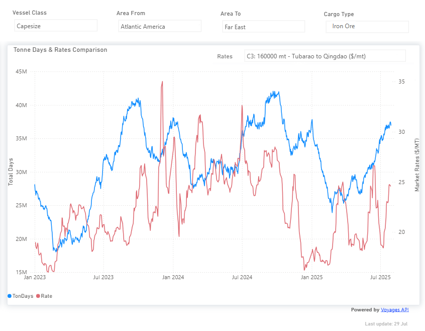

# Weekly Dry Market Monitor: Week 31, 2025

**Date**: July 31, 2025 | **Category**: Dry bulk | **Section**: Monitors | **Source**: [https://www.thesignalgroup.com/weekly-market-monitor/dry-week-31-2025](https://www.thesignalgroup.com/weekly-market-monitor/dry-week-31-2025)

---

## Spotlight on Capesize Tonne Days to the Far East and C3 Market Rates

## ‍

*https://app.signalocean.com/dry/dynamic/timeseries_dry*

‍

This week’sChart Monitorhighlights a continued upward trend in tonne-day growth for the Capesize segment during Q2 2025, particularly on voyages from the Atlantic Americas to the Far East. However, the recent surge in demand on the C3 route (Brazil to China) raises concerns about its durability as we move into the third quarter.

This week, C3 rates saw a downward trend as ballast vessel activity in the South Atlantic increased, potentially signaling a build-up of supply pressure in the weeks ahead. Meanwhile, Rio Tinto reported its lowest first-half profit in five years, at $4.81 billion, marking a ~16% year-on-year decline. The drop was driven by softer iron ore prices and persistent oversupply from key exporting regions, Australia, Brazil, and South Africa. The company also cut its interim dividend and reported higher unit costs, citing cyclone disruptions and reduced shipments from its Pilbara operations.

Global iron ore production stays elevated. Major miners, including Fortescue, Rio Tinto, and BHP, have kept overall iron‑ore output steady or at record levels, while Vale has trimmed its high‑grade pellet guidance. That persistent volume amid soft Chinese steel demand is exacerbating oversupply pressures and capping the scope for a sustained iron‑ore price rebound.

Looking ahead, bullish sentiment for Q3 appears increasingly fragile, especially as macroeconomic signals from China continue to weaken. The Chinese manufacturing PMI has remained below the 50-point threshold for several months, registering 49.3 in June, indicating contraction in industrial activity and softening steel demand beyond just construction.

Seasonal factors also weigh on steel consumption in July–August, driven by high temperatures, heavy rainfall, and routine maintenance shutdowns, typically resulting in a 5–10% dip in demand. This year, however, the usual seasonal slowdown is compounded by structural economic weakness, exerting further downward pressure on iron ore prices.

China’s property sector, responsible for roughly 35–40% of domestic steel and iron ore demand, continues to deteriorate. In Q1 2025, new residential construction starts fell ~24% year-on-year, while property investment dropped ~16–17%. Despite government stimulus efforts, including a ¥4 trillion loan facility and tax incentives, buyer interest remains subdued. A backlog of unsold homes and ongoing developer bankruptcies continue to drag on construction activity and raw material consumption.

Finally, China's portside iron ore inventories climbed to 133–136 million tonnes before the end of June, around 12% above the five-year average, underlining subdued offtake and deepening demand-side risks, rather than any sign of market stabilization.‍

For the latest updates and insights, make sure to visit theSignal Ocean Newsroompage & subscribe to weekly reports. Clickhere to request a demo. Click here to see theprevious dry bulk weeklyreport.

For subscription to our FREE weekly market trends email, please contact us: research@thesignalgroup.com

-Republishing is allowed with an active link to the source
