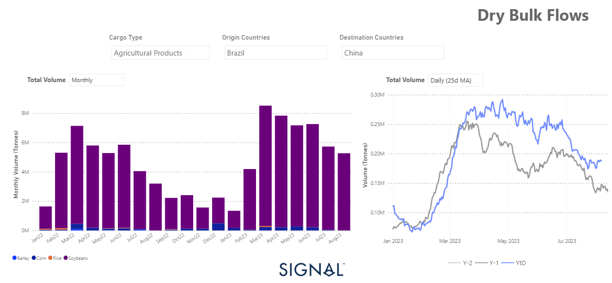

# Weekly Dry Market Monitor - Week 32, 2023

**Date**: May 18, 2024 | **Category**: Dry bulk | **Section**: Monitors | **Source**: [https://www.thesignalgroup.com/weekly-market-monitor/dry-week-32-2023](https://www.thesignalgroup.com/weekly-market-monitor/dry-week-32-2023)

---

## Upward revision of grain flows from Brazil to China throughout this year

*Signal Figure*

As the second week of August commenced, the momentum in the freight market exhibited greater resilience, particularly marked by substantial gains in the larger vessel size segments. Concurrently, persistent geopolitical challenges continued to exert a downward influence on the smaller vessel size categories. Notably, the rising count of ballast ships sent escalating signals, raising apprehensions about the sustainability of the upward trajectory of freight rates as the summer season progresses.

In the grain market, meanwhile, commodity prices have risen again. This increase is due to Russia's withdrawal from a grain agreement and India's imposition of restrictions on certain rice exports. In recent months, China has significantly increased its monthly grain imports from Brazil compared with the corresponding months last year. In addition, the prevailing uncertainty surrounding Ukraine's grain exports has led to an increase in purchase volumes since the end of the first quarter (see chart above). The 25-day moving average of grain purchases from Brazil to China has been increasing in recent months and has been above last year's volumes. This trend is expected to continue, given the uncertainty surrounding a grain agreement between Russia and Ukraine.

For the latest updates and insights, make sure to visit theSignal Ocean Newsroomwebsite page. Clickhere to request a demo.

For subscription to our FREE weekly market trends email, please contact us: research@thesignalgroup.com

-Republishing is allowed with an active link to the source
